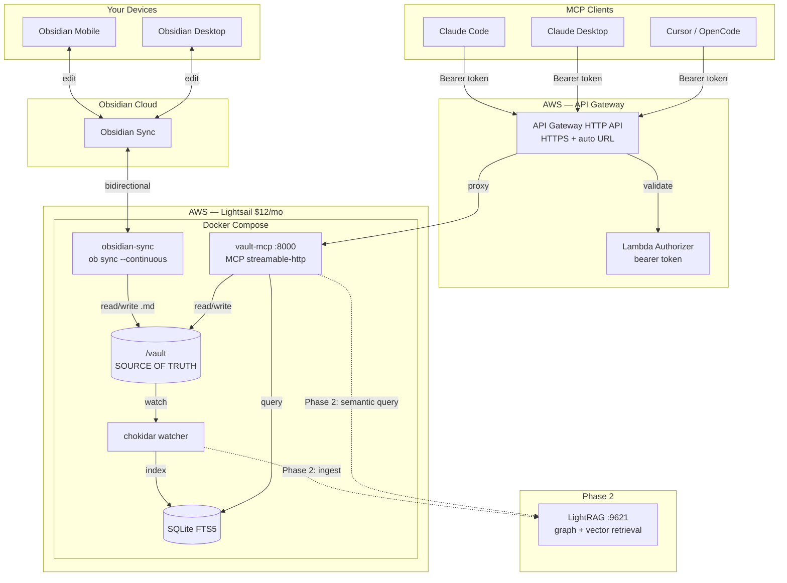

# Architecture

vault-cortex is a remote MCP server that exposes an Obsidian vault over HTTPS
via the Model Context Protocol. Any MCP client — Claude Desktop, Claude Code,
Cursor, OpenCode — can read, write, and search your vault from anywhere.

## Phasing

**Phase 1** delivers vault CRUD, full-text search (SQLite FTS5), and the
About Me/ memory layer. This alone makes any MCP client vault-aware and
personalized across conversations.

**Phase 2** adds a LightRAG container for semantic and knowledge-graph
queries over the vault. The file watcher gains a second hook for LightRAG
ingestion (delete + re-insert on change), a new `vault_query_kb` MCP tool
is added, and the Lightsail instance upgrades to 2–4 GB ($24/mo). The
architecture is designed so this is additive — no rewrites, just a new
container, a new watcher callback, and a new tool.

## User Requirements

| ID  | Requirement                     | Phase | Summary                                                               |
| --- | ------------------------------- | ----- | --------------------------------------------------------------------- |
| R1  | Bidirectional sync              | 1     | Obsidian Sync + obsidian-headless. One vault, always current.         |
| R2  | Remote vault read access        | 1     | Any MCP client can read any note by path, list notes in any folder.   |
| R3  | Remote vault write access       | 1     | Writes sync back to all Obsidian apps automatically via R1.           |
| R4  | Full-text and structured search | 1     | SQLite FTS5 — ranked results, filter by tags/type/folder.             |
| R5  | Memory tools                    | 1     | Read/append to `About Me/` semantic memory files.                     |
| R6  | Secure remote access            | 1     | HTTPS via API Gateway. Bearer token auth. No re-authentication flows. |
| R7  | Low operational overhead        | 1     | Always-on, no manual intervention. ~$12/mo. IaC via SST.             |
| R8  | Extensible for semantic search  | 2     | LightRAG plugs into existing watcher. Not a rewrite.                 |

## Component Diagram

## Data Flow

**Read:** MCP client → API Gateway (TLS + auth) → vault-mcp → filesystem or SQLite → response.

**Write:** MCP client → API Gateway → vault-mcp → filesystem write → obsidian-headless detects → Obsidian Sync propagates. Watcher also updates SQLite index.

**Sync (from apps):** Obsidian app → Obsidian Sync → obsidian-headless → `/vault/` → watcher → SQLite. Now searchable via MCP.

**Semantic query (Phase 2):** MCP client → `vault_query_kb` tool → LightRAG → graph + vector retrieval → response.

## Invariant: Vault Is Source of Truth

The vault `.md` files are canonical. SQLite FTS5 is derived — rebuildable from scratch. Never write to the index directly. This extends to Phase 2: LightRAG's knowledge graph is also derived from vault files, not the other way around.

## MCP Tools

### Phase 1: Vault Read/Write (R2, R3)

| Tool | Input | Annotation |
|------|-------|------------|
| `vault_read_note` | `path` | readOnlyHint |
| `vault_write_note` | `path, content` | destructiveHint |
| `vault_list_notes` | `folder?, glob?` | readOnlyHint |

### Phase 1: Search (R4)

| Tool | Input | Annotation |
|------|-------|------------|
| `vault_search` | `query, folder?, tags?, type?, limit?` | readOnlyHint |
| `vault_search_by_tag` | `tag, exact?` | readOnlyHint |
| `vault_list_tags` | — | readOnlyHint |
| `vault_recent_notes` | `limit?` | readOnlyHint |

### Phase 1: Memory (R5)

| Tool | Input | Annotation |
|------|-------|------------|
| `vault_get_memory` | `file?` | readOnlyHint |
| `vault_update_memory` | `file, entry` | destructiveHint |
| `vault_list_memories` | — | readOnlyHint |

### Phase 2: Knowledge Base (R8)

| Tool | Input | Annotation |
|------|-------|------------|
| `vault_query_kb` | `query, mode?` | readOnlyHint |

`mode` options: `hybrid` (default), `local` (entity-centric), `global` (conceptual), `naive` (vector-only).

## Infrastructure

See `sst.config.ts` for full IaC. Auth is a static bearer token — no Cognito, no JWT, no re-auth.

## Cost

| Component | Phase 1 | Phase 2 |
|-----------|---------|----------|
| Lightsail | $12/mo (2 GB) | $24/mo (4 GB) |
| API Gateway | ~$0 | ~$0 |
| Obsidian Sync | existing | same |
| LightRAG (OpenAI embeddings) | — | ~$1–2/mo |
| **Total** | **~$12/mo** | **~$26/mo** |

## Key Decisions

| Decision | Rationale |
|----------|----------|
| Lightsail over ECS | $12 vs ~$50+. Single-user server. |
| API Gateway over Caddy | Free HTTPS URL, no domain needed, SST native. |
| Bearer token over Cognito | No re-auth flows. Set once, works forever. |
| SQLite FTS5 | Zero services, embedded, personal scale. |
| chokidar | Node-native, same process as SQLite. Phase 2: adds LightRAG hook. |
| Streamable HTTP | Current MCP spec (2025-11-25). SSE is deprecated. |
| GHCR over ECR | GITHUB_TOKEN auth, no AWS IAM for images. |
| Factory over class | Functional style. Closure holds db ref, no `this`. |
| `type` over `interface` | Preferred unless `interface` specifically required. |
