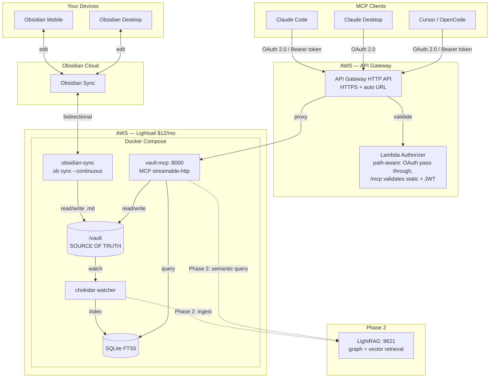
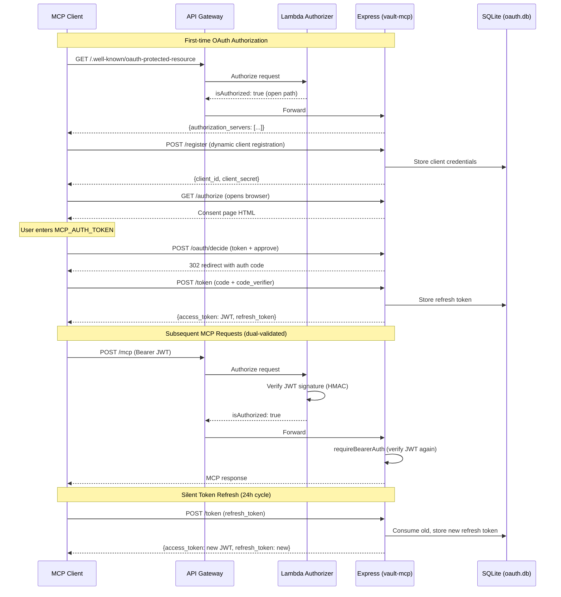
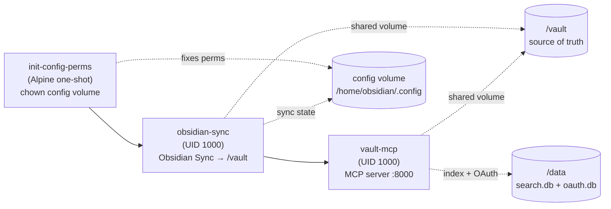

# Architecture

vault-cortex is a remote MCP server that exposes an Obsidian vault over HTTPS
via the Model Context Protocol. Any MCP client — Claude Desktop, Claude Code,
Cursor, OpenCode — can read, write, and search your vault from anywhere.

## Why This Exists

The typical Obsidian + MCP setup requires three moving parts running
simultaneously: Obsidian open → Local REST API plugin installed → a separate
MCP server (Python/uv or npx) wrapping the REST API.

vault-cortex replaces all of that with Docker and your vault folder.

**What makes it different:**

- **No Obsidian running.** Works with just `.md` files on disk. No desktop app
  dependency, no electron process consuming resources.
- **No plugins.** No Local REST API, no community plugin trust decisions, no
  plugin version compatibility issues.
- **Remote-first.** The only Obsidian MCP server that works from your phone,
  claude.ai, or a CI pipeline — via Obsidian Sync in Docker + API Gateway +
  OAuth 2.0.
- **Better search.** SQLite FTS5 with BM25 ranking, porter stemming, phrase
  matching, and tag/property/folder filtering. Ranked results, not grep.
- **Structured memory.** A dedicated memory layer with dated entries, section
  targeting, and auto-initialization — designed for AI agent personalization
  across conversations.
- **Obsidian-native.** Frontmatter-aware, wikilink-aware, tag-aware,
  heading-aware, daily-note-aware. The 22 tools understand Obsidian conventions,
  not just raw markdown.

## Phasing

**Phase 1** delivers vault CRUD, full-text search (SQLite FTS5), and the
About Me/ memory layer. This alone makes any MCP client vault-aware and
personalized across conversations.

**Phase 2** adds a LightRAG container for semantic and knowledge-graph
queries over the vault. The file watcher gains a second hook for LightRAG
ingestion (delete + re-insert on change), a new `vault_query_kb` MCP tool
is added, and the Lightsail instance upgrades to 2–4 GB ($24/mo). The
architecture is designed so this is additive — no rewrites, just a new
container, a new watcher callback, and a new tool.

## User Requirements

| ID  | Requirement                     | Phase | Summary                                                             |
| --- | ------------------------------- | ----- | ------------------------------------------------------------------- |
| R1  | Bidirectional sync              | 1     | Obsidian Sync + obsidian-headless. One vault, always current.       |
| R2  | Remote vault read access        | 1     | Any MCP client can read any note by path, list notes in any folder. |
| R3  | Remote vault write access       | 1     | Writes sync back to all Obsidian apps automatically via R1.         |
| R4  | Full-text and structured search | 1     | SQLite FTS5 — ranked results, filter by tags/type/folder.           |
| R5  | Memory tools                    | 1     | Read/append to configurable memory folder (default: `About Me/`).   |
| R6  | Secure remote access            | 1     | HTTPS via API Gateway. OAuth 2.0 + static bearer token.             |
| R7  | Low operational overhead        | 1     | Always-on, no manual intervention. ~$12/mo. IaC via SST.            |
| R8  | Extensible for semantic search  | 2     | LightRAG plugs into existing watcher. Not a rewrite.                |

## Component Diagram



## Auth Flow



## Docker Compose Startup



## Data Flow

**Read:** MCP client → API Gateway (TLS + auth) → vault-mcp → filesystem or SQLite → response.

**Write:** MCP client → API Gateway → vault-mcp → filesystem write → obsidian-headless detects → Obsidian Sync propagates. Watcher also updates SQLite index.

**Sync (from apps):** Obsidian app → Obsidian Sync → obsidian-headless → `/vault/` → watcher → SQLite. Now searchable via MCP.

**Semantic query (Phase 2):** MCP client → `vault_query_kb` tool → LightRAG → graph + vector retrieval → response.

## Invariant: Vault Is Source of Truth

The vault `.md` files are canonical. SQLite FTS5 is derived — rebuildable from scratch. Never write to the index directly. This extends to Phase 2: LightRAG's knowledge graph is also derived from vault files, not the other way around.

## MCP Tools

### Phase 1: Vault Read/Write (R2, R3)

| Tool                    | Input                                                | Annotation      |
| ----------------------- | ---------------------------------------------------- | --------------- |
| `vault_read_note`       | `path`                                               | readOnlyHint    |
| `vault_write_note`      | `path, body, frontmatter?`                           | destructiveHint |
| `vault_patch_note`      | `path, operation, content, heading?, heading_level?` | destructiveHint |
| `vault_replace_in_note` | `path, old_text, new_text, replace_all_occurrences?` | destructiveHint |
| `vault_list_notes`      | `folder?, glob?`                                     | readOnlyHint    |
| `vault_delete_note`     | `path`                                               | destructiveHint |

`vault_patch_note` supports 4 operations: `append`, `prepend`, `replace`, `insert_before` — heading-targeted with optional file-level mode. `vault_replace_in_note` does exact text find-and-replace in the note body.

`vault_delete_note` refuses paths under folders listed in `PROTECTED_PATHS` (default: the memory dir + `Daily Notes/`) as a server-side guardrail; use `vault_delete_memory` for individual entries in memory files.

### Phase 1: Search (R4)

| Tool                     | Input                        | Annotation   |
| ------------------------ | ---------------------------- | ------------ |
| `vault_search`           | `query, filters?`            | readOnlyHint |
| `vault_search_by_tag`    | `tag, exact?`                | readOnlyHint |
| `vault_search_by_folder` | `folder, recursive?, limit?` | readOnlyHint |
| `vault_list_tags`        | —                            | readOnlyHint |
| `vault_recent_notes`     | `sort_by?, limit?`           | readOnlyHint |

`filters` covers `folder`, `tags`, `related`, `type`, `properties` (arbitrary frontmatter keys), `limit`, and `snippet_tokens`. `sort_by` is `"created" | "modified"` (default `"modified"`).

### Phase 1: Property Discovery + Daily Notes

| Tool                         | Input                         | Annotation   |
| ---------------------------- | ----------------------------- | ------------ |
| `vault_get_daily_note`       | `date?`                       | readOnlyHint |
| `vault_list_property_keys`   | `folder?`                     | readOnlyHint |
| `vault_list_property_values` | `key, folder?, limit?`        | readOnlyHint |
| `vault_search_by_property`   | `key, value, folder?, limit?` | readOnlyHint |

`vault_get_daily_note` reads `.obsidian/daily-notes.json` for the vault's folder and date format, falling back to `Daily Notes/YYYY-MM-DD.md`. Property tools query the `properties` JSON column in the notes table via `json_each`/`json_extract`, handling both scalar and array-valued properties.

### Phase 1: Memory (R5)

| Tool                      | Input                            | Annotation      |
| ------------------------- | -------------------------------- | --------------- |
| `vault_get_memory`        | `file?, section?`                | readOnlyHint    |
| `vault_update_memory`     | `file, section, entry, options?` | destructiveHint |
| `vault_delete_memory`     | `file, section, date, entry`     | destructiveHint |
| `vault_list_memory_files` | —                                | readOnlyHint    |

**Auto-initialization:** On first startup, if the memory folder (default: `About Me/`) doesn't exist, the server creates it with template files (Principles.md, Opinions.md) so agents discover a ready structure. `vault_update_memory` also auto-creates files and sections on write — agents can save preferences without manual setup. This is the two-layer bootstrap: startup seeds the default structure, write-time handles growth beyond templates.

### Phase 1: Link Queries

| Tool                       | Input                      | Annotation   |
| -------------------------- | -------------------------- | ------------ |
| `vault_get_backlinks`      | `path`                     | readOnlyHint |
| `vault_get_outgoing_links` | `path`                     | readOnlyHint |
| `vault_find_orphans`       | `exclude_folders?, limit?` | readOnlyHint |

Link queries use a `links` table populated from `[[wikilink]]` and `[text](path.md)` regex during indexing, with fence-aware parsing (skips code blocks). Links are resolved against all known note paths (shortest-path-first for ambiguous basenames). `vault_find_orphans` excludes folders listed in `ORPHAN_EXCLUDE_FOLDERS` (default: `Daily Notes`, `Templates`, and the memory dir).

### Phase 2: Knowledge Base (R8)

| Tool             | Input          | Annotation   |
| ---------------- | -------------- | ------------ |
| `vault_query_kb` | `query, mode?` | readOnlyHint |

`mode` options: `hybrid` (default), `local` (entity-centric), `global` (conceptual), `naive` (vector-only).

## Infrastructure

See `sst.config.ts` for full IaC.

### Auth: OAuth 2.0 + defense in depth

Two authentication methods, both validated at two layers:

| Method                                | Used by                                                      | Token format                | Lifetime                                    |
| ------------------------------------- | ------------------------------------------------------------ | --------------------------- | ------------------------------------------- |
| OAuth 2.0 (Authorization Code + PKCE) | Claude Desktop, Claude Code, Claude Mobile, any OAuth client | JWT (HS256)                 | 24h access, 60-day sliding refresh (SQLite) |
| Static bearer token                   | Claude Code, MCP Inspector, curl                             | Raw string (MCP_AUTH_TOKEN) | No expiry                                   |

**Layer 1 — API Gateway Lambda authorizer** (`src/functions/authorizer.ts`):
Path-aware. OAuth discovery paths (`/.well-known/*`, `/authorize`, `/token`,
`/register`, `/oauth/decide`, `/healthz`) pass through unauthenticated
(required by the OAuth/MCP spec). `/mcp` validates the bearer token —
accepts both the static `MCP_AUTH_TOKEN` (via `safeEqual`) and JWT access
tokens signed with it (via `verifyJwt`).

**Layer 2 — Express middleware** (MCP SDK's `requireBearerAuth` in `server.ts`):
The OAuth provider's `verifyAccessToken()` accepts both static tokens and
JWTs. Same validation as the Lambda, independent second check.

Both layers share the same HMAC key (`MCP_AUTH_TOKEN`) for JWT verification
and `safeEqual`/`parseBearer` from `src/auth.ts`.

**OAuth flow:**

```
1. Client → GET /.well-known/oauth-protected-resource    → discover auth server
2. Client → GET /.well-known/oauth-authorization-server   → discover endpoints
3. Client → POST /register                                → dynamic client registration
4. Client → GET /authorize?...&code_challenge=...         → consent page in browser
5. User enters MCP_AUTH_TOKEN in consent page → POST /oauth/decide → redirect with auth code
6. Client → POST /token (code + code_verifier)            → JWT access token + refresh token
7. Client → POST /mcp (Authorization: Bearer <JWT>)       → MCP requests (dual-validated)
8. Token expires → POST /token (refresh_token)             → new JWT (silent, no browser)
```

**JWT payload:** `{ sub: clientId, scope: "vault", exp: <unix>, iss: "vault-cortex" }`
Signed with HMAC-SHA256 using `MCP_AUTH_TOKEN` as the key. Both the Lambda
authorizer and Express can verify independently — no shared state needed.

**Token storage:** Refresh tokens and registered clients are persisted in
SQLite (`/data/oauth.db`) — survives container restarts, no re-authentication
needed after deploys for active clients. Auth codes are in-memory (short-lived,
10 minutes). Access tokens are JWTs (stateless, no storage needed). Revoked
tokens are tracked in SQLite.

**Refresh token expiry:** 60-day sliding (inactivity) window. Each successful
use rotates the token AND extends the window by another 60 days, so a daily
client never sees expiry. A client dormant for >60 days is forced through the
full OAuth flow on its next attempt. The schema column is `expires_at INTEGER
NOT NULL`; rows past `expires_at` are deleted on read so the table self-cleans.
This bounds the blast radius of a leaked refresh token without inconveniencing
active sessions.

**Rate limiting:** OAuth endpoints (`/token`, `/register`, `/authorize`,
`/revoke`) are rate-limited at 5 req/min per client IP. A custom key
generator extracts the real client IP from API Gateway's `Forwarded` header
(express-rate-limit's built-in validators are disabled — they assume
direct-to-server traffic, not reverse-proxy deployments).

**Why both layers:** Lightsail port 8000 is publicly bound. If the API Gateway
authorizer is misconfigured, or someone hits the public IP directly, Express
still rejects. `/healthz` bypasses auth for docker-compose healthchecks.

**Rotation:** Update the SST secret AND the Lightsail `.env`, then redeploy
both. Existing JWTs signed with the old key become invalid immediately.
Refresh tokens in SQLite are unaffected — clients silently get new JWTs
signed with the new key on their next token refresh.

### Docker Compose: startup sequence

Three services run in order via `depends_on`:

1. **`init-config-perms`** (Alpine, one-shot) — chowns the obsidian config
   volume to `PUID:PGID`. Workaround for an upstream bug: the
   obsidian-headless Dockerfile creates `/home/obsidian/.config` as root,
   so Docker named volumes inherit root ownership.
2. **`obsidian-sync`** — bidirectional Obsidian Sync. Stores sync state in
   the config volume at `/home/obsidian/.config` (persists across restarts
   for incremental sync — critical for Phase 2 LightRAG ingestion).
3. **`vault-mcp`** — MCP server. Runs as the `node` user (UID 1000),
   matching obsidian-sync's `PUID` so both containers can read/write the
   shared `/vault` volume. On startup: builds the FTS5 search index,
   bootstraps memory templates if the memory folder doesn't exist, then
   starts the file watcher.

### Durability

Four layers cover different failure classes:

| Layer                                 | What it does                                                                                                                | Where                         |
| ------------------------------------- | --------------------------------------------------------------------------------------------------------------------------- | ----------------------------- |
| App-level `removal: "retain"`         | Blocks `sst remove` from destroying the stack                                                                               | `sst.config.ts` `app()`       |
| Resource-level `protect: true`        | Refuses any Pulumi op that would destroy or replace the Instance                                                            | `sst.config.ts` instance opts |
| Resource-level `retainOnDelete: true` | If SST does decide to delete (stage rename), orphan the AWS resource instead of destroying                                  | `sst.config.ts` instance opts |
| Lightsail auto-snapshot (`addOn`)     | Daily disk image at 03:00 UTC, 7-day rolling retention. Captures the full boot disk including ad-hoc SSH-installed packages | `addOn` on the Instance       |

The auto-snapshot is the only one that protects against AWS-side events
(hardware failure, AZ outage) and against in-VM mistakes (fat-finger
`rm -rf`, container compromise). The IaC seatbelts only protect against
Pulumi-driven replacement.

Restore procedures, the intentional-replace flow (unprotect → deploy →
re-protect, e.g. for a Phase 2 bundle upgrade), SST state reconciliation,
and auth implications post-restore live in [`RECOVERY.md`](./RECOVERY.md).

## Cost

| Component                    | Phase 1                                    | Phase 2       |
| ---------------------------- | ------------------------------------------ | ------------- |
| Lightsail                    | $12/mo (2 GB)                              | $24/mo (4 GB) |
| Lightsail auto-snapshots     | ~$0.50–1.50/mo (used disk × 7d × $0.05/GB) | same          |
| API Gateway                  | ~$0                                        | ~$0           |
| Obsidian Sync                | existing                                   | same          |
| LightRAG (OpenAI embeddings) | —                                          | ~$1–2/mo      |
| **Total**                    | **~$13/mo**                                | **~$27/mo**   |

## Key Decisions

| Decision                            | Rationale                                                                                                                             |
| ----------------------------------- | ------------------------------------------------------------------------------------------------------------------------------------- |
| Lightsail over ECS                  | $12 vs ~$50+. Single-user server.                                                                                                     |
| API Gateway over Caddy              | Free HTTPS URL, no domain needed, SST native.                                                                                         |
| OAuth 2.0 + static token            | OAuth for all clients. Static bearer token as CLI alternative.                                                                        |
| JWT over opaque tokens              | Verifiable at Lambda edge without shared state. HS256 with MCP_AUTH_TOKEN.                                                            |
| 60-day sliding refresh              | Active clients never re-auth; leaked tokens bounded. Standard OAuth practice.                                                         |
| Auto-snapshot (`addOn`)             | Native Lightsail primitive over hand-rolled cron + S3. Daily, 7-day retention, captures full boot disk including SSH-installed state. |
| Pulumi `protect` + `retainOnDelete` | IaC seatbelt over `replaceOnChanges` gymnastics. Intentional replaces require explicit unprotect — the friction is the feature.       |
| SQLite FTS5                         | Zero services, embedded, personal scale.                                                                                              |
| chokidar                            | Node-native, same process as SQLite. Phase 2: adds LightRAG hook.                                                                     |
| Streamable HTTP                     | Current MCP spec (2025-11-25). SSE is deprecated.                                                                                     |
| GHCR over ECR                       | GITHUB_TOKEN auth, no AWS IAM for images.                                                                                             |
| Factory over class                  | Functional style. Closure holds db ref, no `this`.                                                                                    |
| `type` over `interface`             | Preferred unless `interface` specifically required.                                                                                   |
