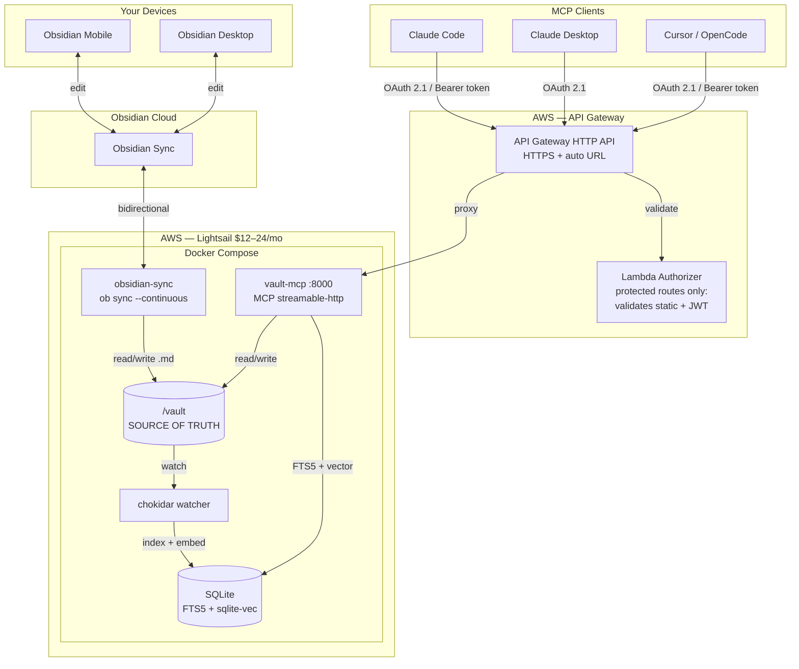
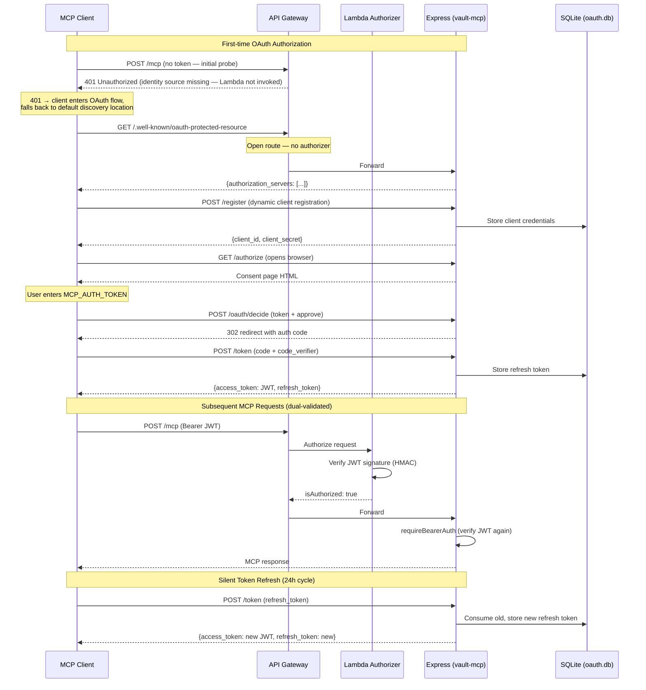
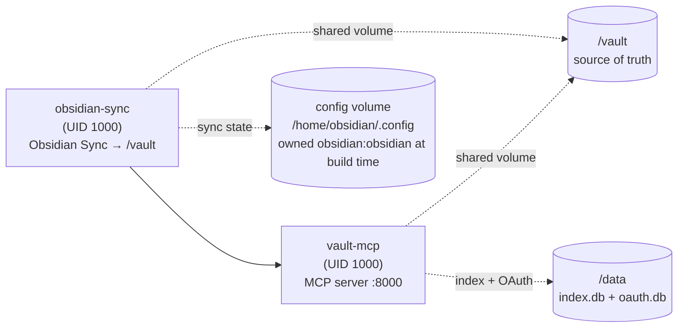
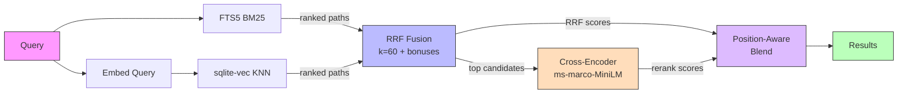
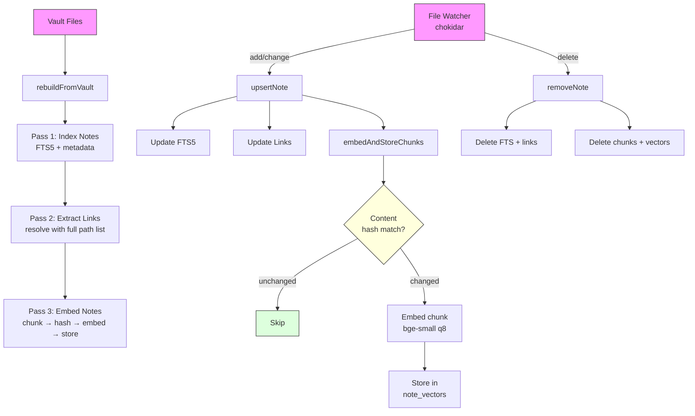

# Architecture

Vault Cortex is a remote MCP server that exposes an Obsidian vault over HTTPS
via the Model Context Protocol. Any MCP client — Claude Desktop, Claude Code,
Cursor, OpenCode — can read, write, and search your vault from anywhere.

## Why This Exists

The typical Obsidian + MCP setup requires three moving parts running
simultaneously: Obsidian open → Local REST API plugin installed → a separate
MCP server wrapping the REST API. That chain is local-only.

Vault Cortex replaces it:

- **Docker-based** — no Obsidian desktop required to be running, no plugins, works with `.md` files on disk
- **Remote access** — Obsidian Sync in Docker keeps the vault current; works from your phone, a remote server, or any MCP client
- **MCP spec-compliant** — streamable-http transport, OAuth 2.1

See the [README](./README.md) for the full value proposition.

This document covers the architecture of the reference deployment — Lightsail,
API Gateway, SST — but Vault Cortex runs anywhere Docker does.

## Capability Layers

The server provides three capability layers, each additive:

- **Vault CRUD + memory** — read/write notes, heading-targeted patching, note moving with link rewriting, and an About Me/ memory layer for AI personalization. The MCP surface is **tools + prompts** — model-driven tools plus user-initiated prompt workflows (see [MCP Prompts](#mcp-prompts)).
- **Hybrid search** — FTS5 keyword matching + sqlite-vec vector similarity, fused via RRF. Embeddings generated locally by a small ONNX model — no external API. The Docker image uses Debian slim (`node:24-slim`) because `onnxruntime-node` requires glibc.
- **Cross-encoder reranking** — position-aware score blending after RRF fusion, rescuing intent-heavy queries where keywords and vectors both miss.

## User Requirements

| ID  | Requirement                     | Phase | Summary                                                                                     |
| --- | ------------------------------- | ----- | ------------------------------------------------------------------------------------------- |
| R1  | Bidirectional sync              | 1     | Obsidian Sync + obsidian-headless. One vault, always current.                               |
| R2  | Remote vault read access        | 1     | Any MCP client can read any note by path, list notes in any folder.                         |
| R3  | Remote vault write access       | 1     | Writes sync back to all Obsidian apps automatically via R1.                                 |
| R4  | Full-text and structured search | 1     | SQLite FTS5 — ranked results, filter by tags/type/folder.                                   |
| R5  | Memory tools                    | 1     | Read/append to configurable memory folder (default: `About Me/`).                           |
| R6  | Secure remote access            | 1     | HTTPS via API Gateway. OAuth 2.1 + static bearer token.                                     |
| R7  | Low operational overhead        | 1     | Always-on, no manual intervention. ~$12–24/mo. IaC via SST.                                 |
| R8  | Extensible for semantic search  | 2     | Hybrid search (sqlite-vec + local embeddings) plugs into existing watcher. Not a rewrite.   |
| R9  | Vault-wide task queries         | 3     | Task index parsing Tasks plugin emoji + Dataview formats. Kanban-aware, structured filters. |

## Component Diagram



## Auth Flow



## Docker Compose Startup



## Data Flow

**Read:** MCP client → API Gateway (TLS + auth) → vault-mcp → filesystem or SQLite → response.

**Write:** MCP client → API Gateway → vault-mcp → filesystem write → obsidian-headless detects → Obsidian Sync propagates. Watcher also updates SQLite index.

**Sync (from apps):** Obsidian app → Obsidian Sync → obsidian-headless → `/vault/` → watcher → SQLite. Now searchable via MCP.

**Hybrid query:** MCP client → `vault_search` → FTS5 BM25 ranks + sqlite-vec KNN ranks → RRF fusion → cross-encoder reranking → response.

## Invariant: Vault Is Source of Truth

The vault `.md` files are canonical. SQLite FTS5 is derived — rebuildable from scratch. Never write to the index directly. The vector embeddings in sqlite-vec are also derived from vault files, not the other way around.

## MCP Tools

### Vault Read/Write (R2, R3)

| Tool                      | Input                                                        | Annotation      |
| ------------------------- | ------------------------------------------------------------ | --------------- |
| `vault_read_note`         | `path, properties_only?, outline?, heading?, heading_level?` | readOnlyHint    |
| `vault_write_note`        | `path, body, properties?`                                    | destructiveHint |
| `vault_patch_note`        | `path, operation, content, heading?, heading_level?`         | destructiveHint |
| `vault_replace_in_note`   | `path, old_text, new_text, replace_all_occurrences?`         | destructiveHint |
| `vault_delete_span`       | `path, start_anchor, end_anchor?, first_match?`              | destructiveHint |
| `vault_list_notes`        | `folder?, glob?`                                             | readOnlyHint    |
| `vault_delete_note`       | `path, prune_empty_folders?`                                 | destructiveHint |
| `vault_move_note`         | `old_path, new_path, prune_empty_folders?`                   | destructiveHint |
| `vault_update_properties` | `path, properties`                                           | destructiveHint |

`vault_read_note` returns full content by default; optional `properties_only`, `outline`, or `heading` (with `heading_level` to disambiguate) modes return just the properties, the structure, or a single section — cheap partial reads for large notes. `outline` returns an object `{ leading_callout?, headings }` — the heading tree plus any top-of-file callout (a `> [!type]` block) when present.

`vault_patch_note` supports 4 operations: `append`, `prepend`, `replace`, `insert_before` — heading-targeted with optional file-level mode. `vault_replace_in_note` does exact text find-and-replace in the note body. `vault_delete_span` deletes a contiguous block of lines by short anchor substrings — more reliable than reproducing the full block as `old_text`, and the complement to `vault_replace_in_note` for deletion.

`vault_delete_note` refuses paths under folders listed in `PROTECTED_PATHS` (default: the memory dir + `Daily Notes/`) as a server-side guardrail; use `vault_delete_memory` for individual entries in memory files. `vault_update_properties` merges properties without touching the body — sets new keys, overwrites matching keys, deletes keys set to `null`.

`vault_move_note` moves or renames a note and rewrites every link across the vault that resolves to it — wikilinks (including aliases, heading anchors, and embeds), markdown links, and frontmatter links — mirroring Obsidian's built-in rename. It reuses the same link-resolution logic as the link-graph tools, only rewrites a link when leaving it would break it, and refuses to overwrite an existing destination or touch `PROTECTED_PATHS`. Both `vault_delete_note` and `vault_move_note` support `prune_empty_folders` to clean up parent directories left empty by the operation.

### Search (R4)

| Tool                     | Input                        | Annotation   |
| ------------------------ | ---------------------------- | ------------ |
| `vault_search`           | `query, filters?`            | readOnlyHint |
| `vault_search_by_tag`    | `tag, exact?`                | readOnlyHint |
| `vault_search_by_folder` | `folder, recursive?, limit?` | readOnlyHint |
| `vault_list_tags`        | —                            | readOnlyHint |
| `vault_recent_notes`     | `sort_by?, limit?`           | readOnlyHint |

`filters` covers `folder`, `tags`, `related`, `type`, `properties` (arbitrary frontmatter keys), `limit`, `snippet_tokens`, and `include_leading_callout` (opt-in; adds each result's top-of-file callout). All discovery tools (`vault_search`, `vault_search_by_tag`, `vault_search_by_folder`, `vault_recent_notes`, `vault_search_by_property`, `vault_find_orphans`) include `bytes` (on-disk file size) and each note's `leading_callout` in its metadata when present — `bytes` lets agents decide whether to read in full or use `outline`/`heading` mode before committing to a read. `sort_by` is `"created" | "modified"` (default `"modified"`).

**Promoted properties:** Five frontmatter keys — `title`, `tags`, `type`, `created`, `related` — get dedicated columns in the `notes` table for direct `WHERE`-clause filtering (no `json_extract` needed). In tool responses, these appear as top-level fields; remaining frontmatter keys are returned under `additional_properties` (via `formatNoteMetadata` in `tool-helpers.ts`). All other properties live in a JSON `properties` column, queryable via `json_extract` — functional for any schema, but without dedicated columns.

### Property Discovery + Daily Notes

| Tool                         | Input                         | Annotation   |
| ---------------------------- | ----------------------------- | ------------ |
| `vault_get_daily_note`       | `date?`                       | readOnlyHint |
| `vault_list_property_keys`   | `folder?`                     | readOnlyHint |
| `vault_list_property_values` | `key, folder?, limit?`        | readOnlyHint |
| `vault_search_by_property`   | `key, value, folder?, limit?` | readOnlyHint |

`vault_get_daily_note` reads `.obsidian/daily-notes.json` for the vault's folder and date format, falling back to `Daily Notes/YYYY-MM-DD.md`. Property tools query the `properties` JSON column in the notes table via `json_each`/`json_extract`, handling both scalar and array-valued properties.

### Memory (R5)

| Tool                      | Input                            | Annotation       |
| ------------------------- | -------------------------------- | ---------------- |
| `vault_get_memory`        | `file?, section?`                | readOnlyHint     |
| `vault_update_memory`     | `file, section, entry, options?` | !destructiveHint |
| `vault_delete_memory`     | `file, section, date, entry`     | destructiveHint  |
| `vault_list_memory_files` | —                                | readOnlyHint     |

**Auto-initialization:** On first startup, if the memory folder (default: `About Me/`) doesn't exist, the server creates it with template files (Me.md, Opinions.md, Principles.md), each opening with a `> [!info] Scope of this file` callout so agents discover a ready, self-documenting structure. `vault_update_memory` also auto-creates files and sections on write — agents can save preferences without manual setup, and a newly-created file is seeded with a placeholder scope callout to fill in. This is the two-layer bootstrap: startup seeds the default structure, write-time handles growth beyond templates.

**Opt-out:** The memory layer is opt-out: set `MEMORY_ENABLED=false` to hide all memory tools and prompts, skip auto-initialization, and strip memory references from server metadata. The vault CRUD and search layers continue to work normally.

### Link Queries

| Tool                       | Input                      | Annotation   |
| -------------------------- | -------------------------- | ------------ |
| `vault_get_backlinks`      | `path`                     | readOnlyHint |
| `vault_get_outgoing_links` | `path`                     | readOnlyHint |
| `vault_find_orphans`       | `exclude_folders?, limit?` | readOnlyHint |

Link queries use a `links` table populated during indexing:

- **Sources:** `[[wikilink]]` and `[text](path.md)` links in the note body (fence-aware parsing skips code blocks), plus `[[wikilink]]`s in frontmatter property values (e.g. `related:`).
- **Resolution:** Each target is resolved against all known note paths covering Obsidian's three "New link format" modes:
  1. Exact vault-relative path (path from vault folder)
  2. Path relative to the linking note (path from current file, including upward `../`)
  3. Basename (shortest-path-first for ambiguous basenames)
- **Non-markdown assets:** Targets that don't resolve to a note are checked against a `non_md_files` table (populated during rebuild, maintained by the file watcher). Wikilinks to `.canvas`, `.base`, images, PDFs, and other non-markdown assets resolve as `kind: "asset"` instead of being counted as broken.
- **Outgoing links:** `vault_get_outgoing_links` returns a `kind` discriminator (`"note"` or `"asset"`) so clients can distinguish retrievable notes from non-retrievable asset references.
- **Orphans:** `vault_find_orphans` excludes folders listed in `ORPHAN_EXCLUDE_FOLDERS` (default: `Daily Notes`, `Templates`, and the memory dir).

### Task Queries (R9)

| Tool               | Input                                                                                               | Annotation   |
| ------------------ | --------------------------------------------------------------------------------------------------- | ------------ |
| `vault_list_tasks` | `status?, dates (6)?, priority?, folder?, tag?, heading?, path?, sort_by?, sort_direction?, limit?` | readOnlyHint |

A `tasks` table in the same SQLite database stores every checkbox task line, parsed by the pure `obsidian-markdown/tasks.ts` grammar — a faithful reimplementation of the [Tasks plugin](https://publish.obsidian.md/tasks/)'s own parser (right-to-left signifier stripping; both emoji and [Dataview](https://blacksmithgu.github.io/obsidian-dataview/) inline-field formats; status, all six dates, priority, recurrence, dependencies, inline tags, block IDs). Unlike the plugin (which reads one configured format per vault), both formats are recognized in the same pass, so mixed-format vaults index uniformly. Task lines inside fenced code blocks and `%% %%` comments are skipped — the parser threads the same fence and comment state machines used by heading and link extraction (`lines.ts`).

Each row carries its full attribution: note path, full parent folder, nearest heading (the Kanban lane on a board), and 1-based file line number — so no follow-up reads are needed to locate a task. Rows are replaced per note inside `upsertNote`, deleted in `removeNote`, and wiped on rebuild — the same lifecycle as the FTS rows.

`vault_list_tasks` queries the table with structured filters (status, six date fields with range bounds, priority, folder/tag/heading/path scoping) and whitelisted sort keys. Three design choices shape the query surface:

- **Array params for status and heading** — both accept `string | string[]`, OR-combined. This collapses multi-lane Kanban queries (e.g. Active + Up Next + Waiting On) into a single call instead of N sequential reads.
- **Date cascade sorting** — when the primary sort field is absent on a task, the sort falls back through related date fields (due → scheduled → start → created), each using its own natural direction. Tasks with sparse dates sort usably instead of clustering at the end.
- **Kanban awareness** — each task carries an `is_kanban_task` flag, derived via `json_extract` on the parent note's `kanban-plugin` frontmatter (no schema changes). When true, `heading` carries the lane name, and `sort_by: "position"` (file path then line number) preserves the board's card arrangement as the sort order.

### Hybrid Search (R8)

`vault_search` combines FTS5 keyword results with sqlite-vec vector similarity using [Reciprocal Rank Fusion](https://github.com/tobi/qmd#score-normalization--fusion) (RRF), refined by a cross-encoder reranker. All models run in-process — no external API, fully rebuildable from vault files, and a progressive enhancement (FTS5 works identically if embeddings are absent).

| Component      | Model                                                                                    | Download | Query latency          | Peak memory |
| -------------- | ---------------------------------------------------------------------------------------- | -------- | ---------------------- | ----------- |
| **Embedding**  | [bge-small-en-v1.5](https://huggingface.co/Xenova/bge-small-en-v1.5) (33M, q8)           | ~25MB    | ~8ms                   | ~200MB      |
| **Reranker**   | [ms-marco-MiniLM-L-6-v2](https://huggingface.co/Xenova/ms-marco-MiniLM-L-6-v2) (22M, q8) | ~20MB    | ~200ms (20 candidates) | ~100MB      |
| **Vector KNN** | sqlite-vec (brute-force)                                                                 | in DB    | <1ms                   | negligible  |
| **RRF fusion** | application-layer                                                                        | —        | <1ms                   | negligible  |

Both models lazy-load on first use (~1–2s cold start each, cached after). Total disk: ~45MB. Total peak memory: ~300MB above baseline. Opt-out: `EMBEDDING_ENABLED=false` disables both models; `RERANK_MODE=none` keeps vectors but skips the cross-encoder.

**Embedding pipeline:** Controlled by `EMBEDDING_ENABLED` (default: `true`). Notes are chunked via heading-aware splitting (`chunker.ts`) with paragraph sub-splitting for oversized sections (MAX_CHUNK_TOKENS = 450). Markdown syntax is stripped before embedding (`plaintext.ts`). Each chunk is prefixed with the note title for context. Content-hash gating (SHA-256 per chunk) skips re-embedding unchanged content on both incremental file-watcher updates and full rebuilds. Vector tables persist across rebuilds (only FTS, notes, links, tasks, and non-md tables are cleared) — Pass 3 cleans up vectors for deleted notes, then embeds only new or modified chunks.

**Vector schema:** Two tables in the same SQLite database as FTS5:

- `note_chunks`: stores chunk text, position index, and content hash per note
- `note_vectors` (vec0): stores 384-dim Float32 embeddings keyed by chunk ID

**Task index:** See [Task Queries](#task-queries-r9) — the `tasks` table lives in the same SQLite database alongside FTS5 and vector tables, with the same lifecycle (replaced per note in `upsertNote`, wiped on rebuild).

**Indexing flow:** `rebuildFromVault` runs three passes — Pass 1 (FTS + metadata), Pass 2 (links with complete path list), then returns so the server can start accepting requests. Pass 3 (embedding) runs in the background — search works with FTS-only until vectors are ready. Vector tables are persistent across restarts; content-hash gating skips unchanged chunks on incremental file-watcher updates. The file watcher calls `embedNote` after `upsertNote`; `removeNote` cleans up both vectors and chunks.

**Hybrid search:** `vault_search` calls `hybridSearch`, which runs FTS5 keyword search and vector similarity search, then merges results via RRF. The flow:

1. FTS5 keyword search (synchronous, existing `fullTextSearch`)
2. Vector search: embed the query → sqlite-vec KNN → deduplicate to best chunk per note
3. RRF fusion (`computeRrfScores`): score = Σ(1/(k+rank)) across both lists, k=60, with top-rank bonuses (+0.05 rank 1, +0.02 ranks 2–3)
4. Build merged results: FTS results keep their metadata and snippet (score replaced with RRF score); vector-only results get metadata from the notes table and a snippet from their best-matching chunk text
5. Apply user filters (folder, tags, type, related, properties) to vector-only results — FTS results are already filtered via SQL

**Cross-encoder reranking:** After RRF fusion, a cross-encoder model ([ms-marco-MiniLM-L-6-v2](https://huggingface.co/Xenova/ms-marco-MiniLM-L-6-v2), 22M params, INT8 quantized) rescores the top candidates by evaluating each (query, document) pair jointly — unlike the bi-encoder, it captures query-document interaction and distinguishes intent ("how I feel about") from topic ("uses of"). Results are reordered via position-aware score blending (inspired by [qmd](https://github.com/tobi/qmd)):

- **Ranks 1–3:** 75% RRF / 25% reranker — protect strong retrieval hits
- **Ranks 4–10:** 50% / 50% — even blend in the middle
- **Ranks 11+:** 40% RRF / 60% reranker — let the reranker rescue demoted results

Both scores are min-max normalized to [0, 1] before blending. Controlled by `RERANK_MODE` (default: `blended`; set `none` to skip reranking for ~200ms lower latency). Reranker failure is non-fatal — the pipeline falls back to RRF-only ordering with a warning log.

Graceful fallback: when no embedder is configured (`EMBEDDING_ENABLED=false`), no vectors are indexed yet (startup), or the embedding model fails, `hybridSearch` returns FTS-only results silently. The response includes `search_mode: "hybrid" | "fts"` and `reranked: boolean` so clients know which ranking produced the scores. The tool description is also conditional — hybrid-aware when embeddings are enabled, keyword-only when disabled.

**Hybrid query flow:**



**Indexing pipeline (startup + incremental):**



**Search module decomposition:** The search query and indexing layer is split into six modules (the embedding pipeline and file watcher are described above):

| Module              | Responsibility                                                                                                                                                                                                                                                                                      |
| ------------------- | --------------------------------------------------------------------------------------------------------------------------------------------------------------------------------------------------------------------------------------------------------------------------------------------------- |
| `search-index.ts`   | Factory/closure (`createSearchIndex`), schema, migrations, write operations (`upsertNote`, `removeNote`, `rebuildFromVault`), embedder + reranker wiring                                                                                                                                            |
| `search-queries.ts` | 16 query methods — `fullTextSearch`, `hybridSearch`, `searchByTag`, `searchByFolder`, `listTasks`, `recentNotes`, `listAllTags`, `listPropertyKeys`, `listPropertyValues`, `searchByProperty`, `getBacklinks`, `getOutgoingLinks`, `findOrphans`, `brokenLinkCount`, `modifiedOnDate`, `vaultStats` |
| `search-helpers.ts` | Pure data transforms — row mappers (`rowToMetadata`, `rowToTaskEntry`, `noteRowToSearchResult`), filters (`noteMatchesSearchFilters`), snippet construction                                                                                                                                         |
| `fts-query.ts`      | FTS5 query sanitization — compound-term handling, reserved-word stripping, phrase extraction                                                                                                                                                                                                        |
| `rrf.ts`            | Reciprocal Rank Fusion scoring (`computeRrfScores`) — rank accumulation, k=60, top-rank bonuses                                                                                                                                                                                                     |
| `reranker.ts`       | Cross-encoder factory (`createReranker`, ms-marco-MiniLM-L-6-v2) + position-aware score blending (`blendScores`, `normalizeScores`)                                                                                                                                                                 |

Write concerns (index mutations) are separated from read concerns (queries) and pure logic (helpers, RRF). `search-index.ts` remains the factory — it binds query functions to the database via a `SearchQueryContext` closure.

## MCP Prompts

Alongside tools, the server registers MCP **prompts** (`prompts/list` / `prompts/get`) via `prompt-definitions.ts`, which orchestrates group modules under `mcp-core/prompts/` — mirroring the `tools/` decomposition pattern — and is called per session in `mcp-router.ts`. Prompts are user-initiated — clients that support the `prompts/list` capability surface them via a **+** menu (Claude Desktop), slash commands (Claude Code), or similar (OpenCode, Zed); support varies by client and some (Cursor, Windsurf) currently expose tools only. Handlers assemble live vault content at invocation time over the same data layer the tools use, so there is no embedded procedure that can drift, only live content plus thin, durable instruction.

| Prompt              | Arguments             | Purpose                                                                                                                                                                                                                                                                                                                                       |
| ------------------- | --------------------- | --------------------------------------------------------------------------------------------------------------------------------------------------------------------------------------------------------------------------------------------------------------------------------------------------------------------------------------------- |
| `vault-orientation` | —                     | Vault stats, folder note counts, property adoption rates, orphan detection, broken link count, tags, recent notes, memory outline, and contextual tool suggestions. Uses `findOrphans`, `brokenLinkCount`, `vaultStats` alongside the existing tag/property/recent queries.                                                                   |
| `memory-review`     | `file?`, `max_chars?` | Structural overview (scope callouts from `listMemoryFiles`, section entry counts) + dated content as a timeline. Guided reflection: evolution narrative, scope-fit against declared scopes, backfill gaps, coverage analysis. Append-only by design.                                                                                          |
| `daily-review`      | `date?`, `max_chars?` | Reconciles a day — daily note content + outgoing links (via `getOutgoingLinks`, with broken-link flags) + backlinks (via `getBacklinks`) + date-specific activity (via `modifiedOnDate`) + vault-wide task status (due/overdue, scheduled, daily-note-scoped via `listTasks`). Surfaces what happened, what's open, and what needs follow-up. |

Each handler degrades to a valid message rather than throwing, so a prompt never hard-fails the client. `memory-review` is deliberately append-only: it reads dated entries as a timeline (each entry true when written), never as "newest supersedes older," and never prunes "stale" entries — matching the memory layer's design. `daily-review` uses `modifiedOnDate` instead of `recentNotes`, so past-date reviews show activity from _that_ date — not today's globally recent notes.

## Infrastructure

See `sst.config.ts` for full IaC.

### Auth: OAuth 2.1 + defense in depth

Two authentication methods, both validated at two layers:

| Method                                | Used by                                                      | Token format                | Lifetime                                    |
| ------------------------------------- | ------------------------------------------------------------ | --------------------------- | ------------------------------------------- |
| OAuth 2.1 (Authorization Code + PKCE) | Claude Desktop, Claude Code, Claude Mobile, any OAuth client | JWT (HS256)                 | 24h access, 60-day sliding refresh (SQLite) |
| Static bearer token                   | Claude Code, MCP Inspector, curl                             | Raw string (MCP_AUTH_TOKEN) | No expiry                                   |

**Layer 1 — API Gateway Lambda authorizer** (`src/functions/authorizer.ts`):
Attached to protected routes only. OAuth discovery paths (`/.well-known/*`,
`/authorize`, `/token`, `/register`, `/revoke`, `/oauth/*`, `/healthz`) are
separate unauthenticated routes in `sst.config.ts` (required by the
OAuth/MCP spec) and never invoke the Lambda. On protected routes the
authorizer validates the bearer token — accepts both the static
`MCP_AUTH_TOKEN` (via `safeEqual`) and JWT access tokens signed with it
(via `verifyJwt`). The Authorization header is the route's identity
source, so a tokenless request gets an automatic **401** from API Gateway
without invoking the Lambda — this is what lets MCP clients (Claude
Desktop/web, etc.) enter the OAuth connect flow on their first
unauthenticated probe. A Lambda deny is a fixed, uncustomizable **403**
on HTTP APIs, which MCP clients treat as a broken server rather than a
sign-in prompt.

**Layer 2 — Express middleware** (MCP SDK's `requireBearerAuth` in `server.ts`):
The OAuth provider's `verifyAccessToken()` accepts both static tokens and
JWTs. Same validation as the Lambda, independent second check.

Both layers share the same HMAC key (`MCP_AUTH_TOKEN`) for JWT verification
and `safeEqual`/`parseBearer` from `src/auth.ts`.

**OAuth flow:**

```
1. Client → GET /.well-known/oauth-protected-resource    → discover auth server
2. Client → GET /.well-known/oauth-authorization-server   → discover endpoints
3. Client → POST /register                                → dynamic client registration
4. Client → GET /authorize?...&code_challenge=...         → consent page in browser
5. User enters MCP_AUTH_TOKEN in consent page → POST /oauth/decide → redirect with auth code
6. Client → POST /token (code + code_verifier)            → JWT access token + refresh token
7. Client → POST /mcp (Authorization: Bearer <JWT>)       → MCP requests (dual-validated)
8. Token expires → POST /token (refresh_token)             → new JWT (silent, no browser)
```

**JWT payload:** `{ sub: clientId, scope: "vault", exp: <unix>, iss: "vault-cortex" }`
Signed with HMAC-SHA256 using `MCP_AUTH_TOKEN` as the key. Both the Lambda
authorizer and Express can verify independently — no shared state needed.

**Token storage:** Refresh tokens and registered clients are persisted in
SQLite (`/data/oauth.db`) — survives container restarts, no re-authentication
needed after deploys for active clients. Auth codes are in-memory (short-lived,
10 minutes). Access tokens are JWTs (stateless, no storage needed). Revoked
tokens are tracked in SQLite.

**Refresh token expiry:** 60-day sliding (inactivity) window. Each successful
use rotates the token AND extends the window by another 60 days, so a daily
client never sees expiry. A client dormant for >60 days is forced through the
full OAuth flow on its next attempt. The schema column is `expires_at INTEGER
NOT NULL`; rows past `expires_at` are deleted on read so the table self-cleans.
This bounds the blast radius of a leaked refresh token without inconveniencing
active sessions.

**Rate limiting:** OAuth endpoints (`/token`, `/register`, `/authorize`,
`/revoke`) are rate-limited at 5 req/min per client IP. A custom key
generator extracts the real client IP from API Gateway's `Forwarded` header
(express-rate-limit's built-in validators are disabled — they assume
direct-to-server traffic, not reverse-proxy deployments).

**Why both layers:** Lightsail port 8000 is publicly bound by default. If the
API Gateway authorizer is misconfigured, or someone hits the public IP
directly, Express still rejects. `/healthz` bypasses auth for docker-compose
healthchecks.

**Optional: close port 8000.** Set `ORIGIN_URL` to route API Gateway through
a tunnel or reverse proxy (e.g., Cloudflare Tunnel), then set
`MCP_PORT_CIDRS=none` to block direct access. With this configuration, bearer
tokens never travel in plaintext on any network segment — all traffic is
HTTPS end-to-end. See [`DEPLOY.md`](./DEPLOY.md#port-8000-hardening-optional).

**Optional: restrict SSH.** Set `SSH_CIDRS=none` to block public SSH and
reach the instance exclusively via a Tailscale WireGuard mesh (Tailscale
traffic bypasses the public-IP firewall). See
[`DEPLOY.md`](./DEPLOY.md#ssh-hardening-with-tailscale-optional).

**Optional: custom domain.** Set `CUSTOM_DOMAIN` + `CUSTOM_DOMAIN_CERT_ARN`
to serve the API Gateway on your own hostname instead of the auto-generated
execute-api URL (which stays active alongside it). The ACM cert and DNS
records are managed outside SST — any DNS provider works. See
[`DEPLOY.md`](./DEPLOY.md#custom-domain-optional).

**Rotation:** Update the SST secret AND the Lightsail `.env`, then redeploy
both. Existing JWTs signed with the old key become invalid immediately.
Refresh tokens in SQLite are unaffected — clients silently get new JWTs
signed with the new key on their next token refresh.

### Docker Compose: startup sequence

Two services run in order via `depends_on`:

1. **`obsidian-sync`** — bidirectional Obsidian Sync. Stores sync state in
   the config volume at `/home/obsidian/.config` (persists across restarts
   for incremental sync — critical for embedding ingestion). The
   sync image owns `/home/obsidian/.config` as `obsidian:obsidian`
   at build time, so named-volume mounts are writable by UID 1000 without a
   separate init container.
2. **`vault-mcp`** — MCP server. Runs as the `node` user (UID 1000),
   matching obsidian-sync's `PUID` so both containers can read/write the
   shared `/vault` volume. On startup: builds the FTS5 search index,
   bootstraps memory templates if the memory folder doesn't exist and
   `MEMORY_ENABLED` is not `false`, then starts the file watcher.

`depends_on` uses `condition: service_healthy`, so vault-mcp waits for
obsidian-sync's healthcheck to pass before starting — not merely for the
container to be created. This matters on a fresh volume: it keeps the memory
bootstrap from racing the first sync and writing skeleton templates over files
that are about to arrive from the cloud. The healthcheck verifies the `ob sync`
process is running and `/vault` exists (`pgrep -f 'ob sync'`), not that the
initial sync has _completed_ — so the guarantee is "sync is up and has had its
`start_period` to land files", not "sync is finished". Combined with the
memory-write shrink guard, that's enough to prevent the fresh-volume clobber.

### Docker runtime hardening

The runtime image (`Dockerfile`) minimizes the attack surface:

| Measure                     | What it does                                                                                           |
| --------------------------- | ------------------------------------------------------------------------------------------------------ |
| Multi-stage build           | Build deps (`python3`, `make`, `g++`) stay in the build stage — never enter the runtime image          |
| Digest-pinned base          | `node:24-slim@sha256:...` — reproducible builds, no tag-mutation supply-chain risk                     |
| Non-root user               | `USER node` (UID 1000) — matches obsidian-sync's `PUID` for shared-volume writes                       |
| PID 1 init (`tini`)         | Forwards SIGTERM so SQLite WAL closes cleanly; reaps zombies                                           |
| Package-manager removal     | `npm`, `npx`, `corepack`, `yarn` stripped from the runtime — reduces CVE surface                       |
| Debian security fixes       | `apt-get upgrade` at build time covers the node-image rebuild window                                   |
| Log rotation (Compose)      | `max-size: 10m`, `max-file: 3` per service — prevents disk exhaustion                                  |
| `trust proxy` = 1 (Express) | Trusts exactly one proxy hop (API Gateway); prevents client IP spoofing via injected `X-Forwarded-For` |
| `Object.freeze` on config   | Prevents accidental mutation of the loaded `ServerConfig` — defense against programming errors         |

### Durability

Four layers cover different failure classes:

| Layer                                 | What it does                                                                                                                | Where                         |
| ------------------------------------- | --------------------------------------------------------------------------------------------------------------------------- | ----------------------------- |
| App-level `removal: "retain"`         | Blocks `sst remove` from destroying the stack                                                                               | `sst.config.ts` `app()`       |
| Resource-level `protect: true`        | Refuses any Pulumi op that would destroy or replace the Instance                                                            | `sst.config.ts` instance opts |
| Resource-level `retainOnDelete: true` | If SST does decide to delete (stage rename), orphan the AWS resource instead of destroying                                  | `sst.config.ts` instance opts |
| Lightsail auto-snapshot (`addOn`)     | Daily disk image at 03:00 UTC, 7-day rolling retention. Captures the full boot disk including ad-hoc SSH-installed packages | `addOn` on the Instance       |

The auto-snapshot is the only one that protects against AWS-side events
(hardware failure, AZ outage) and against in-VM mistakes (fat-finger
`rm -rf`, container compromise). The IaC seatbelts only protect against
Pulumi-driven replacement.

Restore procedures, the intentional-replace flow (unprotect → deploy →
re-protect, e.g. for a bundle upgrade), SST state reconciliation,
and auth implications post-restore live in [`RECOVERY.md`](./RECOVERY.md).

### Data integrity

The vault is source of truth — every write path is built to prevent
corruption, not just errors. These patterns complement the authentication,
Docker hardening, and durability seatbelts above.

#### File I/O safety

- **Atomic writes** (`atomicWriteFile` in `vault-filesystem.ts`):
  write-to-temp-then-rename. The target is never truncated — the
  obsidian-sync container sees either old content or new content, never a
  0-byte or partial write. The temp file is cleaned up in a `finally`
  block on failure (`catch` in `atomicWriteFile`; `finally` in
  `atomicWriteFileExclusive`).
- **Exclusive atomic creates** (`atomicWriteFileExclusive`): uses
  `link()` for POSIX no-clobber semantics — fails atomically with
  `EEXIST` if the target already exists, closing the TOCTOU race on
  `vault_move_note`'s destination. Falls back to `writeFile` with `'wx'`
  flag on Windows-drive bind mounts where hard links aren't supported.
- **Per-file mutex** (`file-write-lock.ts`): three modes sharing one
  lock map. `withFileLock` (serializing) queues writes behind the
  previous write on the same path — used by memory-store where
  append/delete must read inside the lock. `withExclusiveFileLock`
  (fail-fast) rejects immediately if a write is in progress — used by
  patch/replace/write where callers work from stale state.
  `withExclusiveMultiFileLock` (all-or-nothing fail-fast) acquires all
  locks in one synchronous tick — used by note-mover, which must lock the
  source, destination, and every backlink source for the whole
  read-plan-write span.
- **Preflight-then-commit move** (`note-mover.ts`): `moveNote` reads
  every affected file and computes every rewrite _before_ touching
  anything. If any read fails, no file is mutated. Destination is written
  first via exclusive create; source is deleted last — a failure at any
  step leaves both copies rather than losing content.
- **Content-hash gating** (`search-index.ts`): SHA-256 per chunk. Only
  changed content re-embeds on both incremental updates and full rebuilds
  — a correctness guarantee (not just performance).
- **Symlink safety** (`filterValidSymlinks` in
  `utils/filter-valid-symlinks.ts`): broken symlinks and symlinks to
  non-file targets are filtered from directory listings before indexing
  or tool output. Bounded concurrency (16).

#### Path traversal + boundary enforcement

- **`resolveSafePath()`** (`vault-filesystem.ts`): `resolve()` +
  prefix check. Every vault-relative path passes through it before any
  filesystem access. Throws on traversal (`../../etc/passwd`).
- **`toVaultRelativePath()`** (`vault-filesystem.ts`): normalizes
  backslashes and collapses `../` _before_ the protected-path prefix
  check, so `X/../About Me/Principles.md` cannot evade protection.
- **`vaultFolderName`** (Zod schema in `config.ts`): config-time
  validation rejects absolute paths, traversal (`..`), and blank names
  before they reach any file operation.
- **Memory file separator rejection** (`memory-store.ts`):
  `memoryFilePath()` rejects `/` and `\` in memory file names — a name
  like `../../outside` cannot escape the memory directory.
- **Protected paths**: `PROTECTED_PATHS` (default: `MEMORY_DIR`, `Daily
Notes`) blocks deletion and move-into for configured folders, checked
  after normalization.

#### SQL + search safety

- **Parameterized statements**: every SQLite query uses `?` parameters,
  never string interpolation — no user input reaches SQL syntax.
- **`sanitizeFtsQuery()`** (`fts-query.ts`): strips FTS5 metacharacters
  (`*^():`), reserved words (`AND`/`OR`/`NOT`/`NEAR`), and
  compound-joiner punctuation so user input can never produce FTS5 syntax
  errors or operator injection.
- **`escapeLikeWildcards()`** (`search-helpers.ts`): escapes `\`, `%`,
  `_` in LIKE clause values so folder and tag names are matched
  literally.

#### Prompt boundary safety

- **`wrapWithDataMarkers()`** (`prompt-helpers.ts`): vault content
  embedded in prompts is wrapped in `<vault-content>` XML tags with
  source-identifying attributes. LLMs treat the wrapper as a
  data/instruction boundary.
- **`escapeVaultContentClosingTag()`** (`prompt-helpers.ts`): any
  `</vault-content>` in vault content is HTML-entity-escaped, preventing
  tag-breakout injection from notes a synced collaborator could control.

#### Error boundary + info-leak prevention

- **`safeHandler()`** (`tool-helpers.ts`): wraps every MCP tool handler
  with try/catch. Errors return a structured `isError` response with the
  message only — no stack traces, no absolute paths. A buggy tool never
  crashes the server.
- **In-lock existence checks**: `deleteNote` and `moveNote` check file
  existence inside the lock, returning a vault-relative "not found"
  instead of ENOENT (whose message leaks the absolute container path).
- **Graceful shutdown** (`server.ts`): SIGTERM handler drains in-flight
  requests with a 10-second force-exit fallback, so a write is never
  interrupted mid-rename.
- **Error middleware**: catch-all Express middleware logs request
  metadata and the error message server-side but returns only
  `"internal server error"` to the client.

#### Memory layer safety

- **Shrink guard** (`guardAgainstShrink` in `memory-store.ts`): refuses
  a write that would remove >50% of a file's bytes (floor: 200 B) —
  catches template-clobber bugs from the Obsidian Sync startup race.
- **Idempotency guard**: if the exact bullet already exists in the target
  section, `updateMemory` no-ops — prevents duplicate entries from MCP
  client retries after gateway timeouts.
- **Line-break rejection**: entry text, date, and section name all reject
  `\r` and `\n` — a multiline entry would corrupt the dated-bullet format
  and evade the duplicate guard.
- **Serializing locks**: `withFileLock` (serializing mode) ensures
  concurrent appends to the same memory file execute one at a time.
- **Ambiguity guard on delete**: `deleteMemory` refuses to delete when
  more than one line matches — forces the caller to disambiguate rather
  than silently deleting the wrong entry.

## Cost

| Component                          | Keyword-only (`EMBEDDING_ENABLED=false`)   | Full (hybrid + reranker) |
| ---------------------------------- | ------------------------------------------ | ------------------------ |
| Lightsail                          | $12/mo (2 GB)                              | $24/mo (4 GB)            |
| Lightsail auto-snapshots           | ~$0.50–1.50/mo (used disk × 7d × $0.05/GB) | same                     |
| API Gateway                        | ~$0                                        | ~$0                      |
| Obsidian Sync                      | existing                                   | same                     |
| Local embeddings (in-process ONNX) | —                                          | $0 (no API)              |
| **Total**                          | **~$13/mo**                                | **~$25/mo**              |

## Key Decisions

| Decision                                   | Rationale                                                                                                                                                                                                                                                                                                                                                                                                                                                                                                                                                                                                                                                                                                                                                                                                                                                                                 |
| ------------------------------------------ | ----------------------------------------------------------------------------------------------------------------------------------------------------------------------------------------------------------------------------------------------------------------------------------------------------------------------------------------------------------------------------------------------------------------------------------------------------------------------------------------------------------------------------------------------------------------------------------------------------------------------------------------------------------------------------------------------------------------------------------------------------------------------------------------------------------------------------------------------------------------------------------------- |
| Lightsail over ECS                         | $12–24 vs ~$50+. Single-user server.                                                                                                                                                                                                                                                                                                                                                                                                                                                                                                                                                                                                                                                                                                                                                                                                                                                      |
| API Gateway over Caddy                     | Free HTTPS URL without a custom domain, SST native, and a Lambda authorizer for path-aware auth (OAuth endpoints pass through, `/mcp` validates). Tradeoff: 10-minute idle timeout on HTTP connections can cause `Connection closed` on first call after idle.                                                                                                                                                                                                                                                                                                                                                                                                                                                                                                                                                                                                                            |
| Obsidian Sync over git-based sync          | Bidirectional real-time sync to all devices, automatic conflict resolution, no manual push/pull. Tradeoff: dependency on Obsidian's proprietary cloud service.                                                                                                                                                                                                                                                                                                                                                                                                                                                                                                                                                                                                                                                                                                                            |
| obsidian-headless-sync                     | Upstream image provides `DEVICE_NAME` support and config-dir ownership — `--device-name` parameter and `chown` at build time — so named-volume mounts work without an init container. (Previously forked; upstream merged the fixes in PR [#8](https://github.com/Belphemur/obsidian-headless-sync-docker/pull/8).)                                                                                                                                                                                                                                                                                                                                                                                                                                                                                                                                                                       |
| OAuth 2.1 + static token                   | OAuth 2.1 (PKCE) for browser-capable clients — automatic token refresh, no secret in config after consent. Static bearer token for CLI tools and scripts where a browser flow isn't practical. Both validated at two independent layers (Lambda + Express) using the same HMAC key.                                                                                                                                                                                                                                                                                                                                                                                                                                                                                                                                                                                                       |
| Custom JWT over JWT libraries              | 50-line HS256 implementation vs 200KB+ library bundle. Lambda authorizer stays tiny. Constant-time comparison prevents timing attacks. Acceptable for a single-algorithm use case.                                                                                                                                                                                                                                                                                                                                                                                                                                                                                                                                                                                                                                                                                                        |
| JWT over opaque tokens                     | Verifiable at Lambda edge without shared state. HS256 with MCP_AUTH_TOKEN.                                                                                                                                                                                                                                                                                                                                                                                                                                                                                                                                                                                                                                                                                                                                                                                                                |
| 60-day sliding refresh                     | Active clients never re-auth; leaked tokens bounded. Standard OAuth practice.                                                                                                                                                                                                                                                                                                                                                                                                                                                                                                                                                                                                                                                                                                                                                                                                             |
| Auto-snapshot (`addOn`)                    | Native Lightsail primitive over hand-rolled cron + S3. Daily, 7-day retention, captures full boot disk including SSH-installed state.                                                                                                                                                                                                                                                                                                                                                                                                                                                                                                                                                                                                                                                                                                                                                     |
| Pulumi `protect` + `retainOnDelete`        | IaC seatbelt over `replaceOnChanges` gymnastics. Intentional replaces require explicit unprotect — the friction is the feature.                                                                                                                                                                                                                                                                                                                                                                                                                                                                                                                                                                                                                                                                                                                                                           |
| Debian slim over Alpine                    | `onnxruntime-node` (bundled by `@huggingface/transformers` for local embeddings) requires glibc. Alpine uses musl — no musl build exists. Hard architectural constraint, not a preference.                                                                                                                                                                                                                                                                                                                                                                                                                                                                                                                                                                                                                                                                                                |
| SQLite FTS5                                | Zero services, embedded, personal scale.                                                                                                                                                                                                                                                                                                                                                                                                                                                                                                                                                                                                                                                                                                                                                                                                                                                  |
| sqlite-vec over pgvector/Pinecone          | Vectors live alongside FTS5 in the same SQLite database — loaded as an extension into the same connection (`sqliteVec.load(db)`), not a separate datastore or service. No network hop, no second process, no API key. Keeps the "zero services, embedded, personal scale" principle established by FTS5.                                                                                                                                                                                                                                                                                                                                                                                                                                                                                                                                                                                  |
| chokidar                                   | Node-native, same process as SQLite. Embedding hook for vector index updates.                                                                                                                                                                                                                                                                                                                                                                                                                                                                                                                                                                                                                                                                                                                                                                                                             |
| Streamable HTTP                            | Current MCP spec (2025-11-25). SSE is deprecated.                                                                                                                                                                                                                                                                                                                                                                                                                                                                                                                                                                                                                                                                                                                                                                                                                                         |
| 405 on `GET /mcp` (no standalone stream)   | The server never sends server-initiated messages, so the optional GET-opened SSE stream would only ever sit idle until an upstream proxy timeout kills it — surfacing as gateway 5xx noise in monitoring. The Streamable HTTP spec explicitly allows servers that don't offer the stream to reject the GET with 405 (`Allow: POST, DELETE`). Clients fall back cleanly; POST responses still stream per request.                                                                                                                                                                                                                                                                                                                                                                                                                                                                          |
| GHCR over ECR                              | GITHUB_TOKEN auth, no AWS IAM for images.                                                                                                                                                                                                                                                                                                                                                                                                                                                                                                                                                                                                                                                                                                                                                                                                                                                 |
| Express 5 over Fastify/Hono                | Ecosystem maturity, middleware compatibility. Express 5's native async error handling eliminated wrapper boilerplate. MCP SDK reference implementation uses Express.                                                                                                                                                                                                                                                                                                                                                                                                                                                                                                                                                                                                                                                                                                                      |
| Atomic writes + per-file mutex             | MCP handlers are concurrent — two tools could write the same file. Write-to-tmp-then-rename prevents partial writes; `link()` no-clobber (`atomicWriteFileExclusive`) closes the TOCTOU race on moves. Per-file mutex prevents conflicting operations: fail-fast for intent-based writes (patch/replace), serializing for read-inside-lock writes (memory append). Multi-file locking (`withExclusiveMultiFileLock`) covers moves, which must read and write the moved note plus every backlink source as one unit. (→ [Data Integrity](#data-integrity))                                                                                                                                                                                                                                                                                                                                 |
| Factory over class                         | Functional style. Closure holds db ref, no `this`.                                                                                                                                                                                                                                                                                                                                                                                                                                                                                                                                                                                                                                                                                                                                                                                                                                        |
| `type` over `interface`                    | Uniform syntax — `type` handles unions, intersections, tuples, mapped types, and object shapes; `interface` only handles objects, so you'd need both anyway. No accidental declaration merging (interfaces with the same name silently merge — a library augmentation feature that's a footgun in application code). Negligible performance difference in practice.                                                                                                                                                                                                                                                                                                                                                                                                                                                                                                                       |
| Hybrid search over LightRAG                | 30% of natural-language queries fail on FTS-only (vocabulary mismatch), but vector-only loses precision on exact terms and technical jargon where keyword matching excels. Hybrid keeps both strengths. LightRAG requires a ≥32B LLM for entity extraction — far too heavy for a VPS — and the vault's wikilinks already encode a hand-authored knowledge graph. [qmd](https://github.com/tobi/qmd) demonstrated how lightweight hybrid search can be: FTS5 + sqlite-vec + RRF in a single SQLite file, all application-layer code. vault-cortex applies the same patterns with lighter ONNX models ([bge-small-en-v1.5](https://huggingface.co/Xenova/bge-small-en-v1.5) 33M/~25MB vs [qmd](https://github.com/tobi/qmd)'s ~2GB GGUF stack). Opt-out via `EMBEDDING_ENABLED=false` — no model download, no vector tables — and graceful FTS-only fallback when vectors aren't available. |
| RRF fusion (k=60)                          | Merges FTS keyword and vector similarity ranked lists by rank position, not score — BM25 scores and cosine distances are on incomparable scales, so any score-based combination would need normalization. Top-rank bonuses (+0.05 rank 1, +0.02 ranks 2–3) reward results that either system placed highly. Validated at 8/9 on the vocabulary-mismatch evaluation, ~8ms added latency. Inspired by [qmd](https://github.com/tobi/qmd).                                                                                                                                                                                                                                                                                                                                                                                                                                                   |
| Position-aware blending over full reranker | RRF alone scored 8/9 — it bridged vocabulary gaps but couldn't resolve intent-heavy queries ("how I feel about AI tools") where both keyword and vector signals miss. A cross-encoder reranker fills that gap by scoring each (query, document) pair jointly, but pure reranker sort also scored 8/9 — it fixed the intent queries but over-prioritized topical relevance, demoting structurally correct results (TASKS.md) on task-oriented queries. Position-aware blending combines both: top RRF hits are protected (75% retrieval weight for ranks 1–3) while the reranker rescues demoted results at lower ranks (60% reranker weight for ranks 11+). The only approach that scored 9/9, 0 regressions, ~200ms added latency. Opt-out via `RERANK_MODE=none`.                                                                                                                       |
