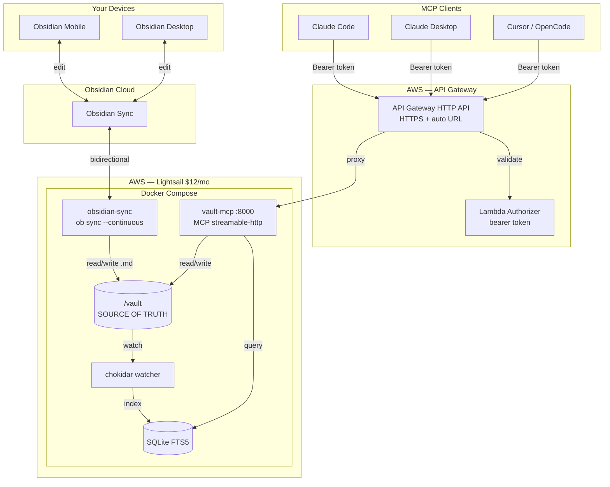

# Architecture

vault-cortex is a remote MCP server that exposes an Obsidian vault over HTTPS
via the Model Context Protocol. Any MCP client — Claude Desktop, Claude Code,
Cursor, OpenCode — can read, write, and search your vault from anywhere.

## User Requirements

| ID  | Requirement                     | Summary                                                                 |
| --- | ------------------------------- | ----------------------------------------------------------------------- |
| R1  | Bidirectional sync              | Obsidian Sync + obsidian-headless. One vault, always current.           |
| R2  | Remote vault read access        | Any MCP client can read any note by path, list notes in any folder.     |
| R3  | Remote vault write access       | Writes sync back to all Obsidian apps automatically via R1.             |
| R4  | Full-text and structured search | SQLite FTS5 — ranked results, filter by tags/type/folder.               |
| R5  | Memory tools                    | Read/append to `About Me/` semantic memory files.                       |
| R6  | Secure remote access            | HTTPS via API Gateway. Bearer token auth. No re-authentication flows.   |
| R7  | Low operational overhead        | Always-on, no manual intervention. ~$12 USD/mo. IaC via SST.           |
| R8  | Extensible for semantic search  | LightRAG plugs into the existing watcher in Phase 2. Not a rewrite.    |

## Component Diagram

## Data Flow

**Read:** MCP client → API Gateway (TLS + auth) → vault-mcp → filesystem or SQLite → response.

**Write:** MCP client → API Gateway → vault-mcp → filesystem write → obsidian-headless detects → Obsidian Sync propagates. Watcher also updates SQLite.

**Sync (from apps):** Obsidian app → Obsidian Sync → obsidian-headless → `/vault/` → watcher → SQLite. Now searchable via MCP.

## Invariant: Vault Is Source of Truth

The vault `.md` files are canonical. SQLite FTS5 is derived — rebuildable from scratch. Never write to the index directly. This extends to Phase 2: LightRAG's graph is also derived.

## MCP Tools

### Vault Read/Write (R2, R3)

| Tool | Input | Annotation |
|------|-------|------------|
| `vault_read_note` | `path` | readOnlyHint |
| `vault_write_note` | `path, content` | destructiveHint |
| `vault_list_notes` | `folder?, glob?` | readOnlyHint |
| `vault_search_notes` | `query, folder?, tags?, type?, limit?` | readOnlyHint |

### Memory (R5)

| Tool | Input | Annotation |
|------|-------|------------|
| `vault_get_memory` | `file?` | readOnlyHint |
| `vault_update_memory` | `file, entry` | destructiveHint |
| `vault_list_memories` | — | readOnlyHint |

## Infrastructure

See `sst.config.ts` for full IaC. Auth is a static bearer token — no Cognito, no JWT, no re-auth.

## Cost

| Component | Phase 1 | Phase 2 |
|-----------|---------|----------|
| Lightsail | $12/mo | $24/mo |
| API Gateway | ~$0 | ~$0 |
| Obsidian Sync | existing | same |
| **Total** | **~$12/mo** | **~$24/mo** |

## Key Decisions

| Decision | Rationale |
|----------|----------|
| Lightsail over ECS | $12 vs ~$50+. Single-user server. |
| API Gateway over Caddy | Free HTTPS URL, no domain needed, SST native. |
| Bearer token over Cognito | No re-auth flows. Set once, works forever. |
| SQLite FTS5 | Zero services, embedded, personal scale. |
| chokidar | Node-native, same process as SQLite. |
| Streamable HTTP | Current MCP spec. SSE is deprecated. |
| GHCR over ECR | GITHUB_TOKEN auth, no AWS IAM for images. |
| Factory over class | Functional style. Closure holds db ref, no `this`. |
