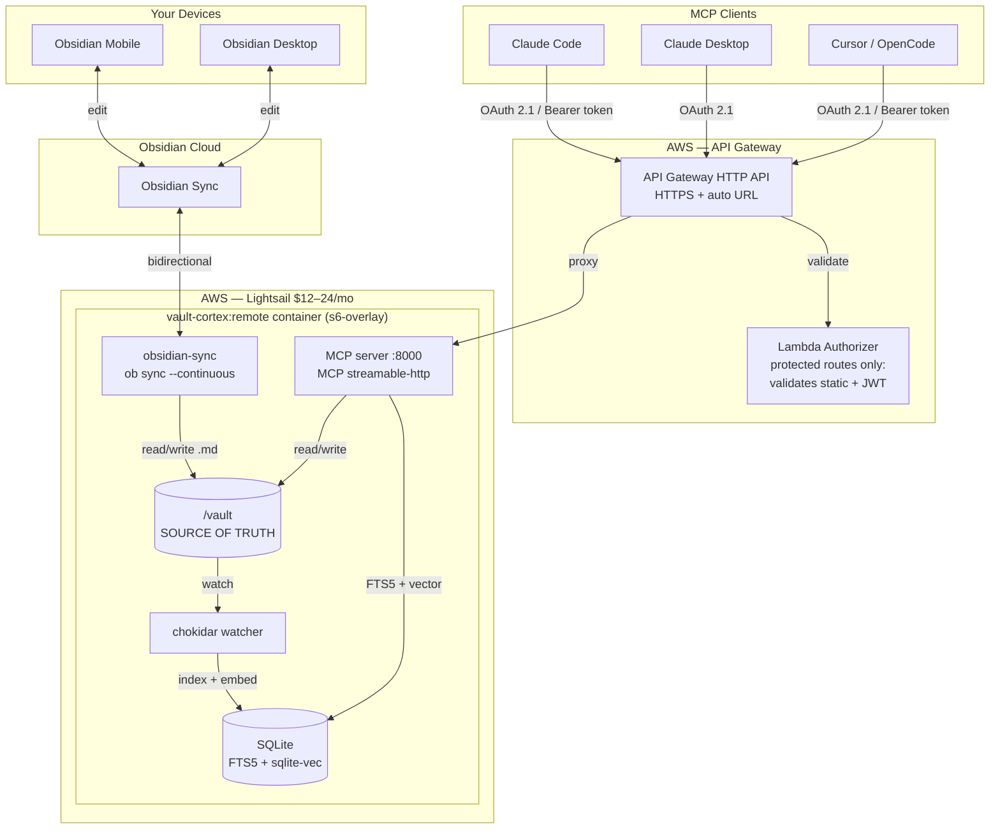
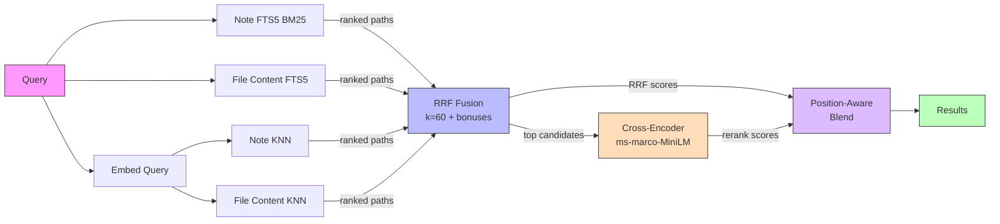
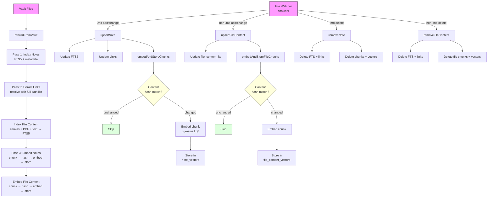
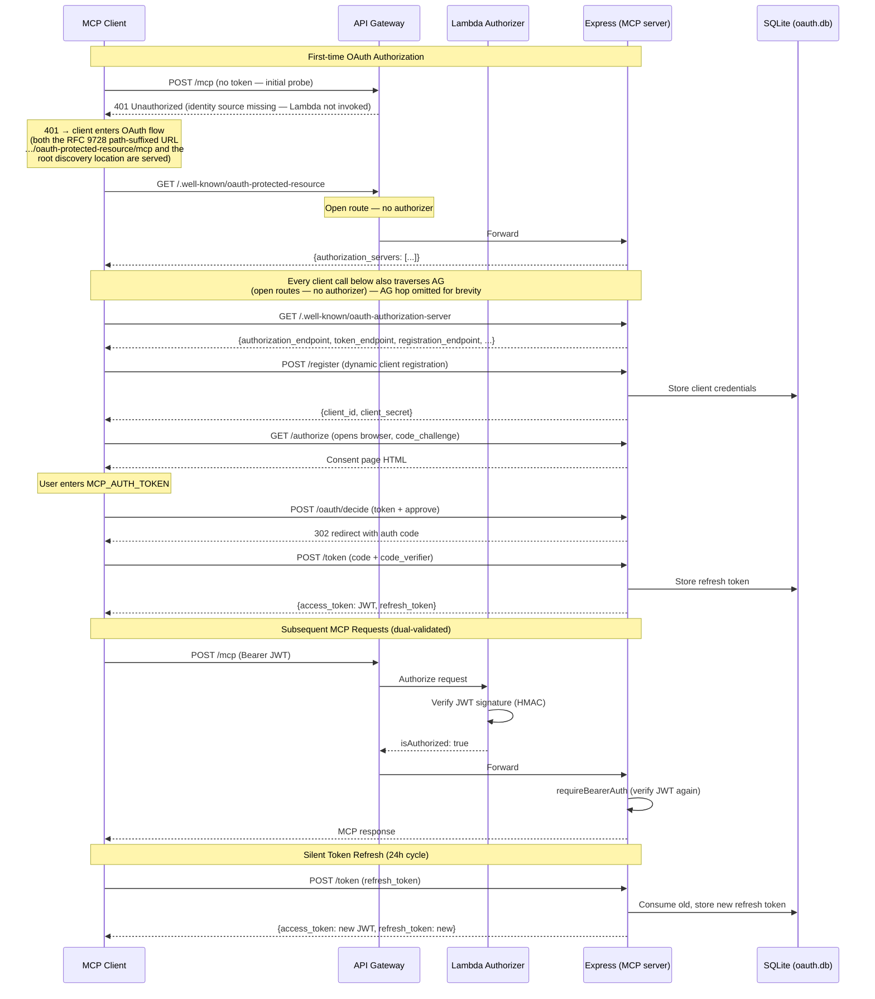
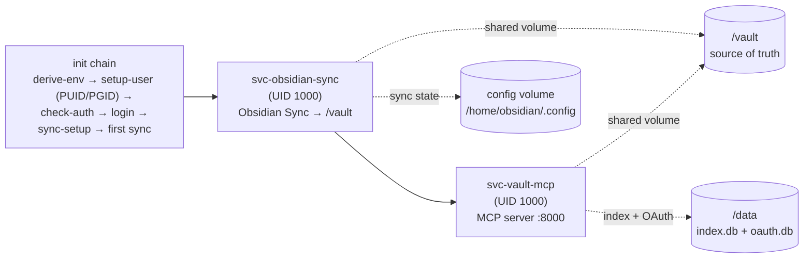

# Architecture

Vault Cortex is a remote MCP server that exposes an Obsidian vault over HTTPS
via the Model Context Protocol. Any MCP client — Claude Desktop, Claude Code,
Cursor, OpenCode — can read, write, and search your vault from anywhere.

## Contents

- [Why This Exists](#why-this-exists)
- [Capabilities](#capabilities)
- [Design Constraints](#design-constraints)
- [Component Diagram](#component-diagram)
- [Data Flow](#data-flow)
- [MCP Tools](#mcp-tools) — [Properties](#property-discovery--daily-notes) · [Memory](#memory) · [Files](#files) · [Tasks](#tasks)
- [MCP Prompts](#mcp-prompts)
- [Hybrid Search](#hybrid-search)
- [Infrastructure](#infrastructure) — [Auth](#auth-oauth-21--defense-in-depth) · [Container Startup](#container-startup) · [Data Integrity](#data-integrity)
- [Cost](#cost)
- [Key Decisions](#key-decisions)

## Why This Exists

Vault Cortex packs the entire vault-to-agent chain into one always-on Docker
container:

- **Docker-based** — works directly with `.md` files on disk; no plugins, and no Obsidian desktop required to be running
- **Remote access** — Obsidian Sync in Docker keeps the vault current; works from your phone, a remote server, or any MCP client
- **MCP spec-compliant** — streamable-http transport, OAuth 2.1

It replaces the typical Obsidian + MCP setup — a local-only chain of three
moving parts: Obsidian running, the Local REST API plugin, and a separate MCP
server wrapping that API.

See the [README](./README.md) for the full value proposition.

Most of this document is deployment-independent. The
[Component Diagram](#component-diagram), [Infrastructure](#infrastructure), and
[Cost](#cost) sections describe the **reference deployment** — the AWS setup
this repo's own IaC provisions (Lightsail + API Gateway via SST, walkthrough in
[`DEPLOY.md`](./DEPLOY.md)) — but Vault Cortex runs anywhere Docker does.

## Capabilities

The MCP surface is **tools + prompts** — model-driven tools plus user-initiated prompt workflows (see [MCP Prompts](#mcp-prompts)). Behind it, capabilities fall into three groups with different availability semantics:

- **Base surface — always on:** vault CRUD (read/write, heading-targeted patching, note moving with link rewriting), FTS5 keyword search, property discovery, daily notes, task queries and mutations, and the link graph.
- **Toggleable feature groups:** the About Me/ memory layer for AI personalization (`MEMORY_ENABLED`) and non-markdown file reading (`FILE_TOOLS_ENABLED`) — images, canvases, PDFs, and data files, each in the form most useful to an agent. Independent opt-outs — either can be disabled without affecting anything else. A third switch cuts across the groups: `READONLY_MODE` hides every vault-writing tool while leaving all reads, search, and indexing untouched. A fourth, `DISABLED_TOOLS`, subtracts individually named tools for finer control.
- **Search enhancement ladder:** unlike the toggles above, each rung builds on the previous. Keyword search → sqlite-vec vector similarity fused via RRF (`EMBEDDING_ENABLED`; local ONNX embeddings, no external API) → cross-encoder reranking with position-aware score blending for intent-heavy queries where keywords and vectors both miss (`RERANK_MODE`). Each step is opt-out with graceful fallback to the one below.

## Design Constraints

The constraints that shaped every decision below:

- **One vault, always current** — the server operates on the same vault your Obsidian apps edit: bind-mounted locally, kept current by bidirectional Obsidian Sync remotely. Writes made over MCP appear in Obsidian and vice versa. No export step, no copy.
- **Design for the Obsidian user** — anything that mirrors an Obsidian concept (links, tags, properties, tasks, daily notes) must match what Obsidian itself does; recognizing a strict subset of Obsidian's behavior is a bug, not a limitation.
- **Personal scale, zero services** — one user's vault, not a multi-tenant platform. Everything runs embedded and in-process: SQLite for the index and OAuth state, ONNX models for embeddings. No external APIs, no second datastore, no per-query cost.
- **Low operational overhead** — always-on with no manual intervention; free to run locally, a modest VPS remotely; infrastructure as code.
- **Secure by default** — the client-facing endpoint is HTTPS, authenticated via OAuth 2.1 or a bearer token; the reference deployment validates every request at two independent layers.
- **Portable** — nothing depends on the author's machine: any Docker host works, and the reference AWS deployment is one option, not a requirement.

## Component Diagram


```mermaid
graph TB
    subgraph devices ["Your Devices"]
        OBS_PHONE["Obsidian Mobile"]
        OBS_LAPTOP["Obsidian Desktop"]
    end

    subgraph cloud ["Obsidian Cloud"]
        SYNC["Obsidian Sync"]
    end

    subgraph apigw_grp ["AWS — API Gateway"]
        APIGW["API Gateway HTTP API<br/>HTTPS + auto URL"]
        AUTH_FN["Lambda Authorizer<br/>protected routes only:<br/>validates static + JWT"]
        APIGW -->|validate| AUTH_FN
    end

    subgraph lightsail ["AWS — Lightsail $12–24/mo"]
        subgraph container ["vault-cortex:remote container (s6-overlay)"]
            OB_HEADLESS["obsidian-sync<br/>ob sync --continuous"]
            VAULT_FS[("/vault<br/>SOURCE OF TRUTH")]
            MCP_SERVER["MCP server :8000<br/>MCP streamable-http"]
            SQLITE[("SQLite\nFTS5 + sqlite-vec")]
            WATCHER["chokidar watcher"]
        end
    end

    subgraph clients ["MCP Clients"]
        CC["Claude Code"]
        CD["Claude Desktop"]
        CU["Cursor / OpenCode"]
    end

    OBS_PHONE <-->|edit| SYNC
    OBS_LAPTOP <-->|edit| SYNC
    SYNC <-->|bidirectional| OB_HEADLESS
    OB_HEADLESS -->|read/write .md| VAULT_FS
    VAULT_FS -->|watch| WATCHER
    WATCHER -->|index + embed| SQLITE
    MCP_SERVER -->|read/write| VAULT_FS
    MCP_SERVER -->|FTS5 + vector| SQLITE
    CC -->|OAuth 2.1 / Bearer token| APIGW
    CD -->|OAuth 2.1| APIGW
    CU -->|OAuth 2.1 / Bearer token| APIGW
    APIGW -->|proxy| MCP_SERVER
```

## Data Flow

**Read:** MCP client → API Gateway (TLS + auth) → MCP server → filesystem or SQLite → response.

**Write:** MCP client → API Gateway → MCP server → filesystem write → the sync service detects → Obsidian Sync propagates. Watcher also updates SQLite index.

**Sync (from apps):** Obsidian app → Obsidian Sync → the sync service → `/vault/` → watcher → SQLite. Now searchable via MCP.

**Hybrid query:** MCP client → `vault_search` → FTS5 BM25 ranks (notes + file content) + sqlite-vec KNN ranks (notes + file content) → RRF fusion → cross-encoder reranking → response.

**Invariant — vault is source of truth:** The vault `.md` files are canonical. SQLite FTS5 is derived — rebuildable from scratch. Never write to the index directly. The sqlite-vec embeddings are equally derived — they persist across rebuilds as an optimization but can always be regenerated from the vault.

## MCP Tools

Common metadata on all discovery tools (`vault_search`, `vault_search_by_tag`, `vault_search_by_folder`, `vault_recent_notes`, `vault_search_by_property`, `vault_find_orphans` — introduced in the subsections below):

- `bytes` — each result's on-disk file size, so agents can decide whether to read a note in full or use `outline`/`heading` mode before committing
- `leading_callout` — the note's top-of-file callout when present (opt-in via `include_leading_callout` on `vault_search`; automatic on the rest)

**Tool gating (registry-driven):** every tool is one entry in a declarative registry (`tool-registry.ts` — name, feature group, MCP annotations), and the served tool set is the registry filtered through one AND-chain of predicates:

1. **Group toggles** — `MEMORY_ENABLED=false` removes the memory group (reads included), `FILE_TOOLS_ENABLED=false` removes the file tools.
2. **Read-only mode** — `READONLY_MODE=true` keeps exactly the tools whose own `readOnlyHint` annotation says they don't write; write tools are never advertised to clients rather than rejected at call time. The `memory-review` prompt follows its write tool, and the memory bootstrap is skipped.
3. **Per-tool disabling** — `DISABLED_TOOLS` subtracts individually named tools. Purely subtractive: it cannot re-enable a tool an earlier predicate removed. Unknown names fail the boot (a typo that silently disabled nothing would mislead the operator).

Group modules register through a gated wrapper that skips disabled names and injects each tool's annotations from the registry — annotations are declared once, and a new gating axis is one new predicate, not new branching in every module. Availability-keyed cross-references in tool descriptions and prompts disappear whenever their target does; a small number of durable API-level references (e.g. error-section alternatives naming sibling tools) remain. Search, indexing, and the file watcher are unaffected by `READONLY_MODE` and `DISABLED_TOOLS` — they write to the index database outside the vault, not to the vault itself.

### Vault read/write

| Tool                      | Input                                                                             | Annotation       |
| ------------------------- | --------------------------------------------------------------------------------- | ---------------- |
| `vault_read_note`         | `path, properties_only?, outline?, heading?, heading_level?, start_line?, limit?` | readOnlyHint     |
| `vault_write_note`        | `path, body, properties?, overwrite?`                                             | destructiveHint  |
| `vault_patch_note`        | `path, operation, content, heading?, heading_level?, include_children?`           | destructiveHint  |
| `vault_replace_in_note`   | `path, old_text, new_text, replace_all_occurrences?`                              | destructiveHint  |
| `vault_delete_span`       | `path, start_anchor, end_anchor?, first_match?`                                   | destructiveHint  |
| `vault_replace_span`      | `path, start_anchor, end_anchor?, content, first_match?`                          | destructiveHint  |
| `vault_insert_at_anchor`  | `path, anchor, position, content, first_match?`                                   | !destructiveHint |
| `vault_list_notes`        | `folder?, glob?`                                                                  | readOnlyHint     |
| `vault_delete_note`       | `path, prune_empty_folders?`                                                      | destructiveHint  |
| `vault_move_note`         | `old_path, new_path, prune_empty_folders?`                                        | destructiveHint  |
| `vault_update_properties` | `path, properties`                                                                | destructiveHint  |

`vault_read_note` returns full content by default; optional `properties_only`, `outline`, or `heading` (with `heading_level` to disambiguate) modes return just the properties, the structure, or a single section — cheap partial reads for large notes. `outline` returns an object `{ leading_callout?, leading_content?, headings }` — the heading tree, any top-of-file callout (a `> [!type]` block), and any remaining body text above the first heading (the callout's own lines excluded, so the two never overlap). `start_line` and `limit` page the delivered rendition (full body or a heading section) by line range — the same idiom as `vault_read_file` paging; not available for JSON modes (outline, properties_only).

The edit tools differ in how they locate the lines they change — by heading, by exact text, or by a short anchor substring:

- **`vault_patch_note`** — heading-targeted, with an optional file-level mode. Four operations: `append`, `prepend`, `replace`, `insert_before`. A no-heading `prepend` whose content starts with a heading reports back when it nested pre-existing leading content inside that heading.
- **`vault_replace_in_note`** — exact-text find-and-replace in the note body.
- **`vault_delete_span`** — anchor-targeted; removes the matched span of whole lines.
- **`vault_replace_span`** — anchor-targeted; swaps the matched span for new content.
- **`vault_insert_at_anchor`** — anchor-targeted; inserts content before or after the anchor line without removing it.

The three anchor tools share one resolution rule: a short, case-sensitive substring locates a full line, ambiguity is an error, and `first_match` takes the first match instead.

`vault_delete_note` refuses paths under protected folders as a server-side guardrail. The default protected set is the memory dir plus the daily notes folder, read at operation time from `DAILY_NOTES_FOLDER` or `.obsidian/daily-notes.json` (default `Daily Notes`). `PROTECTED_PATHS` overrides the default entirely. Use `vault_delete_memory` for individual entries in memory files. `vault_update_properties` merges properties without touching the body — sets new keys, overwrites matching keys, deletes keys set to `null`.

`vault_move_note` moves or renames a note and rewrites every link across the vault that resolves to it, mirroring Obsidian's built-in rename:

- **Every link form:** wikilinks (including aliases, heading anchors, and embeds), markdown links, and frontmatter links, resolved with the same logic as the link-graph tools
- **Minimal rewrites:** a link is rewritten only when leaving it unchanged would break it
- **Guardrails:** refuses to overwrite an existing destination, and blocks moves out of or into `PROTECTED_PATHS`

Both `vault_delete_note` and `vault_move_note` support `prune_empty_folders` to clean up parent directories left empty by the operation.

### Search

| Tool                     | Input                        | Annotation   |
| ------------------------ | ---------------------------- | ------------ |
| `vault_search`           | `query, filters?`            | readOnlyHint |
| `vault_search_by_tag`    | `tag, exact?`                | readOnlyHint |
| `vault_search_by_folder` | `folder, recursive?, limit?` | readOnlyHint |
| `vault_list_tags`        | —                            | readOnlyHint |
| `vault_recent_notes`     | `sort_by?, limit?`           | readOnlyHint |

`vault_search` is the entry point to the full hybrid ranking pipeline — keyword, vector, and cross-encoder reranking — described in [Hybrid Search](#hybrid-search).

`filters` narrows results:

- `folder`, `tags`, `related`, `type`, and `properties` (arbitrary frontmatter keys)
- `created` / `modified` — date bounds `{ before, on, after }` in YYYY-MM-DD, both server-local (before/after exclusive, on exact). `created` matches the frontmatter created day and never matches notes without a parseable value for the property; `modified` matches the filesystem-mtime day
- `limit`, `snippet_tokens`, and `include_leading_callout` (opt-in; adds each result's top-of-file callout)

`vault_recent_notes` sorts by `sort_by` — `"created"` or `"modified"` (default `"modified"`).

### Property discovery + daily notes

| Tool                         | Input                         | Annotation   |
| ---------------------------- | ----------------------------- | ------------ |
| `vault_get_daily_note`       | `date?`                       | readOnlyHint |
| `vault_list_property_keys`   | `folder?`                     | readOnlyHint |
| `vault_list_property_values` | `key, folder?, limit?`        | readOnlyHint |
| `vault_search_by_property`   | `key, value, folder?, limit?` | readOnlyHint |

**Promoted properties:** Five frontmatter keys — `title`, `tags`, `type`, `created`, `related` — get dedicated columns in the `notes` table for direct `WHERE`-clause filtering (no `json_extract` needed). In tool responses, these appear as top-level fields; remaining frontmatter keys are returned under `additional_properties` (via `formatNoteMetadata` in `tool-helpers.ts`). All other properties live in a JSON `properties` column, queryable via `json_extract` — functional for any schema, but without dedicated columns. Array values are unpacked via `json_each`, so scalar and list properties both match.

**Daily notes:** `vault_get_daily_note` resolves the vault's folder and date format, each independently: `DAILY_NOTES_FOLDER`/`DAILY_NOTES_FORMAT` env setting → `.obsidian/daily-notes.json` → fallback (`Daily Notes/YYYY-MM-DD.md`). Only a successful config-file read is cached — a missing or malformed file is re-read on the next call, so a config file that arrives after boot is picked up without a restart. `task-format-config.ts` uses the same cache rule.

### Memory

| Tool                      | Input                            | Annotation       |
| ------------------------- | -------------------------------- | ---------------- |
| `vault_get_memory`        | `file?, section?`                | readOnlyHint     |
| `vault_update_memory`     | `file, section, entry, options?` | !destructiveHint |
| `vault_delete_memory`     | `file, section, date, entry`     | destructiveHint  |
| `vault_list_memory_files` | —                                | readOnlyHint     |
| `vault_memory_recall`     | `query, file?, max_results?`     | readOnlyHint     |

**Entry-granular recall:** `vault_memory_recall` retrieves individual dated
entries — the granularity the other layers miss (`vault_get_memory` returns
whole files/sections; `vault_search` is note-granular).

**Indexing:**

- A pure entry parser (`obsidian-markdown/memory-entries.ts`) feeds dedicated
  index tables: `memory_entries` + FTS, plus `memory_entry_vectors` when
  embeddings are enabled
- Embedding and cross-encoder input include the file name as a prefix
  (`"Agents > Communication\n..."`) so queries like "how agents communicate"
  match the structural context, not just entry text
- Entries reconcile by content-hash identity, not position — a newest-first
  append re-embeds exactly one entry

**Query pipeline:**

1. **Retrieve** — union all lexical matches with the vector top-100, fuse by RRF
2. **Cut** — adaptive cross-encoder relevance floor: 10% of the best score,
   clamped between a 0.001 sanity floor and a 0.05 ceiling. Lexical hits always
   survive the cut
3. **Fallbacks** — degrades to a distance-margin cut without the reranker, and
   lexical-only without vectors. An empty result retries with any-term (OR)
   keyword matching (stopwords dropped) before giving up
4. **Output** — ascending by date; truncation drops the least-relevant entries,
   never a date end

**Auto-initialization:** A two-layer bootstrap — startup seeds the default structure, write-time handles growth beyond it:

- **Startup:** if the memory folder (default: `About Me/`) doesn't exist, the server creates it with template files (Me.md, Opinions.md, Principles.md, Routines.md, Agents.md), each opening with a `> [!info] Scope of this file` callout so agents discover a ready, self-documenting structure.
- **Write-time:** `vault_update_memory` auto-creates files and sections on write — agents can save preferences without manual setup; a newly-created file is seeded with a placeholder scope callout to fill in.

**Opt-out:** The memory layer is opt-out: set `MEMORY_ENABLED=false` to hide all memory tools and prompts, skip auto-initialization, and strip memory references from server metadata. `READONLY_MODE=true` also skips auto-initialization (no vault writes at startup). The vault CRUD and search layers continue to work normally.

### Link queries

| Tool                       | Input                      | Annotation   |
| -------------------------- | -------------------------- | ------------ |
| `vault_get_backlinks`      | `path`                     | readOnlyHint |
| `vault_get_outgoing_links` | `path`                     | readOnlyHint |
| `vault_find_orphans`       | `exclude_folders?, limit?` | readOnlyHint |

Link queries use a `links` table populated during indexing:

- **Sources:** `[[wikilink]]` and `[text](target)` / `` markdown links in the note body (fence-aware parsing skips code blocks), plus `[[wikilink]]`s in frontmatter property values (e.g. `related:`). Canvas `file`-type node references are also extracted as links — text-node `[[wikilink]]`s are not (matching Obsidian's behavior). Markdown links to any vault target — notes (`.md`), images, PDFs, extensionless paths — are recognized; external URLs are excluded by URI-scheme detection.
- **Resolution:** Each target is resolved against all known note paths covering Obsidian's three "New link format" modes:
  1. Exact vault-relative path (path from vault folder)
  2. Path relative to the linking note (path from current file, including upward `../`)
  3. Basename (shortest-path-first for ambiguous basenames)
- **Non-markdown files:** Targets that don't resolve to a note are checked against a `non_md_files` table (populated during rebuild, maintained by the file watcher). Both wikilinks and markdown-style links to `.canvas`, `.base`, images, PDFs, and other non-markdown files resolve as `kind: "file"` instead of being counted as broken.
- **Outgoing links:** `vault_get_outgoing_links` returns a `kind` discriminator (`"note"` or `"file"`) plus each target's byte size (`bytes` — from the notes table for notes, from `non_md_files` for files), so clients can route notes to `vault_read_note` and files to `vault_read_file` with size awareness.
- **Orphans:** `vault_find_orphans` excludes folders listed in `ORPHAN_EXCLUDE_FOLDERS` (default: the daily notes folder — `DAILY_NOTES_FOLDER` or `Daily Notes` — plus `Templates` and the memory dir).

### Files

| Tool               | Input                             | Annotation   |
| ------------------ | --------------------------------- | ------------ |
| `vault_read_file`  | `path, raw?, start_line?, limit?` | readOnlyHint |
| `vault_list_files` | `folder?, extensions?, limit?`    | readOnlyHint |

`vault_read_file` reads non-markdown vault files, dispatching on extension to the most useful representation per type:

1. **Images** (`.png`/`.jpg`/`.jpeg`/`.gif`/`.webp`) return an MCP `image` content block plus a one-line metadata text block. A shared fit-to-byte-budget pipeline (`utils/fit-image-to-byte-budget.ts`, built on sharp) makes oversized images deliverable: EXIF auto-orient → resize long edge to ≤1568px → walk a fixed quality ladder (JPEG via mozjpeg for opaque images, WebP for alpha — PNG has no quality knob) → shrink dimensions by √(budget/actual) if the ladder floor still exceeds the budget. Deterministic and terminating (bounded attempts, 64px floor); sharp's default `limitInputPixels` stays active as the decompression-bomb guard. The budget (`MAX_IMAGE_OUTPUT_BYTES`, default 48 KiB binary) is sized for the tightest mainstream client cap.
2. **Canvas** (`.canvas`) linearizes to markdown via the pure `obsidian-markdown/canvas.ts` parser ([JSON Canvas 1.0](https://jsoncanvas.org)): group membership by spatial rect containment (innermost group wins; equal rects tiebreak deterministically by id), nodes in reading order (y, then x), and an edge list with node ids resolved to display names. Lenient parsing — unknown properties ignored, malformed entries skipped. `raw: true` skips the linearizer and returns the JSON source verbatim for full structural fidelity. Canvas content is also FTS-indexed (linearized text in `file_content` + `file_content_fts` tables, gated behind `FILE_TOOLS_ENABLED`) so canvas files appear in `vault_search` results with `kind: "file"`. Canvas `file`-type node references are extracted unconditionally into the `links` table for graph queries regardless of the feature gate.
3. **Text formats** (`.svg`/`.json`/`.txt`/`.csv`/`.xml`/`.log`/`.yaml`/`.yml`/`.base`) pass through verbatim as text, capped at a fixed 100 KiB output size (explicit error over silent truncation). `start_line`/`limit` page any text result — passthrough formats, canvas renditions, PDF-extracted text — as a 1-based line window preceded by a window-metadata block stating the range, total line count, and next `start_line`; the cap applies to the window, and an unpaged read stays byte-exact.
4. **PDFs** (`.pdf`) return structured markdown reconstructed from layout-aware extraction (`unpdf`, based on Mozilla's PDF.js):
   - A document metadata header (title, page count, link count)
   - Heading hierarchy inferred from font sizes relative to the dominant
     body size (the size carrying the most text) — only sizes larger than
     body become headings
   - Fenced code blocks for fully-monospace lines — with leading indentation
     reconstructed from glyph positions — and inline code spans for monospace
     runs inside mixed lines
   - Page separators and a deduplicated links footer

   `raw: true` switches to page-image mode: each page is rendered at 2× scale via `unpdf`'s `renderPageAsImage` with `@napi-rs/canvas` (prebuilt Skia, no system deps), then fitted through the same byte-budget pipeline as regular images. The total image budget is divided evenly across rendered pages (capped at `MAX_PDF_RENDER_PAGES`, default 5). Scanned or image-only PDFs with no extractable text work in raw mode — the model's own vision handles recognition.

   **Why text works without system fonts:** every PDF read goes through `obsidian-markdown/pdf-engine.ts`, which swaps unpdf's bundled edge build for the `pdfjs-dist` legacy Node build and creates document proxies with `disableFontFace` + bundled standard fonts + cMaps. Glyphs render from font data (embedded or bundled), never from host system fonts, so text survives in the fontless container. Without this, unpdf's defaults silently degrade to system-font rendering, which drops all text glyphs where no fonts exist while vector graphics still draw.

5. **Unknown types** return an error naming the readable set.

The extension-to-representation routing above is implemented by the `vault-operations/asset-operations.ts` use-case. Beneath it, every read goes through `vaultFs.readAsset`, which applies the same `resolveSafePath` traversal + hidden-path guards as notes, rejects `.md` paths (notes belong to `vault_read_note`), and enforces a stat-before-read size cap (`MAX_FILE_BYTES`, default 50 MiB).

`vault_list_files` is the discovery surface (also `vault-operations/asset-operations.ts`): a filesystem walk (`vaultFs.listAssets` — filesystem truth, deliberately not the index), folder and case-insensitive extension filters, per-extension counts computed over the full filtered set, and byte sizes statted only for the returned slice. Canvas, PDF, and text files (.txt, .csv, .json, .xml, .svg, .log, .yaml, .yml, .base) are indexed for full-text search in the `file_content` + `file_content_fts` tables — see Canvas entry above for the canvas-specific link graph integration. PDF text is extracted via `obsidian-markdown/pdf.ts` (structured markdown reconstruction) — this works on PDFs with embedded text content; scanned or image-only PDFs produce no indexable text and are silently skipped. Text files are indexed as raw UTF-8 content. Content exceeding 100 KiB is truncated before FTS insertion.

**Opt-out:** File tools are opt-out: set `FILE_TOOLS_ENABLED=false` to hide `vault_read_file` and `vault_list_files`, and strip file tool references from server metadata and other tool descriptions. The `vault_get_outgoing_links` tool continues to report file links (it indexes from the links table, not the file tools). File config vars (`MAX_FILE_BYTES`, `MAX_IMAGE_OUTPUT_BYTES`, `MAX_PDF_RENDER_PAGES`) are still parsed when disabled.

### Tasks

| Tool                | Input                                                                                                                                                                     | Annotation       |
| ------------------- | ------------------------------------------------------------------------------------------------------------------------------------------------------------------------- | ---------------- |
| `vault_list_tasks`  | `status?, due?, scheduled?, start?, created?, done?, cancelled?, priority?, folder?, tag?, heading?, path?, top_level_only?, sort_by?, sort_direction?, limit?`           | readOnlyHint     |
| `vault_create_task` | `path, description, block_id, heading?, parent_block_id?, parent_line?, priority?, due?, scheduled?, start?, task_id?, depends_on?, subtasks?, format?`                   | !destructiveHint |
| `vault_update_task` | `path, block_id?, line?, status?, priority?, description?, due?, scheduled?, start?, created?, task_id?, depends_on?, add_subtasks?, assign_block_id?, heading?, format?` | destructiveHint  |

A `tasks` table in the same SQLite database stores every checkbox task line, parsed by the pure `obsidian-markdown/tasks.ts` grammar — a reimplementation of the [Tasks plugin](https://publish.obsidian.md/tasks/)'s own parser:

- **Right-to-left signifier stripping** — status, all six dates, priority, recurrence, dependencies, inline tags, block IDs.
- **Both formats in one pass** — emoji and [Dataview](https://blacksmithgu.github.io/obsidian-dataview/) inline fields are recognized together (the plugin reads one configured format per vault), so mixed-format vaults index uniformly.
- **Fences and comments skipped** — task lines inside fenced code blocks and `%% %%` comments are ignored; the parser threads the same fence and comment state machines as heading and link extraction (`lines.ts`).
- **Sub-task depth** — an indent stack during extraction gives each task a `depth` (0 for top-level, 1+ for sub-tasks) and a `parent_block_id` (the parent's block_id, when it has one). Blockquote markers are stripped before measuring indent; a plain list item at a task's indent closes that task's sub-task scope (a task nested under a non-task bullet is top-level); depth resets at heading boundaries.

Each row carries its attribution — note path, full parent folder, 1-based file line number, and the nearest heading when the task sits under one (the Kanban lane on a board) — so no follow-up reads are needed to locate a task. Rows are replaced per note inside `upsertNote`, deleted in `removeNote`, and wiped on rebuild — the same lifecycle as the FTS rows.

`vault_list_tasks` queries the table with structured filters and sort keys:

- **Filters** — status; six date fields (due, scheduled, start, created, done, cancelled), each with before/on/after bounds; priority; folder, tag, heading, and path scoping; `top_level_only`, which excludes sub-tasks from board reads.
- **Sort keys** — `due`, `scheduled`, `start`, `created`, `done`, `priority`, `note_mtime`, `position`.

Three design choices shape the query surface:

- **Array params for status and heading** — both accept `string | string[]`, OR-combined. This collapses multi-lane Kanban queries (e.g. Active + Up Next + Waiting On) into a single call instead of N sequential reads.
- **Date cascade sorting** — when the primary sort date is absent on a task, actionable date sorts fall back through the remaining fields in urgency order (due → scheduled → start → created), each using its own natural direction. (`done`, a terminal-state date, stands alone.) Tasks with sparse dates sort usably instead of clustering at the end.
- **Kanban awareness** — each task carries an `is_kanban_task` flag, derived via `json_extract` on the parent note's `kanban-plugin` frontmatter (no schema changes). When true, `heading` carries the lane name, and `sort_by: "position"` (file path then line number) preserves the board's card arrangement as the sort order. A `done_lanes` field (populated at index time by scanning for the Kanban plugin's `**Complete**` marker between headings and list items) tells agents which lane(s) represent task completion.

`vault_create_task` builds a task line (description, priority, dates, `task_id`, `depends_on`, `block_id`) plus optional checklist sub-item lines. The line builder is a pure string transform in `obsidian-markdown/tasks.ts`; the I/O orchestration lives in `vault-operations/task-mutations.ts`:

- **Field ordering is guaranteed** — description → priority → ➕ created → 🛫 start → ⏳ scheduled → 📅 due → 🆔 task_id → ⛔ depends_on → ^block_id.
- **Always `[ ]`** — creating a task is not starting it.
- **Placement** — a heading (required on Kanban boards), a parent task (for sub-tasks; mutually exclusive with a heading), or end-of-body.

`vault_update_task` applies status, priority, description, dates, task_id, depends_on, block_id assignment, heading moves, and sub-task additions in one atomic read-modify-write under one exclusive file lock:

- **Mutations compose** — every field passed is applied in the same write cycle; clearing a field is always an explicit `null`.
- **Line splitting follows the parser** — the description is everything before the metadata tail, and a signifier only opens the tail when everything after it parses as fields (a priority emoji used as prose stays in the description). Description edits, priority changes, and the returned `description` all use that boundary.
- **Status** — toggles the checkbox character and stamps or strips done/cancelled dates. `status: "done"` on a top-level Kanban task without an explicit `heading` auto-detects the done lane.
- **Dates** — set or clear due, scheduled, start, and created at their position in the field ordering.
- **Heading moves** — `heading` moves the task and its indented sub-items to another section; on a Kanban board that is a lane move, but any note with headings works. A sub-task (depth > 0) never moves: an explicit `heading` is rejected, and `status: "done"` changes its checkbox in place.
- **`add_subtasks`** — appends checklist items under the task's existing ones.

## MCP Prompts

Alongside tools, the server registers MCP **prompts** (`prompts/list` / `prompts/get`) — user-initiated workflows, distinct from the model-driven tools:

- **Registration:** mirrors the tools pattern — `prompt-definitions.ts` orchestrates group modules under `mcp-core/prompts/`, called per session in `mcp-router.ts`.
- **Client surfacing:** varies by client — a **+** menu (Claude Desktop), slash commands (Claude Code), or similar (OpenCode, Zed); some clients (Cursor, Windsurf) currently expose tools only.
- **No drift by construction:** handlers assemble live vault content at invocation time over the same data layer the tools use — live content plus thin, durable instruction, never an embedded procedure that can go stale.

| Prompt              | Arguments             | Purpose                                                                                                                                                                                                                                                                                                                                       |
| ------------------- | --------------------- | --------------------------------------------------------------------------------------------------------------------------------------------------------------------------------------------------------------------------------------------------------------------------------------------------------------------------------------------- |
| `vault-orientation` | —                     | Vault stats, folder note counts, property adoption rates, orphan detection, broken link count, tags, recent notes, memory outline, and contextual tool suggestions. Uses `findOrphans`, `brokenLinkCount`, `vaultStats` alongside the existing tag/property/recent queries.                                                                   |
| `memory-review`     | `file?`, `max_chars?` | Structural overview (scope callouts from `listMemoryFiles`, section entry counts) + dated content as a timeline. Guided reflection: evolution narrative, scope-fit against declared scopes, backfill gaps, coverage analysis. Append-only by design.                                                                                          |
| `daily-review`      | `date?`, `max_chars?` | Reconciles a day — daily note content + outgoing links (via `getOutgoingLinks`, with broken-link flags) + backlinks (via `getBacklinks`) + date-specific activity (via `modifiedOnDate`) + vault-wide task status (due/overdue, scheduled, daily-note-scoped via `listTasks`). Surfaces what happened, what's open, and what needs follow-up. |

- **Handlers degrade, never throw** — a failure returns a valid fallback message; a prompt never hard-fails the client.
- **`memory-review` reads the layer as a timeline** — each dated entry was true when written, never "newest supersedes older," and no pruning of "stale" entries. The one exception: a memory file declaring `entry-policy: living` (a current-state snapshot, e.g. the Routines template) may have expired entries proposed for pruning; `vault_list_memory_files` surfaces the policy as `entry_policy`.
- **`daily-review` uses `modifiedOnDate`, not `recentNotes`** — past-date reviews show activity from _that_ date, not today's globally recent notes.

## Hybrid Search

`vault_search` combines FTS5 keyword results with sqlite-vec vector similarity using [Reciprocal Rank Fusion](https://github.com/tobi/qmd#score-normalization--fusion) (RRF), refined by a cross-encoder reranker. All models run in-process — no external API, fully rebuildable from vault files.

| Component      | Model                                                                                    | Download | Query latency          | Peak memory |
| -------------- | ---------------------------------------------------------------------------------------- | -------- | ---------------------- | ----------- |
| **Embedding**  | [bge-small-en-v1.5](https://huggingface.co/Xenova/bge-small-en-v1.5) (33M, q8)           | ~25MB    | ~8ms                   | ~200MB      |
| **Reranker**   | [ms-marco-MiniLM-L-6-v2](https://huggingface.co/Xenova/ms-marco-MiniLM-L-6-v2) (22M, q8) | ~20MB    | ~200ms (20 candidates) | ~100MB      |
| **Vector KNN** | sqlite-vec (brute-force)                                                                 | in DB    | <1ms                   | negligible  |
| **RRF fusion** | application-layer                                                                        | —        | <1ms                   | negligible  |

Both models lazy-load on first use (~1–2s cold start each, cached after). Total disk: ~45MB. Total peak memory: ~300MB above baseline. Opt-out: `EMBEDDING_ENABLED=false` disables both models; `RERANK_MODE=none` keeps vectors but skips the cross-encoder.

### Query fusion

`vault_search` calls `hybridSearch`, which runs up to four ranked retrieval legs and merges results via RRF. The flow:

1. **Note FTS5** keyword search (synchronous, `fullTextSearch`)
2. **File content FTS5** — linearized canvas, extracted PDF text, plain text files (skipped when note-specific filters are active)
3. **Note vector search** — embed the query → sqlite-vec KNN over `note_vectors` → deduplicate to best chunk per note
4. **File content vector search** — same query embedding → KNN over `file_content_vectors` → deduplicate to best chunk per file (same skip condition as step 2)
5. RRF fusion (`computeRrfScores`): score = Σ(1/(k+rank)) across all available lists, k=60, with top-rank bonuses (+0.05 rank 1, +0.02 ranks 2–3)
6. Build merged results: FTS results keep their metadata and snippet (score replaced with RRF score); vector-only results get metadata from their respective tables and a snippet from their best-matching chunk text
7. Apply user filters (folder, tags, type, related, properties, created, modified) to vector-only note results — FTS results are already filtered via SQL

A `folder` filter is applied inside SQL on all four legs — a `LIKE 'folder/%'` predicate on the FTS queries and a `chunk_id IN (…)` pre-filter on the KNN queries — so each leg's candidate window is drawn from the folder itself rather than filtered down from a vault-wide top-k. Folder matching is case-insensitive on every leg.

### Cross-encoder reranking

After RRF fusion, the cross-encoder model from the component table above rescores the top candidates by evaluating each (query, document) pair jointly — unlike the bi-encoder, it captures query-document interaction and distinguishes intent ("how I feel about") from topic ("uses of"). Results are reordered via position-aware score blending (inspired by [qmd](https://github.com/tobi/qmd)):

- **Ranks 1–3:** 75% RRF / 25% reranker — protect strong retrieval hits
- **Ranks 4–10:** 50% / 50% — even blend in the middle
- **Ranks 11+:** 40% RRF / 60% reranker — let the reranker rescue demoted results

Both scores are min-max normalized to [0, 1] before blending. Controlled by `RERANK_MODE` (default: `blended`; set `none` to skip reranking for ~200ms lower latency). Reranker failure is non-fatal — the pipeline falls back to RRF-only ordering with a warning log.

**Hybrid query flow:**


```mermaid
flowchart LR
    Q[Query] --> NoteFTS[Note FTS5 BM25]
    Q --> FileFTS[File Content FTS5]
    Q --> EMB[Embed Query]
    EMB --> NoteKNN[Note KNN]
    EMB --> FileKNN[File Content KNN]
    NoteFTS --> |ranked paths| RRF[RRF Fusion\nk=60 + bonuses]
    FileFTS --> |ranked paths| RRF
    NoteKNN --> |ranked paths| RRF
    FileKNN --> |ranked paths| RRF
    RRF --> |top candidates| CE[Cross-Encoder\nms-marco-MiniLM]
    RRF --> |RRF scores| BL[Position-Aware\nBlend]
    CE --> |rerank scores| BL
    BL --> R[Results]

    style Q fill:#f9f,stroke:#333
    style RRF fill:#bbf,stroke:#333
    style CE fill:#fdb,stroke:#333
    style BL fill:#dbf,stroke:#333
    style R fill:#bfb,stroke:#333
```

### Graceful fallback

When no embedder is configured (`EMBEDDING_ENABLED=false`), no vectors are indexed yet (startup), or both vector searches return empty, `hybridSearch` returns FTS-only results silently. The response includes `search_mode: "hybrid" | "fts"` and `reranked: boolean` so clients know which ranking produced the scores. The tool description is also conditional — hybrid-aware when embeddings are enabled, keyword-only when disabled.

### Indexing

**Indexing flow:** `rebuildFromVault` runs three passes, then returns so the server can start accepting requests:

1. **Pass 1** — index notes (FTS5 + metadata)
2. **Pass 2** — extract links (with the complete path list for resolution), then index file content (canvas, PDF, text → FTS5)
3. **Pass 3 (background)** — embed notes, then file content. Search works with FTS-only until vectors are ready

Vector tables persist across restarts and rebuilds (only FTS, notes, links, tasks, non-md, and file content tables are cleared). Pass 3 cleans up vectors for deleted notes and files, then embeds only new or modified chunks via content-hash gating.

**Incremental updates:** the file watcher calls `embedNote` after `upsertNote` and `embedFileContent` after `upsertFileContent`; deletion cleans up both vectors and chunks.

**Embedding pipeline:** Controlled by `EMBEDDING_ENABLED` (default: `true`). Notes are chunked via heading-aware splitting (`chunker.ts`) with paragraph sub-splitting for oversized sections (MAX_CHUNK_TOKENS = 450). Markdown syntax is stripped before embedding (`plaintext.ts`). Each chunk is prefixed with the note title for context. Content-hash gating (SHA-256 per chunk) skips re-embedding unchanged content on both incremental file-watcher updates and full rebuilds.

**Vector schema:** Four tables in the same SQLite database as FTS5 (which also holds the `tasks` table — see [Tasks](#tasks)):

- `note_chunks`: stores chunk text, position index, and content hash per note
- `note_vectors` (vec0): stores 384-dim Float32 embeddings keyed by chunk ID
- `file_content_chunks`: stores chunk text, position index, and content hash per non-markdown file (canvas, PDF, text)
- `file_content_vectors` (vec0): stores 384-dim Float32 embeddings keyed by chunk ID

**New-directory rescan:** chokidar handles a newly-appeared directory in two steps: first it scans the directory's contents, then it registers the directory's `fs.watch`. A file created between the scan and the registration is silently lost ([chokidar#1471](https://github.com/paulmillr/chokidar/issues/1471)) — the scan didn't see it, and no watch existed to catch the event. The server's atomic write into a freshly created folder can hit exactly that window, leaving the note invisible to search. As a safety net, the watcher schedules a one-shot rescan of every new directory, delayed to twice chokidar's write-stability threshold (`awaitWriteFinish`, 2 s — a 4 s delay) so in-flight writes settle first. The rescan:

- lists the directory recursively (symlinked directories included) and skips everything chokidar already tracks
- indexes each settled file chokidar missed, and registers every missed entry with `watcher.add()` so future events fire for it
- leaves any file still mid-write for the `awaitWriteFinish` gate to index once it settles, retrying itself only where no watch exists yet

**Indexing pipeline (startup + incremental):**


```mermaid
flowchart TD
    VF[Vault Files] --> RB[rebuildFromVault]
    RB --> P1[Pass 1: Index Notes\nFTS5 + metadata]
    P1 --> P2[Pass 2: Extract Links\nresolve with full path list]
    P2 --> FC[Index File Content\ncanvas + PDF + text → FTS5]
    FC --> P3[Pass 3: Embed Notes\nchunk → hash → embed → store]
    P3 --> P3F[Embed File Content\nchunk → hash → embed → store]

    FW[File Watcher\nchokidar] --> |.md add/change| UP[upsertNote]
    UP --> FTS[Update FTS5]
    UP --> LK[Update Links]
    UP --> EM[embedAndStoreChunks]
    EM --> CH{Content\nhash match?}
    CH --> |unchanged| SK[Skip]
    CH --> |changed| EMB[Embed chunk\nbge-small q8]
    EMB --> VEC[Store in\nnote_vectors]

    FW --> |non-.md add/change| UFC[upsertFileContent]
    UFC --> FFTS[Update file_content_fts]
    UFC --> EFC[embedAndStoreFileChunks]
    EFC --> FCH{Content\nhash match?}
    FCH --> |unchanged| FSK[Skip]
    FCH --> |changed| FEMB[Embed chunk]
    FEMB --> FVEC[Store in\nfile_content_vectors]

    FW --> |.md delete| RM[removeNote]
    RM --> D1[Delete FTS + links]
    RM --> D2[Delete chunks + vectors]

    FW --> |non-.md delete| RMF[removeFileContent]
    RMF --> FD1[Delete FTS + links]
    RMF --> FD2[Delete file chunks + vectors]

    style VF fill:#f9f,stroke:#333
    style FW fill:#f9f,stroke:#333
    style CH fill:#ffd,stroke:#333
    style FCH fill:#ffd,stroke:#333
    style SK fill:#dfd,stroke:#333
    style FSK fill:#dfd,stroke:#333
```

### Module decomposition

The search query and indexing layer is split into seven modules (the embedding pipeline and file watcher are described above):

| Module              | Responsibility                                                                                                                                                                                                                                                                                                             |
| ------------------- | -------------------------------------------------------------------------------------------------------------------------------------------------------------------------------------------------------------------------------------------------------------------------------------------------------------------------- |
| `search-index.ts`   | Factory/closure (`createSearchIndex`), schema, migrations, write operations (`upsertNote`, `removeNote`, `rebuildFromVault`, `upsertFileContent`, `removeFileContent`), embedder + reranker wiring                                                                                                                         |
| `search-queries.ts` | `SearchQueryContext` + 16 query methods — `fullTextSearch`, `memoryRecall`, `searchByTag`, `searchByFolder`, `listTasks`, `recentNotes`, `listAllTags`, `listPropertyKeys`, `listPropertyValues`, `searchByProperty`, `getBacklinks`, `getOutgoingLinks`, `findOrphans`, `brokenLinkCount`, `modifiedOnDate`, `vaultStats` |
| `hybrid-search.ts`  | `hybridSearch` — runs the note FTS, note vector, file-content FTS, and file-content vector legs, fuses them with RRF, applies cross-encoder reranking; falls back to FTS-only when no embeddings are available                                                                                                             |
| `search-helpers.ts` | Pure data transforms — row mappers (`rowToMetadata`, `rowToTaskEntry`, `noteRowToSearchResult`, `fileContentRowToSearchResult`), filters (`noteMatchesSearchFilters`), snippet construction                                                                                                                                |
| `fts-query.ts`      | FTS5 query sanitization — compound-term handling, reserved-word stripping, phrase extraction                                                                                                                                                                                                                               |
| `rrf.ts`            | Reciprocal Rank Fusion scoring (`computeRrfScores`) — rank accumulation, k=60, top-rank bonuses                                                                                                                                                                                                                            |
| `reranker.ts`       | Cross-encoder factory (`createReranker`, ms-marco-MiniLM-L-6-v2) + position-aware score blending (`blendScores`, `normalizeScores`)                                                                                                                                                                                        |

Write concerns (index mutations) are separated from read concerns (queries) and pure logic (helpers, RRF). `search-index.ts` remains the factory — it binds query functions to the database via a `SearchQueryContext` closure.

## Infrastructure

The reference deployment: API Gateway terminates TLS and authenticates at the
edge, fronting a Lightsail instance that runs the `:remote` container — all
provisioned via SST (`sst.config.ts` is the full IaC). The subsections cover
the deployment-specific pieces — auth, container startup, hardening,
durability — and close with the app-level [data integrity](#data-integrity)
guarantees that hold in any deployment. The
[Component Diagram](#component-diagram) shows how the pieces connect.

### Auth: OAuth 2.1 + defense in depth

Two authentication methods, both validated at two layers:

| Method                                | Used by                                                  | Token format                | Lifetime                                    |
| ------------------------------------- | -------------------------------------------------------- | --------------------------- | ------------------------------------------- |
| OAuth 2.1 (Authorization Code + PKCE) | Claude Desktop, Claude Code, claude.ai, any OAuth client | JWT (HS256)                 | 24h access, 60-day sliding refresh (SQLite) |
| Static bearer token                   | Claude Code, MCP Inspector, curl                         | Raw string (MCP_AUTH_TOKEN) | No expiry                                   |

**Layer 1 — API Gateway Lambda authorizer** (`src/functions/authorizer.ts`):
Attached to protected routes only. OAuth discovery paths (`/.well-known/*`,
`/authorize`, `/token`, `/register`, `/revoke`, `/oauth/*`, `/healthz`) are
separate unauthenticated routes in `sst.config.ts` (required by the
OAuth/MCP spec) and never invoke the Lambda. On protected routes the
authorizer validates the bearer token — accepts both the static
`MCP_AUTH_TOKEN` (via `safeEqual`) and JWT access tokens signed with it
(via `verifyJwt`). The Authorization header is the route's identity
source, so a tokenless request gets an automatic **401** from API Gateway
without invoking the Lambda — this is what lets MCP clients (Claude
Desktop/web, etc.) enter the OAuth connect flow on their first
unauthenticated probe. A Lambda deny is a fixed, uncustomizable **403**
on HTTP APIs, which MCP clients treat as a broken server rather than a
sign-in prompt.

**Layer 2 — Express middleware** (MCP SDK's `requireBearerAuth`, applied to the
`/mcp` routes in `mcp-core/mcp-router.ts`):
The OAuth provider's `verifyAccessToken()` accepts both static tokens and
JWTs. Same validation as the Lambda, independent second check.

Both layers share the same HMAC key (`MCP_AUTH_TOKEN`) for JWT verification
and `safeEqual`/`parseBearer` from `src/auth.ts`.

**Why both layers:** Lightsail port 8000 is publicly bound by default. If the
API Gateway authorizer is misconfigured, or someone hits the public IP
directly, Express still rejects. `/healthz` bypasses auth for docker-compose
healthchecks.

**OAuth flow at a glance:**

```text
1. Client → POST /mcp (no token)                          → 401 → client starts OAuth
2. Client → GET /.well-known/oauth-protected-resource     → discover auth server
   (also served at the RFC 9728 path-suffixed URL
   /.well-known/oauth-protected-resource/mcp — same document,
   with resource: <origin>/mcp)
3. Client → GET /.well-known/oauth-authorization-server   → discover endpoints
4. Client → POST /register                                → dynamic client registration
5. Client → GET /authorize?...&code_challenge=...         → consent page in browser
6. User enters MCP_AUTH_TOKEN in consent page → POST /oauth/decide → redirect with auth code
7. Client → POST /token (code + code_verifier)            → JWT access token + refresh token
8. Client → POST /mcp (Authorization: Bearer <JWT>)       → MCP requests (dual-validated)
9. Token expires → POST /token (refresh_token)            → new JWT (silent, no browser)
```

**In detail:**


```mermaid
sequenceDiagram
    participant C as MCP Client
    participant AG as API Gateway
    participant L as Lambda Authorizer
    participant E as Express (MCP server)
    participant DB as SQLite (oauth.db)

    Note over C,E: First-time OAuth Authorization
    C->>AG: POST /mcp (no token — initial probe)
    AG-->>C: 401 Unauthorized (identity source missing — Lambda not invoked)
    Note over C: 401 → client enters OAuth flow<br/>(both the RFC 9728 path-suffixed URL<br/>…/oauth-protected-resource/mcp and the<br/>root discovery location are served)
    C->>AG: GET /.well-known/oauth-protected-resource
    Note over AG: Open route — no authorizer
    AG->>E: Forward
    E-->>C: {authorization_servers: [...]}

    Note over C,E: Every client call below also traverses AG<br/>(open routes — no authorizer) — AG hop omitted for brevity
    C->>E: GET /.well-known/oauth-authorization-server
    E-->>C: {authorization_endpoint, token_endpoint, registration_endpoint, ...}

    C->>E: POST /register (dynamic client registration)
    E->>DB: Store client credentials
    E-->>C: {client_id, client_secret}

    C->>E: GET /authorize (opens browser, code_challenge)
    E-->>C: Consent page HTML
    Note over C: User enters MCP_AUTH_TOKEN
    C->>E: POST /oauth/decide (token + approve)
    E-->>C: 302 redirect with auth code

    C->>E: POST /token (code + code_verifier)
    E->>DB: Store refresh token
    E-->>C: {access_token: JWT, refresh_token}

    Note over C,E: Subsequent MCP Requests (dual-validated)
    C->>AG: POST /mcp (Bearer JWT)
    AG->>L: Authorize request
    L->>L: Verify JWT signature (HMAC)
    L-->>AG: isAuthorized: true
    AG->>E: Forward
    E->>E: requireBearerAuth (verify JWT again)
    E-->>C: MCP response

    Note over C,E: Silent Token Refresh (24h cycle)
    C->>E: POST /token (refresh_token)
    E->>DB: Consume old, store new refresh token
    E-->>C: {access_token: new JWT, refresh_token: new}
```

**JWT payload:** `{ sub: clientId, scope: "vault", exp: <unix>, iss: "vault-cortex" }`
Signed with HMAC-SHA256 using `MCP_AUTH_TOKEN` as the key. Both the Lambda
authorizer and Express can verify independently — no shared state needed.

**Token storage:** what each credential is and where it lives.

- **Registered clients** — persisted in SQLite (`/data/oauth.db`), so they
  survive container restarts and active clients don't re-authenticate after a
  deploy.
- **Refresh tokens** — persisted in the same database, stored under an HMAC of
  the token keyed by `MCP_AUTH_TOKEN`, never in plaintext. A row is only
  reachable under the auth token that wrote it, and a copied `oauth.db` holds
  no token a client could present.
- **Refresh grants** — a refresh token is honoured only for the client it was
  issued to, and a refresh may narrow the granted scope but never widen it.
- **Auth codes** — in-memory, short-lived (10 minutes).
- **Access tokens** — JWTs; stateless, no storage.
- **Revoked tokens** — revoked access tokens are tracked in SQLite; a revoked
  refresh token is simply deleted. A revoked JWT outlives its revocation by at
  most the access-token lifetime, so rows older than that are purged at boot
  and before each new revocation, logged as `oauth_revoked_tokens_purged`.

**Refresh token expiry:** 60-day sliding (inactivity) window. Each successful
use rotates the token AND extends the window by another 60 days, so a daily
client never sees expiry. A client dormant for >60 days is forced through the
full OAuth flow on its next attempt. This bounds the blast radius of a leaked
refresh token without inconveniencing active sessions. Expired rows
(`expires_at INTEGER NOT NULL`) are removed two ways:

- a row past `expires_at` is deleted when its token is presented;
- every remaining expired row is purged each time a new refresh token is
  issued, so rows left by dormant clients or by a token rotation never
  accumulate.

**Rate limiting:** OAuth endpoints (`/token`, `/register`, `/authorize`,
`/revoke`) are rate-limited at 5 req/min per client IP, bucketed by a
client-IP key derived from the deployment's explicit proxy-trust config:

- `TRUST_FORWARDED_HOPS` (default `0`) reads the client from the
  [RFC 7239](https://www.rfc-editor.org/rfc/rfc7239) `Forwarded` header.
  The proxy that writes the header appends its own peer as the **last**
  `for=` element; a client can prepend elements, but its entries land
  before the proxy's append. The value is how many trailing elements
  trusted proxies wrote:
  - `0` — the header is ignored.
  - `1` — the last element is the client (the proxy talks to clients
    directly).
  - `2` — the element before it is the client, for a gateway whose custom
    domain sits behind a CDN: the gateway's peer is the CDN, and the CDN
    recorded the client ahead of it. Only once the CDN is the sole way in
    (`DISABLE_EXECUTE_API_ENDPOINT=true`) — on the default hostname a
    request skips the CDN and carries one fewer trusted element.
- Behind API Gateway, `Forwarded` is the only carrier of the client IP:
  the gateway writes that header, folds a client-supplied
  `X-Forwarded-For` into it as leading elements, and sends no
  `X-Forwarded-For` of its own. The reference deployment therefore runs
  `TRUST_FORWARDED_HOPS=1`.
- `TRUST_PROXY_HOPS` (default `0`) sets Express `trust proxy` — how many
  `X-Forwarded-For` hops feed `req.ip`, the bucket key whenever `Forwarded`
  isn't trusted. An injected forwarding header is ignored on both channels,
  so it can't mint a fresh bucket.
- With the optional `ORIGIN_URL` hardening (a tunnel or reverse proxy
  between API Gateway and the instance —
  [`DEPLOY.md`](./DEPLOY.md#port-8000-hardening-optional)), the tunnel
  host is a second front door that passes a client-written `Forwarded`
  through unverified. `ORIGIN_ACCESS_SERVICE_TOKEN_ENABLED` closes it: API Gateway
  presents a Cloudflare Access service token on every request and an
  Access policy on the tunnel host admits nothing else, so the only
  `Forwarded` header reaching the container is the gateway's.

(express-rate-limit's built-in validators are disabled — they assume
direct-to-server traffic, not reverse-proxy deployments.) A tripped limiter
emits an `oauth_rate_limited` warn log with the client IP and endpoint path
before returning the 429.

**Registrations that never consented:** every MCP client registers itself
through `/register` on first connect, and some register more than once per
connect, so the `clients` table would grow with rows no client ever uses.
A registration older than a week that holds no unexpired refresh token is
deleted at boot and before each new registration, logged as `oauth_clients_swept`:

- Consent mints a refresh token within minutes, so such a row never
  finished consent or had its last token expire
- A swept client that still presents its `client_id` gets `invalid_client`
  and registers again
- Refresh-token rows made unreachable by a rotation stay until they expire,
  so a rotation does not sweep the clients that were active before it
- The per-IP `/register` rate limit bounds how fast rows can appear and the
  sweep bounds how long they stay

**Rotating `MCP_AUTH_TOKEN`:** update the SST secret AND the Lightsail `.env`,
then redeploy both
([`DEPLOY.md`](./DEPLOY.md#rotating-mcp_auth_token)). Rotation ends every
OAuth session:

- existing access JWTs, signed with the old key, fail verification
  immediately (without a rotation they live for 24 hours);
- every stored refresh token becomes unreachable, because rows are keyed
  under the old token;
- each client goes back through the consent page on its next request.

### Optional hardening + customization

**Optional: close port 8000.** Set `ORIGIN_URL` to route API Gateway through
a tunnel or reverse proxy that terminates on the instance and forwards to
`localhost:8000` (e.g., Cloudflare Tunnel), then set `MCP_PORT_CIDRS=none` to
block direct access. With that topology, bearer tokens never travel in
plaintext on any network segment — every network hop is HTTPS or
tunnel-encrypted, and the final proxy-to-server hop stays on loopback. A proxy
on a separate host forwarding plain HTTP would not qualify. See
[`DEPLOY.md`](./DEPLOY.md#port-8000-hardening-optional).

**Optional: restrict SSH.** Set `SSH_CIDRS=none` to block public SSH and
reach the instance exclusively via a Tailscale WireGuard mesh (Tailscale
traffic bypasses the public-IP firewall). See
[`DEPLOY.md`](./DEPLOY.md#ssh-hardening-with-tailscale-optional).

**Optional: custom domain.** Set `CUSTOM_DOMAIN` + `CUSTOM_DOMAIN_CERT_ARN`
to serve the API Gateway on your own hostname instead of the auto-generated
execute-api URL (which stays active alongside it until
`DISABLE_EXECUTE_API_ENDPOINT=true` closes it). The ACM cert and DNS
records are managed outside SST — any DNS provider works. See
[`DEPLOY.md`](./DEPLOY.md#custom-domain-optional).

### Container startup

Inside the `:remote` container, s6-rc runs an init chain of oneshots, then
starts two supervised longruns in dependency order (service definitions live
in `rootfs/etc/s6-overlay/`). Background reading:
[s6-overlay](https://github.com/just-containers/s6-overlay) (the
container-init distribution this image uses — env knobs, service format),
built on skarnet's [s6 supervision suite](https://skarnet.org/software/s6/overview.html)
with [s6-rc](https://skarnet.org/software/s6-rc/) providing the
dependency-ordered service database.


```mermaid
graph LR
    A["init chain<br/>derive-env → setup-user (PUID/PGID) →<br/>check-auth → login →<br/>sync-setup → first sync"] --> B["svc-obsidian-sync<br/>(UID 1000)<br/>Obsidian Sync → /vault"]
    B --> C["svc-vault-mcp<br/>(UID 1000)<br/>MCP server :8000"]
    B -.->|shared volume| D[("/vault<br/>source of truth")]
    C -.->|shared volume| D
    C -.->|index + OAuth| E[("/data<br/>index.db + oauth.db")]
    B -.->|sync state| F[("config volume<br/>/home/obsidian/.config")]
```

1. **Init chain** — `init-derive-env` (publishes boot-time defaults to every
   later stage via `/run/s6/container_environment/`: `VAULT_PATH` and
   `INDEX_DB_PATH`, relocated under `STORAGE_ROOT` when set, and `PUBLIC_URL`
   filled from the hosting platform's variable when unset — see "Single-volume
   layout" below) → `init-setup-user` (adjusts the `obsidian` user to
   PUID/PGID and fixes ownership of the vault, index, and config directories
   plus `/home/obsidian`) →
   `init-check-auth` (looks for the Sync token in the env var, then in the
   Sync client's own credential file on the config volume; with neither,
   the boot switches to [setup mode](#setup-mode) instead of stopping) →
   `init-obsidian-login` (`ob login`) → `init-setup-vault` (`ob sync-setup`
   with `--device-name`, plus optional sync-config; fails fast when
   `VAULT_NAME` is missing) → `init-first-sync`
   (one-shot `ob sync` run to _completion_, with retries; failure
   branches under "`init-first-sync` gates vault state" below). Any
   fatal init failure stops the container
   (`S6_BEHAVIOUR_IF_STAGE2_FAILS=2`) — the restart policy owns retry.
2. **`svc-obsidian-sync`** — bidirectional Obsidian Sync
   (`ob sync --continuous`). Stores sync state in the config volume at
   `/home/obsidian/.config` (persists across restarts for incremental sync —
   critical for embedding ingestion).
3. **`svc-vault-mcp`** — MCP server. Drops to the same `obsidian` user, so
   both processes read/write the shared `/vault` volume. On startup: builds
   the FTS5 search index, bootstraps memory templates if the memory folder
   doesn't exist, `MEMORY_ENABLED` is not `false`, and the server is not in
   `READONLY_MODE`, then starts the file watcher.

`svc-vault-mcp` declares `svc-obsidian-sync` in its `dependencies.d`, so the
MCP server starts only after the full init chain has finished and the sync
process has spawned. Two mechanisms with distinct jobs:

- **The longrun dependency gates startup order only.** It does not wait for
  sync health, and a later sync crash restarts just that service, not the
  MCP server.
- **`init-first-sync` gates vault state.** Three outcomes, checked in order:
  1. **Deletion-storm guard** (before sync runs): the container refuses to
     start when the Sync client's file record lists files but the vault has
     no content.
     - The record is `obsidian-headless/sync/<vaultId>/state.db` on the
       config volume. At startup, the client pushes every recorded file
       that is missing from disk as a deletion.
     - Content is a regular file: any file at any depth with no dot-named
       path component, or any file inside `.obsidian/` except under the
       client's own `.sync.lock/`.
     - Empty folders do not count, so a wipe that deletes files but keeps
       the folder tree still reads as empty. Dotfiles outside `.obsidian/`
       are not synced and do not count either.
     - A record that exists but cannot be read also stops the container.
     - No record means a fresh device, which downloads without deleting.
  2. **Sync succeeds**: the first sync runs to completion before any service
     starts.
  3. **Sync fails**: FATAL when the memory bootstrap could still overwrite
     real files (memory layer enabled, memory folder absent). Warn-and-continue
     when the memory folder is present or memory is disabled — the server
     starts while continuous sync keeps retrying.

On a fresh volume, the gate closes the memory-bootstrap race: either the vault
already holds the user's real `About Me/` files when the server's bootstrap
check runs, or the container refuses to start — so default templates are
never created over a syncing vault and never pushed upstream. Files arriving
through later continuous sync self-heal — the file watcher indexes them as
they land — and the memory-write
[shrink guard](#memory-layer-safety) remains defense-in-depth for
update/delete writes.

#### Setup mode

`init-check-auth` looks for the Obsidian Sync token in the order the Sync
client itself uses: `OBSIDIAN_AUTH_TOKEN`, then the client's credential file
(`<config home>/obsidian-headless/auth_token`). With neither, the boot enters
setup mode — the owner signs in to Obsidian from the browser instead of
running `get-sync-token` on their own computer:

1. `init-check-auth` publishes `SETUP_MODE=1` to
   `/run/s6/container_environment/`; the login, vault-setup, and first-sync
   steps skip.
2. `svc-obsidian-sync` holds its slot with `sleep` so `svc-vault-mcp` can
   start.
3. `svc-vault-mcp` runs `src/vault-mcp/setup/setup-server.ts` instead of
   `server.ts`: `/healthz` answers `{ ok: true, mode: "setup" }` within
   seconds (so a platform deploy goes live), `/setup` serves the sign-in
   page, and every other path answers 503 with the setup URL.
4. `POST /setup` checks `MCP_AUTH_TOKEN` first, signs in through Obsidian's
   account API (the same request `ob login` makes, two-factor included),
   checks `VAULT_NAME` and `VAULT_PASSWORD` against the account's vault list
   so a boot-breaking setting is reported on the page rather than in a
   crash loop (the check is advisory: when the list cannot be fetched,
   sign-in proceeds and the boot chain reports any problem as it does
   today), and writes the token where the Sync client reads it
   (directory 0700, file 0600).
5. The setup server exits; `svc-vault-mcp/finish` finds the token, writes
   exit code 1 to `/run/s6-linux-init-container-results/exitcode`, and halts.
   The restart policy boots the container again — a normal boot, with the
   token on the volume. The exit code is 1 rather than 0 because Railway's
   default policy ("On Failure") treats 0 as finished.

A file-sourced token that `ob login` later rejects is kept:
`init-obsidian-login` publishes `SETUP_MODE=1` and
`SETUP_REASON=login-failed`, the sign-in page says the saved login stopped
working, a fresh sign-in overwrites the file, and a restart retries it.
Once a token exists, `/setup` on the full server answers a static "already
set up" page; a different account goes in through `OBSIDIAN_AUTH_TOKEN`,
which always wins over the file.

#### Single-volume layout

Hosted container platforms (Railway, Render)
allow one persistent volume per service, while the image's default
layout spans three mounts. Setting `STORAGE_ROOT=<dir>` makes
`init-derive-env` place everything under that one directory:

- `$STORAGE_ROOT/vault` → `VAULT_PATH`
- `$STORAGE_ROOT/data/index.db` → `INDEX_DB_PATH` (OAuth state lives beside it)
- `$STORAGE_ROOT/data/logs` → `LOG_DIR`
- `$STORAGE_ROOT/config` → `XDG_CONFIG_HOME` — the
  [XDG Base Directory](https://specifications.freedesktop.org/basedir-spec/latest/)
  variable for per-user config, `~/.config` when unset; obsidian-headless
  keeps its Sync login and device registration under
  `$XDG_CONFIG_HOME/obsidian-headless/`, and `init-setup-user` /
  `init-first-sync` read the `.applied-ids` record and the Sync client's
  own state there

Derivation never overrides a variable that is already set to a non-empty
value. `LOG_DIR=none` turns log files off; the sentinel exists because every
deployment surface that defaults `LOG_DIR` on substitutes its default for an
empty value, so "empty" cannot mean "off". Without `STORAGE_ROOT`, the layout
is the three-mount one, and Compose and plain `docker run` deployments are
unaffected.

#### `PUBLIC_URL` derivation

Hosted platforms assign a service's public
address only at creation, so a template deploy cannot ask the user to type it
up front. When `PUBLIC_URL` is unset, `init-derive-env` checks these
platform variables in order and builds `PUBLIC_URL` from the first one that
is set:

- `RENDER_EXTERNAL_URL` — used as-is (Render supplies the full `https://` URL)
- `RAILWAY_PUBLIC_DOMAIN` → `https://$RAILWAY_PUBLIC_DOMAIN`

When none is present, `PUBLIC_URL` stays unset and the server's
required-variable error fires as usual. The derivations live in one pure
script, `print-derived-env`, which `init-derive-env` runs at boot and the unit
tests run directly under `sh`.

#### Hosted platform templates

Two templates run the `:remote` image in
single-volume mode on container hosting platforms. Each sets
`STORAGE_ROOT=/persist`, `PORT=8000`, `DEVICE_NAME=vault-cortex`, and the
platform's `TRUST_PROXY_HOPS`, and leaves `PUBLIC_URL` to the derivation
above. `DEVICE_NAME` is fixed because the platform's container hostname is
random, so the Sync device name cannot fall back to it.

- `render.yaml` (repo root — Render reads Blueprints only from there) backs
  the "Deploy to Render" button; guide in `deploy/render/`
- the Railway template lives in Railway's Template Composer; its definition
  is recorded in `CONTRIBUTING.md` → Railway template

A platform qualifies only if it starts the image's entrypoint as PID 1 —
s6-overlay v3 refuses to run as a child of a platform-injected init
(`s6-overlay-suexec: fatal: can only run as pid 1`). Both platforms above
do; the probe is a deploy with no variables set, which must reach
`init-check-auth`'s own error rather than the s6 one.

`cli/src/__tests__/templates.test.ts` pins `render.yaml` to the published
image, to the fixed values above (`PORT`, `STORAGE_ROOT`, `DEVICE_NAME`), to
the image's own defaults for the optional settings it pre-fills
(`MEMORY_ENABLED`, `EMBEDDING_ENABLED`, `READONLY_MODE`, `FILE_TOOLS_ENABLED`,
`SYNC_MODE`, `CONFLICT_STRATEGY`, `SYNC_EXCLUDED_FOLDERS`, `SYNC_FILE_TYPES`), and to
leaving the boot-derived variables unset.

The local target (`:latest`) skips all of this — no s6, no sync; tini runs
the MCP server as PID 1's only child.

### Docker runtime hardening

The runtime image (`Dockerfile`) minimizes the attack surface:

| Measure                        | What it does                                                                                                                                                                                                                                         |
| ------------------------------ | ---------------------------------------------------------------------------------------------------------------------------------------------------------------------------------------------------------------------------------------------------- |
| Multi-stage build              | Build deps (`python3`, `make`, `g++`) stay in the build stage — never enter the runtime image                                                                                                                                                        |
| Digest-pinned base             | `node:24-trixie-slim@sha256:...` — reproducible builds, no tag-mutation supply-chain risk; trixie because better-sqlite3's linux-arm64 prebuild needs glibc >= 2.38                                                                                  |
| Non-root processes             | Local target: `USER node` (UID 1000). Remote target: s6 `/init` is PID 1 as root, both services drop to `obsidian` (UID 1000, PUID/PGID-adjustable) via `s6-setuidgid`                                                                               |
| PID 1 init                     | Local: `tini` forwards SIGTERM so SQLite WAL closes cleanly and reaps zombies. Remote: s6-overlay's `/init` does the same plus process supervision                                                                                                   |
| Package-manager removal        | `npm`, `npx`, `corepack`, `yarn` stripped from both targets — reduces CVE surface. `obsidian-headless` is installed under `/opt/obsidian-headless` from a sha512-pinned lockfile (`npm ci`)                                                          |
| Debian security fixes          | `apt-get upgrade` at build time covers the node-image rebuild window                                                                                                                                                                                 |
| Log rotation (Compose)         | `max-size: 10m`, `max-file: 3` — prevents disk exhaustion                                                                                                                                                                                            |
| Explicit proxy trust (Express) | `trust proxy` = `TRUST_PROXY_HOPS` (default 0 — direct exposure); the `Forwarded` header is honored only under a non-zero `TRUST_FORWARDED_HOPS` — injected forwarding headers can't spoof the client IP (OAuth rate-limit bucket key, request logs) |
| `Object.freeze` on config      | Prevents accidental mutation of the loaded `ServerConfig` — defense against programming errors                                                                                                                                                       |

### Durability

Four layers cover different failure classes:

| Layer                                 | What it does                                                                                                                | Where                         |
| ------------------------------------- | --------------------------------------------------------------------------------------------------------------------------- | ----------------------------- |
| App-level `removal: "retain"`         | Blocks `sst remove` from destroying the stack                                                                               | `sst.config.ts` `app()`       |
| Resource-level `protect: true`        | Refuses any Pulumi op that would destroy or replace the Instance                                                            | `sst.config.ts` instance opts |
| Resource-level `retainOnDelete: true` | If SST does decide to delete (stage rename), orphan the AWS resource instead of destroying                                  | `sst.config.ts` instance opts |
| Lightsail auto-snapshot (`addOn`)     | Daily disk image at 03:00 UTC, 7-day rolling retention. Captures the full boot disk including ad-hoc SSH-installed packages | `addOn` on the Instance       |

The auto-snapshot is the only one that protects against AWS-side events
(hardware failure, AZ outage) and against in-VM mistakes (fat-finger
`rm -rf`, container compromise). The IaC seatbelts only protect against
Pulumi-driven replacement.

Restore procedures, the intentional-replace flow (unprotect → deploy →
re-protect, e.g. for a bundle upgrade), SST state reconciliation,
and auth implications post-restore live in [`RECOVERY.md`](./RECOVERY.md).

### Data integrity

The vault is source of truth — every write path is built to prevent
corruption, not just errors. These patterns complement the authentication,
Docker hardening, and durability seatbelts above.

#### File I/O safety

- **Atomic writes** (`atomicWriteFile` in `vault-filesystem.ts`):
  write-to-temp-then-rename. The target is never truncated — the
  Obsidian Sync process sees either old content or new content, never a
  0-byte or partial write. The temp file is cleaned up in a `finally`
  block on failure (`catch` in `atomicWriteFile`; `finally` in
  `atomicWriteFileExclusive`).
- **Exclusive atomic creates** (`atomicWriteFileExclusive`): uses
  `link()` for POSIX no-clobber semantics — fails atomically with
  `EEXIST` if the target already exists, closing the TOCTOU race on
  `vault_move_note`'s destination. Falls back to `writeFile` with `'wx'`
  flag on Windows-drive bind mounts where hard links aren't supported.
- **Per-file mutex** (`file-write-lock.ts`): three modes sharing one
  lock map. `withFileLock` (serializing) queues writes behind the
  previous write on the same path — used by memory-store where
  append/delete must read inside the lock. `withExclusiveFileLock`
  (fail-fast) rejects immediately if a write is in progress — used by
  patch/replace/write where callers work from stale state.
  `withExclusiveMultiFileLock` (all-or-nothing fail-fast) acquires all
  locks in one synchronous tick — used by note-mover, which must lock the
  source, destination, and every backlink source for the whole
  read-plan-write span.
- **Verify-then-preflight-then-commit move** (`note-mover.ts`): under the
  lock, `moveNote` first scans the filesystem for backlinks the search
  index missed (closing a lag race); then reads every affected file and
  computes every rewrite _before_ touching anything. If any read fails, no
  file is mutated. Destination is written first via exclusive create;
  source is deleted last — a failure at any step leaves both copies rather
  than losing content.
- **Content-hash gating** (`search-index.ts`): SHA-256 per chunk. Only
  changed content re-embeds on both incremental updates and full rebuilds
  — a correctness guarantee (not just performance).
- **Symlink safety** (`filterValidSymlinks` in
  `utils/filter-valid-symlinks.ts`): broken symlinks and symlinks to
  non-file targets are filtered from directory listings before indexing
  or tool output. Bounded concurrency (16).

#### Path traversal + boundary enforcement

- **`resolveSafePath()`** (`vault-filesystem.ts`): `resolve()` +
  prefix check. Every vault-relative path passes through it before any
  filesystem access. Throws on traversal (`../../etc/passwd`) and on
  hidden paths — any dot-prefixed segment (`.obsidian/x`, `.trash/y.md`),
  checked on the resolved relative path so `a/../.obsidian/x` is caught
  while `notes/./plan.md` passes. The predicate
  (`utils/has-hidden-path-segment.ts`) is shared with the listing
  filter, file watcher, and index rebuild — one definition of "hidden",
  every layer ("one rule, every layer", like `assertPathHasExtension`).
  The internal `.obsidian/` config readers (`daily-notes.ts`,
  `task-format-config.ts`) deliberately bypass this guard via direct
  `readFile`.
- **`toVaultRelativePath()`** (`vault-filesystem.ts`): normalizes
  backslashes and collapses `../` _before_ the protected-path prefix
  check, so `X/../About Me/Principles.md` cannot evade protection.
- **`vaultFolderName`** (Zod schema in `config.ts`): config-time
  validation rejects absolute paths, traversal (`..`), and blank names
  before they reach any file operation.
- **Memory file name rejection** (`memory-store.ts`):
  `memoryFilePath()` rejects `/` and `\` in memory file names — a name
  like `../../outside` cannot escape the memory directory — and leading
  dots, which would create hidden files (memory paths are built via
  `join`, bypassing `resolveSafePath`'s hidden-path guard).
- **Protected paths**: `PROTECTED_PATHS` (default: `MEMORY_DIR` plus
  `DAILY_NOTES_FOLDER`, falling back to `Daily Notes`) blocks deleting
  notes in, moving notes out of, and moving notes into configured
  folders, checked after normalization.

#### SQL + search safety

- **Parameterized statements**: every SQLite query uses `?` parameters,
  never string interpolation — no user input reaches SQL syntax.
- **`sanitizeFtsQuery()`** (`fts-query.ts`): strips FTS5 metacharacters
  (`*^():`), reserved words (`AND`/`OR`/`NOT`/`NEAR`), and
  compound-joiner punctuation so user input can never produce FTS5 syntax
  errors or operator injection.
- **`escapeLikeWildcards()`** (`search-helpers.ts`): escapes `\`, `%`,
  `_` in LIKE clause values so folder and tag names are matched
  literally.

#### Prompt boundary safety

- **`wrapWithDataMarkers()`** (`prompt-helpers.ts`): vault content
  embedded in prompts is wrapped in `<vault-content>` XML tags with
  source-identifying attributes. LLMs treat the wrapper as a
  data/instruction boundary.
- **`escapeVaultContentClosingTag()`** (`prompt-helpers.ts`): any
  `</vault-content>` in vault content is HTML-entity-escaped, preventing
  tag-breakout injection from notes a synced collaborator could control.

#### Error boundary + info-leak prevention

- **`safeHandler()`** (`tool-helpers.ts`): wraps every MCP tool handler
  with try/catch. Errors return a structured `isError` response with the
  message only — no stack traces, no absolute paths. A buggy tool never
  crashes the server.
- **In-lock existence checks**: `deleteNote` and `moveNote` check file
  existence inside the lock, returning a vault-relative "not found"
  instead of ENOENT (whose message leaks the absolute container path).
- **Graceful shutdown** (`server.ts`): SIGTERM handler drains in-flight
  requests with a 10-second force-exit fallback, so a write is never
  interrupted mid-rename.
- **Error middleware**: catch-all Express middleware logs request
  metadata and the error message server-side but returns only
  `"internal server error"` to the client.

#### Memory layer safety

- **First-sync gate** (`:remote` image): the init chain runs the first
  Obsidian Sync to completion before the server starts, so the memory
  bootstrap can never race an incoming sync — see
  [Container startup](#container-startup).
- **Shrink guard** (`guardAgainstShrink` in `memory-store.ts`): refuses
  an update/delete that would remove >50% of a file's bytes —
  defense-in-depth against bugs that would silently erase most of a
  memory file. Files at or under 1250 bytes are exempt (a threshold just
  above the largest empty template, so a file with no real entries is
  never guarded).
- **Idempotency guard**: if the exact bullet already exists in the target
  section, `updateMemory` no-ops — prevents duplicate entries from MCP
  client retries after gateway timeouts.
- **Line-break rejection**: entry text, date, and section name all reject
  `\r` and `\n` — a multiline entry would corrupt the dated-bullet format
  and evade the duplicate guard.
- **Serializing locks**: `withFileLock` (serializing mode) ensures
  concurrent appends to the same memory file execute one at a time.
- **Ambiguity guard on delete**: `deleteMemory` refuses to delete when
  more than one line matches — forces the caller to disambiguate rather
  than silently deleting the wrong entry.

## Cost

**Local-only** is free — Docker on your machine, vault bind-mounted. No VPS, no Sync subscription.

**Remote** adds a VPS (the reference deployment uses Lightsail) and [Obsidian Sync](https://obsidian.md/sync) ($4 USD/mo). The server runs on modest hardware — a 2 GiB instance handles full semantic search for a typical vault (~1,000 notes); 4 GiB adds headroom for concurrent ONNX inference and larger vaults. Skip semantic search entirely (`EMBEDDING_ENABLED=false`) and even smaller instances work — the keyword-only footprint is under 200 MiB. Embeddings are generated locally by in-process ONNX models (~45 MB total) — no external API, no per-query cost.

| Component          | Cost                                               |
| ------------------ | -------------------------------------------------- |
| Lightsail instance | $12/mo (1 vCPU / 2 GiB) or $24/mo (2 vCPU / 4 GiB) |
| Auto-snapshots     | ~$0.50–1.50/mo (used disk × 7d × $0.05/GiB)        |
| API Gateway        | <$1/mo                                             |
| Obsidian Sync      | $4 USD/mo                                          |
| **Total**          | **~$17–29/mo**                                     |

Any VPS with comparable specs works — the table above prices the Lightsail reference deployment.

## Key Decisions

| Decision                                    | Rationale                                                                                                                                                                                                                                                                                                                                                                                                                                                                                                                                                                                         |
| ------------------------------------------- | ------------------------------------------------------------------------------------------------------------------------------------------------------------------------------------------------------------------------------------------------------------------------------------------------------------------------------------------------------------------------------------------------------------------------------------------------------------------------------------------------------------------------------------------------------------------------------------------------- |
| Lightsail over ECS                          | $12–24 vs ~$50+. Single-user server.                                                                                                                                                                                                                                                                                                                                                                                                                                                                                                                                                              |
| API Gateway over Caddy                      | Free HTTPS URL without a custom domain, SST native, and a Lambda authorizer for path-aware auth (OAuth endpoints pass through, `/mcp` validates). Tradeoff: 10-minute idle timeout on HTTP connections can cause `Connection closed` on first call after idle.                                                                                                                                                                                                                                                                                                                                    |
| Obsidian Sync over git-based sync           | Bidirectional real-time sync to all devices, automatic conflict resolution, no manual push/pull. Tradeoff: dependency on Obsidian's proprietary cloud service.                                                                                                                                                                                                                                                                                                                                                                                                                                    |
| Single image over a separate sync container | The two processes have shared fate through `/vault` — the MCP server without sync serves a stale vault; sync without the server serves nothing — so a single supervised container is the semantically honest packaging, not a convenience bundle. One image also means one repo, one CI, one version, and no Compose requirement for users (`docker run`/Podman/nerdctl all work). The `local` target has no sync process and stays single-process under tini.                                                                                                                                    |
| OAuth 2.1 + static token                    | OAuth 2.1 (PKCE) for browser-capable clients — automatic token refresh, no secret in config after consent. Static bearer token for CLI tools and scripts where a browser flow isn't practical. Both validated at two independent layers (Lambda + Express) using the same HMAC key.                                                                                                                                                                                                                                                                                                               |
| Custom JWT over JWT libraries               | 50-line HS256 implementation vs 200KB+ library bundle. Lambda authorizer stays tiny. Constant-time comparison prevents timing attacks. Acceptable for a single-algorithm use case.                                                                                                                                                                                                                                                                                                                                                                                                                |
| JWT over opaque tokens                      | Verifiable at Lambda edge without shared state. HS256 with MCP_AUTH_TOKEN.                                                                                                                                                                                                                                                                                                                                                                                                                                                                                                                        |
| 60-day sliding refresh                      | Active clients never re-auth; leaked tokens bounded. Standard OAuth practice.                                                                                                                                                                                                                                                                                                                                                                                                                                                                                                                     |
| Auto-snapshot (`addOn`)                     | Native Lightsail primitive over hand-rolled cron + S3. Daily, 7-day retention, captures full boot disk including SSH-installed state.                                                                                                                                                                                                                                                                                                                                                                                                                                                             |
| Pulumi `protect` + `retainOnDelete`         | IaC seatbelt over `replaceOnChanges` gymnastics. Intentional replaces require explicit unprotect — the friction is the feature.                                                                                                                                                                                                                                                                                                                                                                                                                                                                   |
| Debian slim over Alpine                     | `onnxruntime-node` (bundled by `@huggingface/transformers` for local embeddings) requires glibc. Alpine uses musl — no musl build exists. Hard architectural constraint, not a preference.                                                                                                                                                                                                                                                                                                                                                                                                        |
| SQLite FTS5                                 | The [personal-scale, zero-services](#design-constraints) constraint applied to search — embedded in-process, no search service to run.                                                                                                                                                                                                                                                                                                                                                                                                                                                            |
| sqlite-vec over pgvector/Pinecone           | Vectors live alongside FTS5 in the same SQLite database — loaded as an extension into the same connection (`sqliteVec.load(db)`), not a separate datastore or service. No network hop, no second process, no API key. Keeps vector search inside the [personal-scale, zero-services](#design-constraints) constraint.                                                                                                                                                                                                                                                                             |
| chokidar                                    | Node-native, same process as SQLite. Embedding hook for vector index updates.                                                                                                                                                                                                                                                                                                                                                                                                                                                                                                                     |
| Streamable HTTP                             | Current MCP spec (2025-11-25). SSE is deprecated.                                                                                                                                                                                                                                                                                                                                                                                                                                                                                                                                                 |
| 405 on `GET /mcp` (no standalone stream)    | The server never sends server-initiated messages, so the optional GET-opened SSE stream would only ever sit idle until an upstream proxy timeout kills it — surfacing as gateway 5xx noise in monitoring. The Streamable HTTP spec explicitly allows servers that don't offer the stream to reject the GET with 405 (`Allow: POST, DELETE`). Clients fall back cleanly; POST responses still stream per request.                                                                                                                                                                                  |
| GHCR over ECR                               | GITHUB_TOKEN auth, no AWS IAM for images.                                                                                                                                                                                                                                                                                                                                                                                                                                                                                                                                                         |
| Express 5 over Fastify/Hono                 | Ecosystem maturity, middleware compatibility. Express 5's native async error handling eliminated wrapper boilerplate. MCP SDK reference implementation uses Express.                                                                                                                                                                                                                                                                                                                                                                                                                              |
| Atomic writes + per-file mutex              | MCP handlers are concurrent — two tools could write the same file. Write-to-tmp-then-rename prevents partial writes; `link()` no-clobber (`atomicWriteFileExclusive`) closes the TOCTOU race on moves. Per-file mutex prevents conflicting operations: fail-fast for intent-based writes (patch/replace), serializing for read-inside-lock writes (memory append). Multi-file locking (`withExclusiveMultiFileLock`) covers moves, which must read and write the moved note plus every backlink source as one unit. (→ [Data Integrity](#data-integrity))                                         |
| Factory over class                          | Functional style. Closure holds db ref, no `this`.                                                                                                                                                                                                                                                                                                                                                                                                                                                                                                                                                |
| `type` over `interface`                     | Uniform syntax — `type` handles unions, intersections, tuples, mapped types, and object shapes; `interface` only handles objects, so you'd need both anyway. No accidental declaration merging (interfaces with the same name silently merge — a library augmentation feature that's a footgun in application code). Negligible performance difference in practice.                                                                                                                                                                                                                               |
| Hybrid search over LightRAG                 | 30% of natural-language queries fail on FTS-only (vocabulary mismatch), while vector-only loses precision on exact terms and technical jargon — hybrid keeps both strengths. LightRAG requires a ≥32B LLM for entity extraction (far too heavy for a VPS), and the vault's wikilinks already encode a hand-authored knowledge graph. [qmd](https://github.com/tobi/qmd) demonstrated the lightweight pattern — FTS5 + sqlite-vec + RRF in a single SQLite file — and vault-cortex applies it with far lighter ONNX models; opt-out via `EMBEDDING_ENABLED=false` with graceful FTS-only fallback. |
| RRF fusion (k=60)                           | Merges FTS keyword and vector similarity ranked lists by rank position, not score — BM25 scores and cosine distances are on incomparable scales, so any score-based combination would need normalization. Small top-rank bonuses reward results that either system placed highly. Validated at 8/9 on the vocabulary-mismatch evaluation, ~8ms added latency. Inspired by [qmd](https://github.com/tobi/qmd).                                                                                                                                                                                     |
| Position-aware blending over full reranker  | RRF alone bridged vocabulary gaps but missed intent-heavy queries; a pure reranker sort fixed those but over-prioritized topical relevance, demoting structurally correct results — both scored 8/9. Blending the two scores with position-dependent weights (top retrieval hits protected, lower ranks reranker-led — weights in [Hybrid Search](#hybrid-search)) was the only approach that scored 9/9 with 0 regressions, at ~200ms added latency. Opt-out via `RERANK_MODE=none`.                                                                                                             |
