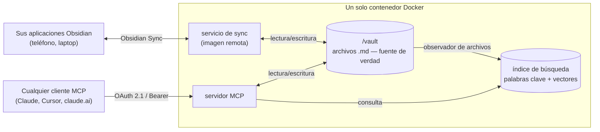

<p align="center">
  
</p>

<div align="center">

[](https://github.com/aliasunder/vault-cortex/actions/workflows/ci.yml)
[](https://github.com/aliasunder/vault-cortex/actions/workflows/gitleaks.yml)
[](https://github.com/aliasunder/vault-cortex/actions/workflows/trivy.yml)
[](https://github.com/aliasunder/vault-cortex/releases)
[](https://www.npmjs.com/package/vault-cortex)
[](https://github.com/aliasunder/vault-cortex/blob/main/LICENSE)
[](https://deepwiki.com/aliasunder/vault-cortex)
[](https://glama.ai/mcp/servers/aliasunder/vault-cortex)

</div>

**Vault Cortex** es un servidor MCP independiente que proporciona a cualquier agente de IA **búsqueda híbrida, gestión de tareas, memoria estructurada y acceso de lectura/escritura** a su [cofre de Obsidian](https://obsidian.md). Sin complementos, sin necesidad de tener Obsidian en ejecución, sin puentes externos. Un solo contenedor Docker, la carpeta de su cofre, un conjunto completo de herramientas + prompts guiados. Despliegue en un VPS con Obsidian Sync y el mismo cofre será accesible desde su teléfono, claude.ai o cualquier cliente MCP remoto, protegido con OAuth 2.1.

**Contenido** — [Lo que obtienes](#what-you-get) · [Inicio rápido](#quick-start) · [Cómo funciona](#how-it-works) · [Búsqueda híbrida](#hybrid-search) · [Memoria](#memory) · [Tareas](#tasks) · [Archivos](#files) · [Herramientas](#tools) · [Prompts](#prompts) · [Propiedades](#properties) · [Configuración](#configuration) · [Integridad de datos](#data-integrity) · [Autenticación](#auth) · [Opciones de despliegue](#deployment-options)

## Lo que obtienes

<table align="center">
  <tr>
    <td align="center"><strong>Buscar en el cofre</strong></td>
    <td align="center"><strong>Razonar sobre notas</strong></td>
    <td align="center"><strong>Escribir de vuelta en Obsidian</strong></td>
  </tr>
  <tr>
    <td></td>
    <td></td>
    <td></td>
  </tr>
</table>

<p align="center"><em>Las tres demostraciones se ejecutan en Claude móvil. El cofre está en un servidor remoto, no en el teléfono.</em></p>

- **[Acceso remoto](#deployment-options)** — funciona desde su teléfono, un servidor remoto o cualquier cliente MCP mediante OAuth 2.1. Despliegue en un VPS con Obsidian Sync para acceder desde cualquier lugar.
- **[Sin complementos](#how-it-works)** — Obsidian no necesita estar en ejecución. El servidor trabaja directamente con archivos `.md` en el disco. La sincronización headless mantiene el cofre actualizado.
- **[Búsqueda híbrida](#hybrid-search)** — coincidencia de palabras clave FTS5 + similitud semántica vectorial mediante fusión RRF, refinada por reclasificación con cross-encoder para consultas con alta intención. Las palabras clave se mantienen precisas en términos exactos y jerga; los vectores encuentran notas incluso cuando sus palabras difieren de las del cofre.
- **[Memoria estructurada](#memory)** — entradas con fecha y solo para agregar que se acumulan en una capa de conocimiento personal, inicializadas automáticamente para la personalización de IA. El recall por tema responde "¿qué pienso sobre X?" con la postura actual y el historial fechado detrás de ella, incluida la evolución.
- **[Tareas](#tasks)** — consultas y actualizaciones de tareas conscientes de Kanban: triaje por estado, fechas o prioridad, luego complete, repriorice o mueva tareas entre carriles en una sola llamada. Analiza tanto los emojis del [complemento Tasks](https://publish.obsidian.md/tasks/) como los formatos de campos inline de [Dataview](https://blacksmithgu.github.io/obsidian-dataview/).
- **[Grafo de enlaces](#tools)** — backlinks, enlaces salientes y detección de huérfanos en todo el cofre
- **[Archivos](#files)** — lea también los archivos no markdown del cofre: las imágenes llegan como imágenes reales (redimensionadas si es necesario), los PDFs como texto estructurado o páginas renderizadas, los canvas como esquemas legibles, los archivos de datos como texto
- **[Nativo de Obsidian](#properties)** — entiende frontmatter, wikilinks, etiquetas, encabezados y notas diarias
- **[Flujos de trabajo guiados](#prompts)** — prompts integrados para salud del cofre, revisión de memoria y conciliación diaria, ensamblados a partir de datos en vivo del cofre en cada ejecución

**Probado durante un viaje de 15 días por Europa.** 30+ sesiones desde un teléfono, 216 llamadas a herramientas, cero necesidad de acceso a laptop. Las escrituras de una sesión estuvieron disponibles inmediatamente en la siguiente, a través de ciudades y días.

## Inicio rápido

### Local (2 minutos — Docker + su carpeta de cofre)

**Prerrequisitos:** [Docker](https://docs.docker.com/get-docker/) (o un runtime compatible con Docker, p. ej., OrbStack, Colima, Podman), Node.js >= 20.12 (solo para la CLI — el servidor en sí se ejecuta en Docker) y un cofre de Obsidian (o cualquier carpeta de archivos `.md`).

```bash
npx vault-cortex@latest init
```

Eso es todo: la CLI le pedirá la ruta de su cofre, generará el token de autenticación y los archivos de configuración, iniciará el servidor e imprimirá los detalles de conexión para su cliente MCP ([referencia de CLI →](./cli/)).


**¿Configurado con la CLI?** Gestionará el servidor a partir de ahora: `configure`, `upgrade`, `restart`, `logs`, `down` ([referencia de CLI →](./cli/)).

**¿Configurado con Compose?** Use Compose para las actualizaciones también (`docker compose pull && docker compose up -d`) — la CLI y Compose gestionan el contenedor de forma independiente.

<details>
<summary><strong>Configuración manual</strong> (sin Node.js necesario)</summary>

```bash
# 1. Get the quickstart files
curl -O https://raw.githubusercontent.com/aliasunder/vault-cortex/main/deploy/local/docker-compose.yml
curl -O https://raw.githubusercontent.com/aliasunder/vault-cortex/main/deploy/local/.env.example

# 2. Configure
cp .env.example .env
# Edit .env — set MCP_AUTH_TOKEN (openssl rand -hex 32) and VAULT_PATH

# 3. Start
docker compose up
```

</details>

**[Guía local completa →](./deploy/local/)** (incluye [configuración de Windows](./deploy/local/#windows-docker-desktop))

### Remote (acceso desde cualquier lugar — Docker + Obsidian Sync)

**Prerrequisitos:** un VPS con [Docker](https://docs.docker.com/engine/install/) (o un runtime compatible con Docker), una suscripción a [Obsidian Sync](https://obsidian.md/sync) y Node.js >= 20.12 (solo para la CLI — el servidor en sí se ejecuta en Docker).

```bash
# On your VPS:
npx vault-cortex@latest init --mode remote
```

Eso es todo: la CLI lo guiará por la URL pública, el token de Obsidian Sync (puede ejecutar [`get-sync-token`](./cli/#get-sync-token) por usted) y la configuración de autenticación, luego iniciará el servidor ([referencia de CLI →](./cli/)).

**¿Configurado con la CLI?** Gestionará el servidor a partir de ahora: `configure`, `upgrade`, `restart`, `logs`, `down` ([referencia de CLI →](./cli/)).

**¿Configurado con Compose?** Use Compose para las actualizaciones también (`docker compose pull && docker compose up -d`) — la CLI y Compose gestionan el contenedor de forma independiente.

<details>
<summary><strong>Configuración manual</strong> (sin Node.js necesario)</summary>

```bash
# On your VPS:
mkdir -p /opt/vault-cortex && cd /opt/vault-cortex
curl -O https://raw.githubusercontent.com/aliasunder/vault-cortex/main/deploy/remote/docker-compose.yml
curl -O https://raw.githubusercontent.com/aliasunder/vault-cortex/main/deploy/remote/.env.example
cp .env.example .env
# Edit .env — set MCP_AUTH_TOKEN, PUBLIC_URL, OBSIDIAN_AUTH_TOKEN, VAULT_NAME
docker compose up -d
```

</details>

**[Guía remota completa →](./deploy/remote/)**

### Conecte su cliente MCP

| Configuración | URL del servidor              |
| ------------- | ----------------------------- |
| **Local**     | `http://localhost:8000/mcp`   |
| **Remote**    | `<PUBLIC_URL>/mcp`            |

Agregue la URL del servidor en cualquier cliente MCP — Claude Code, Claude Desktop, Cursor, OpenCode, u otro. Los clientes OAuth abren una página de consentimiento en su navegador; apruebe con su token y el cliente se encargará de la renovación del token a partir de entonces. Los clientes sin OAuth (MCP Inspector, scripts) envían el token directamente como un encabezado `Authorization: Bearer`.

**Claude Code:**

```bash
claude mcp add --scope user --transport http vault-cortex http://localhost:8000/mcp   # local (or <PUBLIC_URL>/mcp)
```

`--scope user` registra el servidor para cada proyecto; omita este flag para limitarlo solo al directorio actual.

<details>
<summary><strong>Claude Desktop</strong> (localhost requiere puente mcp-remote)</summary>

El diálogo "Add custom connector" solo acepta URLs `https`. Con una PUBLIC_URL `https`, agréguela directamente en el diálogo del conector; para un servidor localhost, regístrelo en `claude_desktop_config.json` a través del puente stdio [mcp-remote](https://github.com/geelen/mcp-remote) en su lugar:

```json
{
  "mcpServers": {
    "vault-cortex": {
      "command": "npx",
      "args": [
        "-y",
        "mcp-remote",
        "http://localhost:8000/mcp",
        "--header",
        "Authorization: Bearer <your MCP_AUTH_TOKEN>"
      ]
    }
  }
}
```

</details>

**claude.ai (web y móvil)** se conecta solo a la configuración remota — sus conectores se obtienen del lado del servidor y nunca pueden alcanzar localhost.

> "Servidor MCP remoto" se refiere al tipo de conexión (HTTP) — en la configuración local, el servidor aún se ejecuta completamente en su máquina.

Consulte [Autenticación](#authentication) para ambos métodos y la vida útil de los tokens.

## Cómo funciona

Todo se ejecuta en un solo contenedor Docker, trabajando directamente con los archivos `.md` en el disco:

- **Su cofre sigue siendo la fuente de verdad** — el servidor lee y escribe los mismos archivos de Markdown plano que sus aplicaciones de Obsidian.
- **La búsqueda es datos derivados** — un observador de archivos mantiene el índice (palabras clave + vectores) actualizado a medida que cambian las notas, y puede reconstruirse desde sus notas en cualquier momento.
- **La imagen remota agrega un bucle de sincronización** — un servicio integrado de Obsidian Sync mantiene el cofre del contenedor actualizado con cada dispositivo: edite una nota en su teléfono y será buscable momentos después; un agente escribe una nota y aparece en Obsidian.



Consulte [ARCHITECTURE.md](./ARCHITECTURE.md) para el diseño completo, diagramas de flujo de autenticación y desglose de componentes.

## Búsqueda híbrida

La búsqueda por palabras clave por sí sola falla cuando su vocabulario no coincide con el del cofre: "aspirations" no encontrará una nota sobre "targets", "coworkers" no mostrará su archivo de "references". En pruebas contra un cofre real, el 30% de las consultas en lenguaje natural devolvieron cero resultados o resultados tangenciales con palabras clave solas. La búsqueda híbrida eliminó esos fallos: los vectores puenteado la brecha de vocabulario, y el reclasificador rescata las consultas de alta intención donde ninguna señal es fuerte por sí sola.

La búsqueda híbrida combina tres señales de clasificación mediante [Reciprocal Rank Fusion](./ARCHITECTURE.md#hybrid-search):

- **Palabras clave** (FTS5) se mantienen precisas en términos exactos, jerga y valores de propiedades
- **Vectores** (sqlite-vec) cierran la brecha de vocabulario coincidiendo por significado
- **Reclasificador** (cross-encoder) refina el orden puntuando cada par consulta-documento conjuntamente — rescata consultas de alta intención donde tanto palabras clave como vectores fallan

Todos los modelos se ejecutan localmente (~45MB en total, sin API externa). Establezca `EMBEDDING_ENABLED=false` para búsqueda solo por palabras clave, o `RERANK_MODE=none` para omitir la reclasificación y reducir la latencia.

Consulte [ARCHITECTURE.md → Búsqueda híbrida](./ARCHITECTURE.md#hybrid-search) para detalles de modelos, pesos de fusión y el desglose completo del pipeline.

## Memoria

Una capa de memoria que solo crece solo es útil si los agentes pueden recuperar las entradas correctas sin volcar todo al contexto. Una vez que tenga cientos de entradas con fecha a través de múltiples archivos — preferencias, principios, estilo de comunicación, compromisos en curso — leer archivos completos desperdicia contexto en material irrelevante y entierra la señal. El sistema de memoria está diseñado para recuperación dirigida: los agentes acumulan conocimiento con el tiempo y recuerdan exactamente lo relevante para la tarea en cuestión.

La capa es una carpeta de archivos de Markdown plano (predeterminado: `About Me/`) que contiene entradas con fecha bajo encabezados de tema — creadas automáticamente con plantillas iniciales en la primera ejecución, y expandidas por agentes a través de `vault_update_memory`. Tres propiedades lo hacen funcionar:

- **Solo para agregar** — las entradas nunca se sobrescriben; las correcciones llegan como nuevas entradas con fecha. La capa se convierte en una base de conocimiento personal que captura su estado actual _y_ la evolución detrás de él
- **Recall por tema** — `vault_memory_recall` recupera cada entrada relevante a través de todos los archivos de memoria de una vez, coincidiendo por palabras clave y semántica, de la más antigua a la más reciente. Pregunte "¿qué pienso sobre X?" y obtenga la postura actual más el historial fechado de cómo se desarrolló — sin necesidad de leer archivos completos o adivinar qué archivo contiene qué
- **Crece sin degradarse** — limitar resultados (`max_results`) descarta las entradas menos relevantes, nunca un fragmento de la línea de tiempo. Una capa de memoria con 500 entradas sirve una consulta dirigida tan bien como una con 50

Los archivos que describen lo actual en lugar de lo que ha sido verdad (rutinas, compromisos activos) pueden declarar `entry-policy: living` en el frontmatter — sus entradas expiradas son eliminables en lugar de preservadas, manteniendo precisa la imagen del estado actual.

Toda la capa es opcional — establezca `MEMORY_ENABLED=false` para ocultar las herramientas de memoria y omitir la creación automática de la carpeta por completo.

Consulte [ARCHITECTURE.md → Memoria](./ARCHITECTURE.md#memory) para el pipeline de recall, modelo de indexación, inicialización automática y comportamiento de opt-out, y [templates/memory](./templates/memory/) para el formato de archivo, convención de entry-policy y plantillas iniciales.

## Tareas

Los metadatos de las tareas viven en markdown plano — dispersos por archivos, codificados en identificadores de emoji o campos inline, organizados bajo encabezados de Kanban. Un agente que responda "¿qué está vencido?" necesitaría analizar cada archivo y entender su formato elegido; completar una tarea en un tablero Kanban significa conocer la estructura de carriles del tablero, la sintaxis de fechas y qué encabezado es el carril completado.

La capa de tareas maneja esto para que los agentes no tengan que hacerlo:

- **Encontrar** — filtre por estado, seis campos de fecha (due, scheduled, start, created, done, cancelled), prioridad, carpeta o carril de Kanban. Cada resultado incluye su carril, ruta de nota, encabezado y número de línea — sin lecturas de seguimiento necesarias para localizar una tarea
- **Actualizar** — complete, repriorice y mueva tareas entre carriles de Kanban en una sola llamada. Marcar una tarea como completada detecta automáticamente el carril de completadas y marca la fecha de finalización; revertirlo elimina la fecha. Los tres cambios pueden ocurrir a la vez
- **Ambos formatos** — sea cual sea el formato que use, identificadores de emoji del [complemento Tasks](https://publish.obsidian.md/tasks/) o campos inline de [Dataview](https://blacksmithgu.github.io/obsidian-dataview/), el servidor lee ambos y escribe en el formato para el que está configurado su complemento Tasks

Consulte [ARCHITECTURE.md → Tareas](./ARCHITECTURE.md#tasks) para el modelo de indexación, clasificación por cascada de fechas y detección de carriles Kanban.

## Archivos

Sus notas incrustan capturas de pantalla, referencian diagramas de arquitectura y enlazan hacia canvas y archivos de datos — pero para un agente que lee markdown, `![[diagram.png]]` es solo texto. vault-cortex trata los archivos como parte del cofre en lugar de desorden a su alrededor — enlazados, dimensionados y legibles, cada uno en la forma que un agente puede usar realmente:

- **Imágenes** — la imagen en sí, no el nombre de archivo. Las capturas de pantalla y diagramas se reducen y recomprimen en el servidor cuando exceden lo que aceptan los clientes MCP, por lo que incluso una sesión desde un teléfono puede revisar un diagrama de arquitectura de 5MB
- **Canvas** — un tablero [Canvas](https://help.obsidian.md/canvas) llega como un esquema legible: sus grupos, el contenido de cada tarjeta en orden de lectura y las conexiones entre ellos. El JSON fuente exacto está a una bandera de distancia cuando la fidelidad completa es importante
- **PDFs** — el texto se extrae conservando jerarquía de encabezados, bloques de código e hipervínculos; establezca `raw: true` para renderizar páginas como imágenes en su lugar, mostrando diseño, diagramas y tablas que la extracción de texto no puede preservar — PDFs escaneados y solo de imágenes funcionan en este modo
- **Archivos de texto y datos** — SVG, JSON, CSV, logs y archivos [Bases](https://help.obsidian.md/bases) devuelven exactamente como están escritos; archivos de datos grandes y logs pueden leerse un rango de líneas a la vez, con cada página informando dónde está y cuánto archivo queda
- **Explorar** — liste los archivos de cualquier carpeta con conteos por extensión y tamaños de archivo; los archivos a los que enlaza una nota reportan su tamaño en el grafo de enlaces también

Establezca `FILE_TOOLS_ENABLED=false` para ocultar las herramientas de archivo — útil cuando su cofre remoto se sincroniza sin adjuntos.

Consulte [ARCHITECTURE.md → Archivos](./ARCHITECTURE.md#files) para el pipeline de imágenes y modelo de envío.

## Herramientas

| Categoría        | Herramienta                    | Descripción                                                                            |
| ---------------- | ------------------------------ | -------------------------------------------------------------------------------------- |
| **CRUD Cofre**   | `vault_read_note`              | Leer una nota — cuerpo completo, propiedades, esquema o una sección                    |
|                  | `vault_write_note`             | Crear una nota (falla si ya existe; establezca `overwrite` para reemplazar)            |
|                  | `vault_patch_note`             | Edición dirigida por encabezado (agregar, preagregar, reemplazar, insertar)            |
|                  | `vault_replace_in_note`        | Buscar y reemplazar texto en una nota                                                  |
|                  | `vault_delete_span`            | Eliminar un bloque de líneas por anclas cortas, sin re-cita completa                   |
|                  | `vault_list_notes`             | Listar notas con filtro glob/carpeta opcional                                          |
|                  | `vault_delete_note`            | Eliminar una nota (ruta protegida aplicada)                                            |
|                  | `vault_move_note`              | Mover o renombrar una nota, reescribiendo enlaces en todo el cofre                     |
| **Búsqueda**     | `vault_search`                 | Búsqueda híbrida con filtros de etiqueta/carpeta/propiedad/fecha                       |
|                  | `vault_search_by_tag`          | Encontrar notas por etiqueta (coincidencia exacta o de prefijo)                        |
|                  | `vault_search_by_folder`       | Explorar notas en una carpeta con metadatos                                            |
|                  | `vault_recent_notes`           | Notas modificadas o creadas recientemente                                              |
|                  | `vault_list_tags`              | Todas las etiquetas con conteos de uso                                                 |
| **Tareas**       | `vault_list_tasks`             | Índice de tareas en todo el cofre — consciente de Kanban, 6 campos de fecha, prioridad, ámbito de carpeta/encabezado |
|                  | `vault_update_task`            | Cambios de estado, prioridad y carril en una sola llamada — detecta automáticamente carriles completados en tableros Kanban |
| **Memoria**      | `vault_get_memory`             | Leer memoria estructurada (archivo, sección o todo)                                    |
|                  | `vault_update_memory`          | Agregar una entrada con fecha a una sección de memoria                                 |
|                  | `vault_delete_memory`          | Eliminar una entrada de memoria específica por fecha                                   |
|                  | `vault_list_memory_files`      | Descubrir archivos de memoria, sus secciones y la política de entrada de cada archivo  |
|                  | `vault_memory_recall`          | Recall híbrido a nivel de entrada de un tema a través de archivos de memoria, de la más antigua a la más reciente |
| **Propiedades**  | `vault_list_property_keys`     | Todas las claves de propiedades con valores de ejemplo                                 |
|                  | `vault_list_property_values`   | Valores distintos para una clave de propiedad                                          |
|                  | `vault_search_by_property`     | Encontrar notas por clave-valor de propiedad                                           |
|                  | `vault_update_properties`      | Agregar o actualizar propiedades sin tocar el cuerpo                                   |
| **Enlaces**      | `vault_get_backlinks`          | Notas que enlazan a una ruta dada                                                      |
|                  | `vault_get_outgoing_links`     | Enlaces desde una nota dada                                                            |
|                  | `vault_find_orphans`           | Notas sin enlaces entrantes                                                            |
| **Archivos**     | `vault_read_file`              | Leer un archivo no markdown — imágenes entregadas como imágenes, canvas como esquemas legibles |
|                  | `vault_list_files`             | Explorar los archivos no markdown del cofre con tamaños y conteos por extensión        |
| **Notas Diarias**| `vault_get_daily_note`         | La nota diaria de hoy (o de cualquier fecha)                                           |

## Prompts

Las herramientas son impulsadas por el modelo — el asistente las llama. **Los prompts** son flujos de trabajo _que usted_ activa. Cada uno consulta el índice de búsqueda, el grafo de enlaces y la capa de memoria en el momento de invocación, luego ensambla los resultados con instrucciones guiadas — para que la sesión comience anclada en el estado real de su cofre, no en suposiciones.

| Prompt              | Argumentos            | Qué hace                                                                                                                                                                                                                                                                                            |
| ------------------- | --------------------- | ------------------------------------------------------------------------------------------------------------------------------------------------------------------------------------------------------------------------------------------------------------------------------------------------------- |
| `vault-orientation` | —                     | Analiza estadísticas del cofre, distribución de carpetas, tasas de adopción de propiedades (marca baja adopción), huérfanos, conteo de enlaces rotos, etiquetas, notas recientes y la capa de memoria — con sugerencias de herramientas contextuales                                                                                                         |
| `memory-review`     | `file?`, `max_chars?` | Vista estructural (scope callouts, conteos de entradas por sección) + contenido con fecha como línea de tiempo. Reflexión guiada: narrativa de evolución, ajuste de alcance, brechas de relleno y análisis de cobertura — solo para agregar por defecto, poda propuesta solo para archivos `entry-policy: living`. Oculto cuando `MEMORY_ENABLED=false`. |
| `daily-review`      | `date?`, `max_chars?` | Concilia un día — nota diaria, estado de tareas en todo el cofre (vencidas/adelantadas, programadas), notas modificadas, enlaces salientes (detección de enlaces rotos) y backlinks — muestra qué sucedió, qué está abierto y qué necesita seguimiento                                                                                   |

Los prompts se adaptan a su configuración (`MEMORY_DIR`, ajustes de notas diarias) y funcionan para cualquier cofre sin configuración adicional. Pase `max_chars` para limitar el contenido incrustado si su cliente tiene límites de payload.

> **Compatibilidad de cliente:** Los prompts funcionan en Claude Desktop (Chat y Cowork — a través del menú **+** bajo su conector), Claude Code (comandos slash) y OpenCode. El soporte en otros clientes (Cursor, Windsurf) varía — consulte la [matriz de clientes MCP](https://modelcontextprotocol.io/clients) para lo más reciente.

## Propiedades

Vault Cortex indexa cada [propiedad](https://help.obsidian.md/Editing+and+formatting/Properties) en sus notas, pero cinco reciben tratamiento **promovido** — columnas dedicadas para filtrado rápido y campos de primer nivel en cada resultado de búsqueda y descubrimiento:

| Propiedad  | Qué puede hacer                                                                                              |
| ---------- | ------------------------------------------------------------------------------------------------------------ |
| `title`    | Nombre para mostrar en resultados de búsqueda; recurre al nombre de archivo cuando falta                      |
| `tags`     | Buscar y filtrar por etiqueta, incluidas jerarquías padre-hijo (`project` coincide con `project/vault-cortex`) |
| `type`     | Filtrar por tipo de nota — `meeting`, `person`, `session-log`, o cualquier valor que use su cofre             |
| `created`  | Ordenar por fecha de creación y ver cuándo se creó cada nota junto a cada resultado de búsqueda               |
| `related`  | Filtrar notas que hacen referencia cruzada a un enlace específico — muestra conexiones invisibles sin una consulta de grafo |

**Todas las demás propiedades** siguen siendo totalmente consultables — use `vault_search` con `filters.properties` para consultas combinadas de texto + metadatos, o `vault_search_by_property` para búsquedas solo de metadatos. `vault_list_property_keys` y `vault_list_property_values` descubren qué propiedades existen en todo su cofre.

Estas son convenciones, no requisitos — Vault Cortex funciona con cualquier esquema de propiedades. Las propiedades promovidas simplemente le dan un filtrado más rico y resultados más limpios desde el inicio.

**Los callouts principales** reciben el mismo tratamiento. Cuando el primer contenido del cuerpo de una nota es un [callout](https://help.obsidian.md/Editing+and+formatting/Callouts) de Obsidian (`> [!type]`) — ya sea justo después del frontmatter o justo después del encabezado del título — se indexa y muestra junto a cada resultado de descubrimiento (en `vault_search`, solicítelo con `include_leading_callout`). Esto hace que las notas se autodescriban: un agente que escanea resultados puede ver para _qué_ sirve cada nota antes de decidir cuál leer. Las plantillas de memoria usan callouts `> [!info] Scope of this file` para esto, y cualquier nota en su cofre puede usar el mismo patrón.

## Configuración

Todos los ajustes son variables de entorno con valores predeterminados sensatos.

| Variable                    | ¿Requerido? | Predeterminado                         | Descripción                                                                                                                                                                                                                                                    |
| --------------------------- | ----------- | -------------------------------------- | -------------------------------------------------------------------------------------------------------------------------------------------------------------------------------------------------------------------------------------------------------------- |
| `MCP_AUTH_TOKEN`            | Sí          | —                                      | Token bearer para autenticación (también la clave de firma JWT)                                                                                                                                                                                                 |
| `VAULT_PATH`                | Solo local  | —                                      | Ruta de host a su cofre (origen de bind mount; remoto usa un volumen con nombre)                                                                                                                                                                                |
| `PUBLIC_URL`                | Solo remoto | —                                      | URL pública para metadatos de descubrimiento OAuth                                                                                                                                                                                                             |
| `EMBEDDING_ENABLED`         | —           | `true`                                 | Establezca `false` para deshabilitar el pipeline de embeddings — omite descarga de modelo, tablas vectoriales, pasadas de embedding y búsqueda híbrida. La búsqueda recurre a coincidencia de palabras clave FTS5.                                                                                        |
| `RERANK_MODE`               | —           | `blended`                              | Modo de reclasificación con cross-encoder: `blended` aplica fusión de puntuaciones consciente de posición después de fusión RRF (~200ms de latencia adicional), `none` omite la reclasificación. Solo tiene efecto cuando `EMBEDDING_ENABLED` es true.                                              |
| `MEMORY_ENABLED`            | —           | `true`                                 | Establezca `false` para deshabilitar completamente la capa de memoria — oculta herramientas de memoria, omite bootstrap, excluye memoria de metadatos del servidor. `MEMORY_DIR` se ignora cuando es `false`.                                                                                            |
| `FILE_TOOLS_ENABLED`        | —           | `true`                                 | Establezca `false` para ocultar herramientas de archivo (`vault_read_file`, `vault_list_files`) — útil para despliegues remotos donde Obsidian Sync tiene sincronización de adjuntos deshabilitada.                                                                                                  |
| `MEMORY_DIR`                | —           | `About Me`                             | Carpeta del cofre para archivos de memoria estructurada                                                                                                                                                                                                        |
| `PROTECTED_PATHS`           | —           | `MEMORY_DIR, Daily Notes`              | Carpetas que `vault_delete_note` se niega a tocar                                                                                                                                                                                                              |
| `ORPHAN_EXCLUDE_FOLDERS`    | —           | `Daily Notes, Templates, MEMORY_DIR`   | Carpetas excluidas de la detección de huérfanos                                                                                                                                                                                                                 |
| `TZ`                        | —           | `UTC`                                  | Zona horaria IANA para marcas de tiempo y resolución de notas diarias                                                                                                                                                                                          |
| `SERVICE_DOCUMENTATION_URL` | —           | URL del repo GitHub                    | URL devuelta en metadatos de descubrimiento OAuth                                                                                                                                                                                                              |
| `LOG_LEVEL`                 | —           | `info`                                 | Verboacidad de registro: `debug`, `info`, `warn`, `error`                                                                                                                                                                                                      |
| `LOG_DIR`                   | —           | `/data/logs` (remoto), sin configurar (local) | Directorio para archivos de registro persistentes. Cuando se establece, los registros se escriben en archivos con marca de fecha allí junto con stdout. Sin configurar significa solo stdout.                                                                                                         |
| `LOG_RETENTION_DAYS`        | —           | `30`                                   | Días para mantener archivos de registro antes de la limpieza automática al iniciar                                                                                                                                                                             |
| `WINDOWS_MODE`              | —           | `false`                                | ¿En Windows? Establezca `true`. Cambia el observador de archivos a polling y los movimientos de nota a escrituras basadas en rename para que un cofre en una unidad `C:` funcione a través de Docker Desktop. Seguro dejarlo activado para cualquier configuración Windows; innecesario en macOS/Linux/WSL2. |
| `MAX_FILE_BYTES`            | —           | `52428800` (50 MiB)                    | Tamaño máximo de archivo que `vault_read_file` leerá (en bytes). Los archivos que exceden esto se rechazan antes de leer. Incremente para cofres con archivos individuales muy grandes.                                                                                                               |
| `MAX_IMAGE_OUTPUT_BYTES`    | —           | `49152` (48 KiB)                       | Presupuesto de bytes para imágenes entregadas por `vault_read_file`, en bytes binarios antes de la codificación base64. Las imágenes que exceden esto se reducen y recomprimen para ajustar. Dimensionado para el límite más ajustado de clientes MCP principales; incremente para clientes que aceptan respuestas más grandes. |
| `MAX_PDF_RENDER_PAGES`      | —           | `5`                                    | Máximo de páginas PDF para renderizar como imágenes cuando `raw: true` se establece en `vault_read_file`. El presupuesto de bytes por página es `MAX_IMAGE_OUTPUT_BYTES` dividido uniformemente entre las páginas renderizadas — menos páginas significa mayor calidad cada una.                   |

**Valores predeterminados inteligentes:** Establecer `MEMORY_DIR` actualiza automáticamente los predeterminados para `PROTECTED_PATHS` y `ORPHAN_EXCLUDE_FOLDERS`. Solo configure esos explícitamente para una lista completamente personalizada. Cuando `MEMORY_ENABLED` es `false`, la capa de memoria está completamente deshabilitada — las herramientas de memoria están ocultas y la carpeta de memoria no se crea automáticamente. Cuando `FILE_TOOLS_ENABLED` es `false`, las herramientas de archivo se ocultan por completo — útil cuando Obsidian Sync tiene sincronización de adjuntos deshabilitada y no existen archivos en el disco.

Consulte [`templates/memory/`](./templates/memory/) para ejemplos de archivos de memoria y la filosofía de diseño de entradas con fecha.

## Integridad de datos

Vault Cortex escribe en notas personales — la capa de seguridad de archivos está construida para prevenir corrupción, no solo errores.

- **Escrituras atómicas** — cada escritura de archivo se prepara en un archivo temporal, luego se renombra. Los lectores nunca ven una nota parcial o de 0 bytes. Las creaciones exclusivas usan `link()` (POSIX no-clobber) para cerrar la ventana TOCTOU en movimientos de nota.
- **Mutex por archivo** — las llamadas concurrentes a herramientas MCP se serializan o fallan rápido por archivo. Los movimientos bloquean el origen, destino y cada fuente de backlink como una sola unidad.
- **Travesía de ruta bloqueada** — `resolveSafePath()` resuelve y verifica por prefijo cada ruta. La eliminación de rutas protegidas se rechaza después de la normalización. Los nombres de archivos de memoria rechazan separadores en los límites.
- **Prevención de inyección** — las consultas de búsqueda están parametrizadas y sanitizadas para FTS5; el contenido de prompts se envuelve en marcadores de datos XML con escape de etiquetas de cierre para prevenir inyección por ruptura de etiqueta.
- **Endurecimiento de contenedor** — usuario no root, init PID 1, sin gestores de paquetes en la imagen de runtime, base fijada por digest, apagado graceful.

Consulte [ARCHITECTURE.md → Integridad de datos](./ARCHITECTURE.md#data-integrity) para detalles de mecanismos y [SECURITY.md → Endurecimiento en Runtime](./SECURITY.md#runtime-hardening) para el inventario completo de superficie de ataque.

## Autenticación

Para un servidor con acceso de lectura/escritura a notas personales, la autenticación no es opcional. Vault Cortex implementa la especificación completa de OAuth 2.1, incluyendo PKCE y rotación de tokens de refresco. El [despliegue en AWS (SST)](#deployment-options) añade defensa en profundidad: las solicitudes se validan en dos capas independientes (autorizador Lambda de API Gateway + middleware Express). Según el [análisis de seguridad MCP de BlueRock 2026](https://www.bluerock.io/use-cases/safely-adopt-mcp), solo el 8.5% de los servidores MCP implementan OAuth; el 41% no tiene autenticación en absoluto.

Dos métodos:

| Método            | Usado por                                                  | Formato de token     |
| ----------------- | -------------------------------------------------------- | -------------------- |
| **OAuth 2.1**     | Claude Desktop, Claude Code, claude.ai, cualquier cliente OAuth | JWT (HS256, 24h)     |
| **Bearer estático** | Claude Code, MCP Inspector, curl                         | `MCP_AUTH_TOKEN` en bruto |

OAuth usa registro dinámico de cliente — no se necesita Client ID/Secret. Una página de consentimiento se abre en su navegador; ingrese su `MCP_AUTH_TOKEN` para aprobar. Los tokens de refresco tienen una expiración deslizante de 60 días (los usuarios diarios nunca vuelven a autenticarse).

Consulte [ARCHITECTURE.md → Auth](./ARCHITECTURE.md#auth-oauth-21--defense-in-depth) para el diagrama de flujo completo.

## Opciones de despliegue

Local se ejecuta en su máquina. Los despliegues remotos corren en un VPS — su cofre es accesible incluso cuando su laptop está cerrada.

| Ruta          | Qué ofrece                                                              | Guía                                 |
| ------------- | ----------------------------------------------------------------------- | ------------------------------------ |
| **Local**     | Su cofre en su máquina — gratuito, sin nube                             | [`deploy/local/`](./deploy/local/)   |
| **Remote**    | VPS + Obsidian Sync — acceso desde cualquier dispositivo                | [`deploy/remote/`](./deploy/remote/) |
| **AWS (SST)** | Despliegue de referencia IaC — infra automatizada, auth defensa en profundidad | [`DEPLOY.md`](./DEPLOY.md)           |

La ruta AWS incluye flujos CI/CD construidos para este repo — [los forkers deben configurar sus propias credenciales y stage](./DEPLOY.md#dont-fork-deploy-without-re-staging) antes de desplegar.

Las tres rutas ejecutan la misma imagen, `ghcr.io/aliasunder/vault-cortex` — `:latest` es solo el servidor MCP (local), `:remote` incluye Obsidian Sync en el mismo contenedor bajo supervisión de [s6-overlay](https://github.com/just-containers/s6-overlay) (remoto y AWS). Un solo contenedor significa que cualquier runtime OCI funciona: `docker run`, Podman, nerdctl — Docker Compose es opcional.

> **También en Docker Hub:** las mismas imágenes están espejadas en [`aliasunder/vault-cortex`](https://hub.docker.com/r/aliasunder/vault-cortex). GHCR es la fuente principal; las etiquetas de Hub son idénticas.

**Costo:** Una configuración remota necesita un VPS y $4 USD/mes para [Obsidian Sync](https://obsidian.md/sync). Una instancia de 2 GiB maneja la búsqueda semántica bien para un cofre típico; 4 GiB agrega margen para búsqueda concurrente y cofres más grandes. Omita la búsqueda semántica por completo para ir aún más pequeño. Solo local es gratuito. El [despliegue de referencia en AWS](./ARCHITECTURE.md#cost) corre ~$17–29/mes todo incluido.

## Desarrollo

```bash
# Run locally with hot reload
PUBLIC_URL=http://localhost:8000 MCP_AUTH_TOKEN=local-dev-token VAULT_PATH=~/Vault npm run dev:mcp

# Tests
npm test

# Full check suite
npm run prettier:check && npm run lint && npm test && npm run build
```

**Inspector MCP** — interfaz de navegador interactiva para probar herramientas:

```bash
# Start server (terminal 1), then:
npx @modelcontextprotocol/inspector
# Enter http://localhost:8000/mcp as URL, local-dev-token as Bearer token
```

Consulte [CONTRIBUTING.md](./CONTRIBUTING.md) para la configuración de desarrollo completa.

## Complemento: skill obsidian-vault

El servidor MCP funciona por sí solo con cualquier cliente. Para agentes que soportan [skills](https://github.com/vercel-labs/skills) (Claude Code, Cursor, Windsurf, Cline, y [70+ otros](https://github.com/vercel-labs/skills#supported-agents)), el skill **obsidian-vault** añade conocimiento más profundo de markdown con sabor Obsidian — convenciones de frontmatter, sintaxis de callouts y formatos específicos de complementos como Dataview, Tasks y Kanban.

```bash
npx skills add aliasunder/agent-skills --skill obsidian-vault
```

[Código fuente del skill →](https://github.com/aliasunder/agent-skills/tree/main/skills/obsidian-vault)

## Hoja de ruta

| Fase   | Qué                                                                                                                       | Estado    |
| ------ | ------------------------------------------------------------------------------------------------------------------------- | --------- |
| **1**  | CRUD del cofre, búsqueda de texto completo (FTS5), capa de memoria, OAuth 2.1                                             | Completo  |
| **2a** | Búsqueda híbrida — FTS5 + vector + fusión RRF, chunking consciente de encabezados                                          | Completo  |
| **2b** | Reclasificador — reclasificación con cross-encoder, fusión de puntuaciones consciente de posición                           | Completo  |
| **3a** | Capa de tareas — índice de tareas en todo el cofre, consultas estructuradas y actualizaciones de tareas en una llamada (emoji de complemento Tasks + formatos Dataview) | Completo  |
| **3b** | Recall de memoria — recuperación a nivel de entrada a través del historial con fecha de la capa de memoria                 | Completo  |
| **3c** | Consultas de grafo — recorrido multi-salto sobre el grafo de wikilinks existente del cofre (path, vecindarios)              | Explorando|

## Agradecimientos

La sincronización de Obsidian está impulsada por [obsidian-headless](https://obsidian.md/help/headless) — el enfoque de contenedorización está inspirado por [@Belphemur](https://github.com/Belphemur)'s [obsidian-headless-sync-docker](https://github.com/Belphemur/obsidian-headless-sync-docker). El andamiaje de supervisión de s6-overlay de la imagen `:remote` fue absorbido de ese proyecto's [fork mantenido](https://github.com/aliasunder/obsidian-headless-sync-docker) y ahora vive en este repo.

El pipeline de búsqueda híbrida se basa en patrones de [@tobi](https://github.com/tobi)'s [qmd](https://github.com/tobi/qmd) — fusión RRF con bonos de rango, fusión de puntuaciones consciente de posición para reclasificación con cross-encoder, gating por hash de contenido y chunking consciente de encabezados.

## Contribuir

Consulte [CONTRIBUTING.md](./CONTRIBUTING.md) para configuración de desarrollo, convenciones de código y directrices de PR.

## Licencia

[MIT](./LICENSE)

La imagen `:remote` **incluye** [`obsidian-headless`](https://github.com/obsidianmd/obsidian-headless)
(el CLI `ob`), que es **propietario** — su `package.json` declara `"license": "UNLICENSED"`
(© Dynalist Inc. / Obsidian). Se instala desde npm público en el momento de la construcción; la licencia MIT aquí
**no** lo cubre, y usarlo requiere una suscripción activa a Obsidian Sync. La imagen `:latest`
(local) no contiene componentes propietarios.

## Seguridad

Reporte vulnerabilidades de forma privada — consulte [SECURITY.md](./SECURITY.md).
