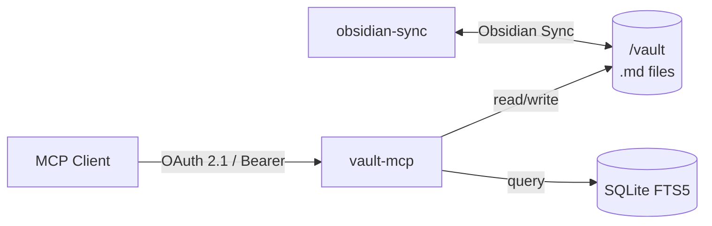

<p align="center">
  
</p>

<div align="center">

[](https://github.com/aliasunder/vault-cortex/actions/workflows/ci.yml)
[](https://github.com/aliasunder/vault-cortex/actions/workflows/gitleaks.yml)
[](https://github.com/aliasunder/vault-cortex/actions/workflows/trivy.yml)
[](https://github.com/aliasunder/vault-cortex/releases)
[](https://github.com/aliasunder/vault-cortex/blob/main/LICENSE)
[](https://nodejs.org/)
[](https://www.typescriptlang.org/)

</div>

<div align="center">

[](https://glama.ai/mcp/servers/aliasunder/vault-cortex)

</div>

<!-- TODO: Uncomment when demo GIF is recorded (see ^demo-gif task)
<p align="center">
  
</p>
-->

## What is this?

**Vault Cortex** gives any MCP client — Claude Desktop, Claude Code, Cursor, OpenCode — full access to your [Obsidian](https://obsidian.md) vault. Search notes, read and write content, query the link graph, manage structured memory, and resolve daily notes — all through 23 tools and 3 guided prompts over a single Docker container.

The typical Obsidian + MCP setup requires three moving parts running simultaneously: Obsidian open → Local REST API plugin → a separate MCP server wrapping the REST API. **Vault Cortex** replaces all of that with Docker and your vault folder.

- **Plugin-free** — Obsidian doesn't need to be running; headless sync keeps the vault current, and the server works directly with `.md` files on disk
- **Remote access** — works from your phone, a remote server, or any MCP client via OAuth 2.1
- **Ranked search** — SQLite FTS5 with BM25 scoring, stemming, phrase matching, and tag/property/folder filtering
- **Structured memory** — dated entries, section targeting, auto-initialization for AI personalization
- **Obsidian-native** — understands frontmatter, wikilinks, tags, headings, and daily notes
- **Guided workflows** — user-initiated prompts (orientation, memory review, daily review) surfaced as slash commands or **+**-menu actions, assembling live vault content on demand and costing zero tokens until invoked

### Roadmap

| Phase | What                                                                                | Status   |
| ----- | ----------------------------------------------------------------------------------- | -------- |
| **1** | Vault CRUD, full-text search (FTS5), memory layer, OAuth 2.1                        | Complete |
| **2** | Semantic search + knowledge graph via [LightRAG](https://github.com/HKUDS/LightRAG) | Planned  |

## Quick Start

### Local (2 minutes — Docker + your vault folder)

**Prerequisites:** [Docker](https://docs.docker.com/get-docker/), Node.js >= 20.12 (only for the CLI — the server itself runs in Docker), and an Obsidian vault (or any folder of `.md` files).

```bash
npx vault-cortex@latest init
```

That's it — the CLI asks for your vault path, generates the auth token and config files, starts the server, and prints the connection details for your MCP client.

<details>
<summary><strong>Manual setup</strong> (no Node.js needed)</summary>

```bash
# 1. Get the quickstart files
curl -O https://raw.githubusercontent.com/aliasunder/vault-cortex/main/deploy/local/docker-compose.yml
curl -O https://raw.githubusercontent.com/aliasunder/vault-cortex/main/deploy/local/.env.example

# 2. Configure
cp .env.example .env
# Edit .env — set MCP_AUTH_TOKEN (openssl rand -hex 32) and VAULT_PATH

# 3. Start
docker compose up
```

</details>

**[Full local guide →](./deploy/local/)**

### Remote (access from anywhere — Docker + Obsidian Sync)

**Prerequisites:** a VPS with [Docker](https://docs.docker.com/engine/install/), an [Obsidian Sync](https://obsidian.md/sync) subscription, and Node.js >= 20.12 (only for the CLI — the server itself runs in Docker).

```bash
# On your VPS:
npx vault-cortex@latest init --mode remote
```

That's it — the CLI walks through the public URL, Obsidian Sync token (it can run the token generator for you), and auth config, then starts the server.

<details>
<summary><strong>Manual setup</strong> (no Node.js needed)</summary>

```bash
# On your VPS:
mkdir -p /opt/vault-cortex && cd /opt/vault-cortex
curl -O https://raw.githubusercontent.com/aliasunder/vault-cortex/main/deploy/remote/docker-compose.yml
curl -O https://raw.githubusercontent.com/aliasunder/vault-cortex/main/deploy/remote/.env.example
cp .env.example .env
# Edit .env — set MCP_AUTH_TOKEN, PUBLIC_URL, OBSIDIAN_AUTH_TOKEN, VAULT_NAME
docker compose up -d
```

</details>

**[Full remote guide →](./deploy/remote/)**

### Connect your MCP client

| Setup      | Server URL                  |
| ---------- | --------------------------- |
| **Local**  | `http://localhost:8000/mcp` |
| **Remote** | `<PUBLIC_URL>/mcp`          |

Add the server URL in any MCP client — Claude Code, Claude Desktop, Cursor, OpenCode, or any other. OAuth clients open a consent page in your browser — approve with your token, and the client handles token renewal from then on. Clients without OAuth (MCP Inspector, scripts) send the token directly as an `Authorization: Bearer` header.

**Claude Code:**

```bash
claude mcp add --scope user --transport http vault-cortex http://localhost:8000/mcp   # local (or <PUBLIC_URL>/mcp)
```

`--scope user` registers the server for every project; omit it to scope it to the current directory only.

**Claude Desktop:** the "Add custom connector" dialog only accepts `https` URLs. With an `https` PUBLIC_URL, add it directly in the connector dialog; for a localhost server, register it in `claude_desktop_config.json` through the [mcp-remote](https://github.com/geelen/mcp-remote) stdio bridge instead:

```json
{
  "mcpServers": {
    "vault-cortex": {
      "command": "npx",
      "args": [
        "-y",
        "mcp-remote",
        "http://localhost:8000/mcp",
        "--header",
        "Authorization: Bearer <your MCP_AUTH_TOKEN>"
      ]
    }
  }
}
```

**claude.ai (web and mobile)** connects to the remote setup only — its connectors are fetched server-side and can never reach localhost.

> "Remote MCP server" refers to the connection type (HTTP) — in the local setup the server still runs entirely on your machine.

See [Authentication](#authentication) for both methods and token lifetimes.

## Tools (23)

| Category        | Tool                         | Description                                                |
| --------------- | ---------------------------- | ---------------------------------------------------------- |
| **Vault CRUD**  | `vault_read_note`            | Read a note — full body, properties, outline, or a section |
|                 | `vault_write_note`           | Create or overwrite a note with frontmatter                |
|                 | `vault_patch_note`           | Heading-targeted edit (append, prepend, replace, insert)   |
|                 | `vault_replace_in_note`      | Find-and-replace text in a note                            |
|                 | `vault_list_notes`           | List notes with optional glob/folder filter                |
|                 | `vault_delete_note`          | Delete a note (protected paths enforced)                   |
| **Search**      | `vault_search`               | Full-text search with tag/folder/property filters          |
|                 | `vault_search_by_tag`        | Find notes by tag (exact or prefix match)                  |
|                 | `vault_search_by_folder`     | Browse notes in a folder with metadata                     |
|                 | `vault_recent_notes`         | Recently modified or created notes                         |
|                 | `vault_list_tags`            | All tags with usage counts                                 |
| **Memory**      | `vault_get_memory`           | Read structured memory (file, section, or all)             |
|                 | `vault_update_memory`        | Append a dated entry to a memory section                   |
|                 | `vault_delete_memory`        | Remove a specific memory entry by date                     |
|                 | `vault_list_memory_files`    | Discover memory files and their sections                   |
| **Properties**  | `vault_list_property_keys`   | All frontmatter keys with sample values                    |
|                 | `vault_list_property_values` | Distinct values for a property key                         |
|                 | `vault_search_by_property`   | Find notes by frontmatter key-value                        |
|                 | `vault_update_properties`    | Add or update properties without touching the body         |
| **Links**       | `vault_get_backlinks`        | Notes linking to a given path                              |
|                 | `vault_get_outgoing_links`   | Links from a given note                                    |
|                 | `vault_find_orphans`         | Notes with no incoming links                               |
| **Daily Notes** | `vault_get_daily_note`       | Today's (or any date's) daily note                         |

## Prompts (3)

Beyond tools (model-driven, always on), Vault Cortex exposes **prompts** — workflows you trigger explicitly. They cost zero tokens until invoked and assemble live vault content at call time. In Claude Code they appear as `/mcp__vault-cortex__<name>`; in Claude Desktop and claude.ai connectors they appear in the **+** menu.

| Prompt              | Arguments             | What it does                                                                                                                                    |
| ------------------- | --------------------- | ----------------------------------------------------------------------------------------------------------------------------------------------- |
| `vault-orientation` | —                     | Surveys the vault's folders, tags, property keys, recent notes, and memory layer so the assistant works with your conventions, not assumptions. |
| `memory-review`     | `file?`, `max_chars?` | Reads the `About Me/` memory layer as a dated timeline — an evolution, not "latest wins" — and proposes append-only updates. Never prunes.      |
| `daily-review`      | `date?`, `max_chars?` | Reviews a day's daily note against recent activity, captures follow-ups, and surfaces durable facts worth saving to memory.                     |

Prompts are parameterized through the same config as the tools (`MEMORY_DIR`, daily-notes settings), so they work for any vault out of the box. `memory-review` and `daily-review` embed full vault content by default; pass the optional `max_chars` argument when invoking them to cap that content (truncated with a marker pointing to the relevant tool) if your client has strict payload limits.

## Configuration

All settings are environment variables with sensible defaults.

| Variable                    | Required?   | Default                              | Description                                                             |
| --------------------------- | ----------- | ------------------------------------ | ----------------------------------------------------------------------- |
| `MCP_AUTH_TOKEN`            | Yes         | —                                    | Bearer token for authentication (also the JWT signing key)              |
| `VAULT_PATH`                | Local only  | —                                    | Host path to your vault (bind mount source; remote uses a named volume) |
| `PUBLIC_URL`                | Remote only | —                                    | Public URL for OAuth discovery metadata                                 |
| `MEMORY_DIR`                | —           | `About Me`                           | Vault folder for structured memory files                                |
| `PROTECTED_PATHS`           | —           | `MEMORY_DIR, Daily Notes`            | Folders that `vault_delete_note` refuses to touch                       |
| `ORPHAN_EXCLUDE_FOLDERS`    | —           | `Daily Notes, Templates, MEMORY_DIR` | Folders excluded from orphan detection                                  |
| `TZ`                        | —           | `UTC`                                | IANA timezone for timestamps and daily note resolution                  |
| `SERVICE_DOCUMENTATION_URL` | —           | GitHub repo URL                      | URL returned in OAuth discovery metadata                                |
| `LOG_LEVEL`                 | —           | `info`                               | Logging verbosity: `debug`, `info`, `warn`, `error`                     |
| `LOG_DIR`                   | —           | `/data/logs` (Docker)                | Directory for persistent log files. Logs survive container restarts.    |
| `LOG_RETENTION_DAYS`        | —           | `30`                                 | Days to keep log files before automatic cleanup on startup              |

**Smart defaults:** Setting `MEMORY_DIR` automatically updates the defaults for `PROTECTED_PATHS` and `ORPHAN_EXCLUDE_FOLDERS`. You only set those explicitly for a fully custom list.

See [`templates/memory/`](./templates/memory/) for memory file examples and the dated-entry design philosophy.

## Authentication

Two methods, both validated at two layers (Lambda authorizer + Express middleware):

| Method            | Used by                                                  | Token format         |
| ----------------- | -------------------------------------------------------- | -------------------- |
| **OAuth 2.1**     | Claude Desktop, Claude Code, claude.ai, any OAuth client | JWT (HS256, 24h)     |
| **Static bearer** | Claude Code, MCP Inspector, curl                         | Raw `MCP_AUTH_TOKEN` |

OAuth uses dynamic client registration — no Client ID/Secret needed. A consent page opens in your browser; enter your `MCP_AUTH_TOKEN` to approve. Refresh tokens have a 60-day sliding expiry (daily users never re-authenticate).

See [ARCHITECTURE.md → Auth](./ARCHITECTURE.md#auth-oauth-21--defense-in-depth) for the full flow diagram.

## How It Works



The vault `.md` files are the source of truth. SQLite FTS5 is rebuildable derived state — the index is built on startup and kept current by a file watcher. `obsidian-sync` keeps the vault in sync with your Obsidian apps (remote deployments only).

See [ARCHITECTURE.md](./ARCHITECTURE.md) for the full design, auth flow diagrams, and Phase 1/2 boundaries.

## Deployment Options

| Path          | What                                               | Guide                                |
| ------------- | -------------------------------------------------- | ------------------------------------ |
| **Local**     | Docker on your machine, vault bind-mounted         | [`deploy/local/`](./deploy/local/)   |
| **Remote**    | VPS + Obsidian Sync, access from anywhere          | [`deploy/remote/`](./deploy/remote/) |
| **AWS (SST)** | Full IaC: Lightsail + API Gateway + Lambda + CI/CD | [`DEPLOY.md`](./DEPLOY.md)           |

## Development

```bash
# Run locally with hot reload
PUBLIC_URL=http://localhost:8000 MCP_AUTH_TOKEN=local-dev-token VAULT_PATH=~/Vault npm run dev:mcp

# Tests
npm test

# Full check suite
npm run prettier:check && npm run lint && npm test && npm run build
```

**MCP Inspector** — interactive browser UI for testing tools:

```bash
# Start server (terminal 1), then:
npx @modelcontextprotocol/inspector
# Enter http://localhost:8000/mcp as URL, local-dev-token as Bearer token
```

See [CONTRIBUTING.md](./CONTRIBUTING.md) for the full development setup.

## Companion: obsidian-vault skill

The MCP server works on its own with any client. For agents that support [skills](https://github.com/vercel-labs/skills) (Claude Code, Cursor, Windsurf, Cline, and [70+ others](https://github.com/vercel-labs/skills#supported-agents)), the **obsidian-vault** skill adds deeper knowledge of Obsidian-flavored markdown — frontmatter conventions, callout syntax, and plugin-specific formats like Dataview, Tasks, and Kanban.

```bash
npx skills add aliasunder/agent-skills --skill obsidian-vault
```

[Skill source →](https://github.com/aliasunder/agent-skills/tree/main/skills/obsidian-vault)

## Acknowledgments

Vault Cortex's remote capability exists because of [@Belphemur](https://github.com/Belphemur)'s [obsidian-headless-sync-docker](https://github.com/Belphemur/obsidian-headless-sync-docker) — a [headless Obsidian Sync](https://obsidian.md/help/sync/headless) client that runs in Docker without a display server. It's the piece that makes "access your vault from anywhere" possible. The remote stack runs a small [fork](https://github.com/aliasunder/obsidian-headless-sync-docker) that adds a build-time config `chown` and `--device-name` on the initial Sync registration ([upstream PR #8](https://github.com/Belphemur/obsidian-headless-sync-docker/pull/8) remains open).

## Contributing

See [CONTRIBUTING.md](./CONTRIBUTING.md) for development setup, code conventions, and PR guidelines.

## License

[MIT](./LICENSE)

## Security

Report vulnerabilities privately — see [SECURITY.md](./SECURITY.md).
