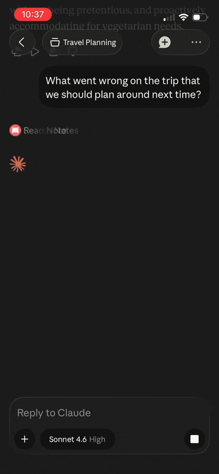
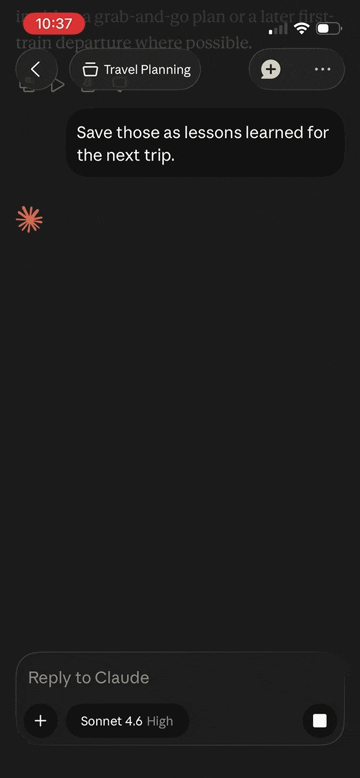
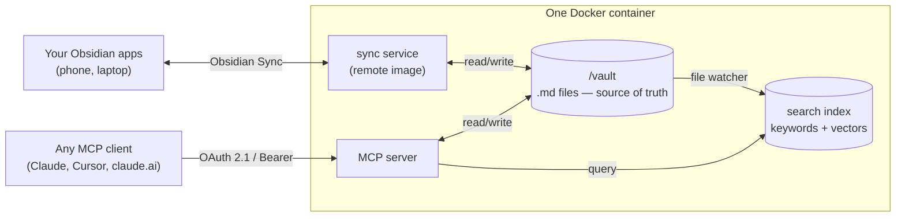

<p align="center">
  
</p>

<div align="center">

[](https://github.com/aliasunder/vault-cortex/actions/workflows/ci.yml)
[](https://github.com/aliasunder/vault-cortex/actions/workflows/gitleaks.yml)
[](https://github.com/aliasunder/vault-cortex/actions/workflows/trivy.yml)
[](https://github.com/aliasunder/vault-cortex/releases)
[](https://www.npmjs.com/package/vault-cortex)
[](https://scorecard.dev/viewer/?uri=github.com/aliasunder/vault-cortex)
[](https://www.bestpractices.dev/projects/14162)
[](https://deepwiki.com/aliasunder/vault-cortex)
[](https://glama.ai/mcp/servers/aliasunder/vault-cortex)

</div>

**Vault Cortex** is a standalone MCP server that gives any AI agent **hybrid search, task management, structured memory, and read/write access** to your [Obsidian](https://obsidian.md) vault. No plugins, no running Obsidian, no separate bridge. One Docker container, your vault folder, a full tool suite + guided prompts. Run it on a remote server with Obsidian Sync, and the same vault is accessible from your phone, claude.ai, or any remote MCP client, secured with OAuth 2.1. Deploy it with one click or self-host it; either way, the vault is always yours.

**Contents** — [What you get](#what-you-get) · [Quick Start](#quick-start) · [How It Works](#how-it-works) · [Hybrid Search](#hybrid-search) · [Memory](#memory) · [Tasks](#tasks) · [Files](#files) · [Tools](#tools) · [Prompts](#prompts) · [Properties](#properties) · [Config](#configuration) · [Daily Notes](#daily-notes) · [Data Integrity](#data-integrity) · [Auth](#authentication) · [Deployment](#deployment-options) · [One-click Deploy](#one-click-deploy) · [Community Deployments](#community-deployments)

## What you get

<table align="center">
  <tr>
    <td align="center"><strong>Search the vault</strong></td>
    <td align="center"><strong>Reason over notes</strong></td>
    <td align="center"><strong>Write back to Obsidian</strong></td>
  </tr>
  <tr>
    <td></td>
    <td></td>
    <td></td>
  </tr>
</table>

<p align="center"><em>All three demos run on Claude mobile. The vault is on a remote server, not the phone.</em></p>

- **[Remote access](#remote-access-from-anywhere)** — works from your phone, a remote server, or any MCP client via OAuth 2.1. One click on Render or Railway gets you there with no server to manage; a VPS works too.
- **[Plugin-free](#how-it-works)** — Obsidian doesn't need to be running. The server works directly with `.md` files on disk. Headless sync keeps the vault current.
- **[Hybrid search](#hybrid-search)** — FTS5 keyword matching + vector semantic similarity via RRF fusion, refined by cross-encoder reranking for intent-heavy queries. Keywords stay precise on exact terms and jargon; vectors find notes even when your words differ from the vault's.
- **[Structured memory](#memory)** — dated, append-only entries accumulate into a personal knowledge layer, auto-initialized for AI personalization. Topic recall answers "what do I think about X?" with the current take and the dated history behind it — evolution included.
- **[Tasks](#tasks)** — Kanban-aware task queries and updates: triage by status, dates, or priority, then complete, reprioritize, or move tasks between lanes in one call. Parses both [Tasks plugin](https://publish.obsidian.md/tasks/) emoji and [Dataview](https://blacksmithgu.github.io/obsidian-dataview/) inline-field formats.
- **[Link graph](#tools)** — backlinks, outgoing links, and orphan detection across the vault
- **[Files](#files)** — read the vault's non-markdown files too: images arrive as actual images (shrunk to fit when needed), PDFs as structured text or rendered pages, canvases as readable outlines, data files as text
- **[Obsidian-native](#properties)** — understands frontmatter, wikilinks, tags, headings, and daily notes
- **[Guided workflows](#prompts)** — built-in prompts for vault health, memory review, and daily reconciliation — assembled from live vault data each time

**Tested across a 15-day trip through Europe.** 30+ sessions from a phone, 216 tool calls, zero laptop access needed. Writes in one session were immediately available in the next, across cities and days.

---

## Quick Start

### Local (2 minutes — Docker + your vault folder)

**Prerequisites:** [Docker](https://docs.docker.com/get-docker/) (or a Docker-compatible runtime, e.g. OrbStack, Colima, Podman), Node.js >= 20.12 (only for the CLI — the server itself runs in Docker), and an Obsidian vault (or any folder of `.md` files).

```bash
npx vault-cortex@latest init
```

That's it — the CLI asks for your vault path, generates the auth token and config files, starts the server, and prints the connection details for your MCP client ([CLI reference →](./cli/)).


**Set up with the CLI?** It manages the server from here on — `configure`, `upgrade`, `start`, `restart`, `logs`, `down` ([CLI reference →](./cli/)).

**Set up with Compose?** Stick with Compose for updates too (`docker compose pull && docker compose up -d`) — the CLI and Compose manage the container independently.

<details>
<summary><strong>Manual setup</strong> (no Node.js needed)</summary>

```bash
# 1. Get the quickstart files
curl -O https://raw.githubusercontent.com/aliasunder/vault-cortex/main/deploy/local/docker-compose.yml
curl -O https://raw.githubusercontent.com/aliasunder/vault-cortex/main/deploy/local/.env.example

# 2. Configure
cp .env.example .env
# Edit .env — set MCP_AUTH_TOKEN (openssl rand -hex 32) and VAULT_PATH

# 3. Start
docker compose up
```

</details>

**[Full local guide →](./deploy/local/)** (includes [Windows setup](./deploy/local/#windows-docker-desktop))

### Remote (access from anywhere)

Your vault on a server, kept current by Obsidian Sync, reachable from your phone, claude.ai, or any MCP client. The one-click options ask for your Obsidian Sync token, vault name, and timezone (plus the vault password if your vault is encrypted), then handle HTTPS, restarts, a generated MCP token, and persistent storage for the vault and its index. On your own server the CLI asks for the public URL and vault name, captures the Sync token for you, and generates the MCP token; HTTPS is yours to set up.

|                | Railway                                                                                                                                                                             | Render                                                                                                                                                  | Self-hosted                                                  |
| -------------- | ----------------------------------------------------------------------------------------------------------------------------------------------------------------------------------- | ------------------------------------------------------------------------------------------------------------------------------------------------------- | ------------------------------------------------------------ |
|                | [](https://railway.com/deploy/vault-cortex?referralCode=_ldHIU&utm_medium=integration&utm_source=template&utm_campaign=generic) | [](https://render.com/deploy?repo=https://github.com/aliasunder/vault-cortex) | **[CLI setup →](#self-hosted-your-own-vps)**                 |
| **Account**    | [Railway](https://railway.com) on the Hobby plan or higher — the 5 GB volume is included                                                                                            | [Render](https://render.com) with a card on file                                                                                                        | A VPS with [Docker](https://docs.docker.com/engine/install/) |
| **Cost**       | Usage-metered: typically $20–30 USD/mo for a personal vault — a little under Render for a quiet vault, a little over for a busy one                                                 | Flat: about $26 USD/mo for the Standard instance (2 GB) and 5 GB disk, billed by the second                                                             | Whatever your VPS costs                                      |
| **Pick it if** | You want the easier start — the template lands you in a configured project                                                                                                          | A predictable bill matters more than setup polish                                                                                                       | You already run a server or want full control                |
| **Guide**      | **[Railway guide →](./deploy/railway/)**                                                                                                                                            | **[Render guide →](./deploy/render/)**                                                                                                                  | **[Remote guide →](./deploy/remote/)**                       |

All three need an [Obsidian Sync](https://obsidian.md/sync) subscription. Whichever you pick, the server is replaceable and your vault isn't — it stays in plain Markdown in Obsidian Sync and on your devices; the container only holds a copy.

#### Self-hosted: your own VPS

The [vault-cortex CLI](./cli/) sets up the same container on any Linux box you run — you manage the server, the image, and updates. You need Node.js >= 20.12 for the CLI itself; the server runs in Docker.

```bash
# On your VPS:
npx vault-cortex@latest init --mode remote
```

That's it — the CLI walks through the public URL, Obsidian Sync token (it can run [`get-sync-token`](./cli/#get-sync-token) for you), vault name, the vault password for an encrypted vault, and auth config, then starts the server ([CLI reference →](./cli/)).

**Set up with the CLI?** It manages the server from here on — `configure`, `upgrade`, `start`, `restart`, `logs`, `down` ([CLI reference →](./cli/)).

**Set up with Compose?** Stick with Compose for updates too (`docker compose pull && docker compose up -d`) — the CLI and Compose manage the container independently.

<details>
<summary><strong>Manual setup</strong> (no Node.js needed)</summary>

```bash
# On your VPS:
mkdir -p /opt/vault-cortex && cd /opt/vault-cortex
curl -O https://raw.githubusercontent.com/aliasunder/vault-cortex/main/deploy/remote/docker-compose.yml
curl -O https://raw.githubusercontent.com/aliasunder/vault-cortex/main/deploy/remote/.env.example
cp .env.example .env
# Edit .env — set MCP_AUTH_TOKEN, PUBLIC_URL, OBSIDIAN_AUTH_TOKEN, VAULT_NAME
docker compose up -d
```

</details>

### Connect your MCP client

| Setup                    | Server URL                                                                                |
| ------------------------ | ----------------------------------------------------------------------------------------- |
| **Local**                | `http://localhost:8000/mcp`                                                               |
| **Remote (one-click)**   | `https://<host>/mcp` — `<host>` is the domain Render or Railway shows on the service page |
| **Remote (self-hosted)** | `<PUBLIC_URL>/mcp`                                                                        |

Add the server URL in any MCP client — Claude Code, Claude Desktop, Cursor, OpenCode, or any other. OAuth clients open a consent page in your browser — approve with your token, and the client handles token renewal from then on. Clients without OAuth (MCP Inspector, scripts) send the token directly as an `Authorization: Bearer` header.

**Claude Code:**

```bash
claude mcp add --scope user --transport http vault-cortex http://localhost:8000/mcp   # local (or <PUBLIC_URL>/mcp)
```

`--scope user` registers the server for every project; omit it to scope it to the current directory only.

<details>
<summary><strong>Claude Desktop</strong> (localhost requires mcp-remote bridge)</summary>

The "Add custom connector" dialog only accepts `https` URLs. With an `https` PUBLIC_URL, add it directly in the connector dialog; for a localhost server, register it in `claude_desktop_config.json` through the [mcp-remote](https://github.com/geelen/mcp-remote) stdio bridge instead:

```json
{
  "mcpServers": {
    "vault-cortex": {
      "command": "npx",
      "args": [
        "-y",
        "mcp-remote",
        "http://localhost:8000/mcp",
        "--header",
        "Authorization: Bearer <your MCP_AUTH_TOKEN>"
      ]
    }
  }
}
```

</details>

**claude.ai (web and mobile)** connects to the remote setup only — its connectors are fetched server-side and can never reach localhost.

> "Remote MCP server" refers to the connection type (HTTP) — in the local setup the server still runs entirely on your machine.

See [Authentication](#authentication) for both methods and token lifetimes.

---

## How It Works

Everything runs in one Docker container, working directly with the `.md` files on disk:

- **Your vault stays the source of truth** — the server reads and writes the same plain Markdown files your Obsidian apps do.
- **Search is derived data** — a file watcher keeps the index (keywords + vectors) current as notes change, and it can be rebuilt from your notes at any time.
- **The remote image adds a sync loop** — a bundled Obsidian Sync service keeps the container's vault current with every device: edit a note on your phone and it's searchable moments later; an agent writes a note and it shows up in Obsidian.


```mermaid
graph LR
    subgraph container ["One Docker container"]
        Sync["sync service<br/>(remote image)"]
        Vault[("/vault<br/>.md files — source of truth")]
        Index[("search index<br/>keywords + vectors")]
        Server["MCP server"]
        Sync <-->|read/write| Vault
        Vault -->|file watcher| Index
        Server <-->|read/write| Vault
        Server -->|query| Index
    end
    Obsidian["Your Obsidian apps<br/>(phone, laptop)"] <-->|Obsidian Sync| Sync
    Client["Any MCP client<br/>(Claude, Cursor, claude.ai)"] -->|OAuth 2.1 / Bearer| Server
```

See [ARCHITECTURE.md](./ARCHITECTURE.md) for the full design, auth flow diagrams, and component breakdown.

---

## Hybrid Search

Keyword search alone fails when your vocabulary doesn't match the vault's — "aspirations" won't find a note about "targets", "coworkers" won't surface your "references" file. In testing against a real vault, 30% of natural-language queries returned zero or tangential results with keywords alone. Hybrid search eliminated those misses — vectors bridge the vocabulary gap, and the reranker rescues intent-heavy queries where neither signal is strong on its own.

Hybrid search combines three ranking signals via [Reciprocal Rank Fusion](./ARCHITECTURE.md#hybrid-search):

- **Keywords** (FTS5) stay precise on exact terms, jargon, and property values
- **Vectors** (sqlite-vec) bridge the vocabulary gap by matching on meaning
- **Reranker** (cross-encoder) refines ordering by scoring each query-document pair jointly — rescues intent-heavy queries where keywords and vectors both miss

All models run locally (~45MB total, no external API). Set `EMBEDDING_ENABLED=false` for keyword-only search, or `RERANK_MODE=none` to skip reranking for lower latency.

See [ARCHITECTURE.md → Hybrid Search](./ARCHITECTURE.md#hybrid-search) for model details, blend weights, and the full pipeline breakdown.

---

## Memory

A memory layer that only grows is only useful if agents can retrieve the right entries without dumping everything into context. Once you have hundreds of dated entries across multiple files — preferences, principles, communication style, ongoing commitments — reading whole files wastes context on irrelevant material and buries the signal. The memory system is designed for targeted retrieval: agents accumulate knowledge over time and recall exactly what's relevant to the task at hand.

The layer is a folder of plain Markdown files (default: `About Me/`) holding dated entries under topic headings — auto-created with starter templates on first run, grown by agents through `vault_update_memory`. Three properties make it work:

- **Append-only** — entries are never overwritten; corrections arrive as new dated entries. The layer becomes a personal knowledge base that captures your current state _and_ the evolution behind it
- **Topic recall** — `vault_memory_recall` retrieves every relevant entry across all memory files at once, keyword- and semantically-matched, oldest first. Ask "what do I think about X?" and get the current take plus the dated history of how it developed — no need to read entire files or guess which file holds what
- **Grows without degrading** — capping results (`max_results`) drops the least-relevant entries, never a slice of the timeline. A memory layer with 500 entries serves a targeted query as well as one with 50

Files that describe what's current rather than what has been true (routines, active commitments) can declare `entry-policy: living` in frontmatter — their expired entries are prunable rather than preserved, keeping the current-state picture accurate.

The whole layer is optional — set `MEMORY_ENABLED=false` to hide the memory tools and skip the folder auto-creation entirely.

See [ARCHITECTURE.md → Memory](./ARCHITECTURE.md#memory) for the recall pipeline, indexing model, auto-initialization, and opt-out behavior, and [templates/memory](./templates/memory/) for the file format, entry-policy convention, and starter templates.

---

## Tasks

Task metadata lives in plain markdown — scattered across files, encoded in emoji signifiers or inline fields, organized under Kanban headings. An agent answering "what's overdue?" would need to parse every file and understand your chosen format; completing a task on a Kanban board means knowing the board's lane structure, the date syntax, and which heading is the done lane.

The task layer handles this so agents don't have to:

- **Find** — filter by status, six date fields (due, scheduled, start, created, done, cancelled), priority, folder, or Kanban lane. Each result carries its note path, line number, and nearest heading when the task sits under one (the lane on a Kanban board) — no follow-up reads needed to locate a task
- **Create** — add a correctly-formatted task in one call: description, priority, dates, block_id, and checklist sub-items, placed under a heading or nested under a parent task
- **Update** — complete, reprioritize, edit the text, set or clear dates, add checklist items, and move tasks between headings in a single call. Marking a task done auto-detects the done lane and stamps the completion date; reversing it removes the date
- **Both formats** — whichever format you use, [Tasks plugin](https://publish.obsidian.md/tasks/) emoji signifiers or [Dataview](https://blacksmithgu.github.io/obsidian-dataview/) inline fields, the server reads both and writes in the format your Tasks plugin is configured for

See [ARCHITECTURE.md → Tasks](./ARCHITECTURE.md#tasks) for the indexing model, date cascade sorting, and Kanban lane detection.

---

## Files

Your notes embed screenshots, reference architecture diagrams, and link out to canvases and data files — but to an agent reading markdown, `![[diagram.png]]` is just text. vault-cortex treats files as part of the vault rather than clutter around it — linked, sized, and readable, each in the form an agent can actually use:

- **Images** — the image itself, not the filename. Screenshots and diagrams are downscaled and recompressed server-side when they exceed what MCP clients accept, so even a phone session can look at a 5MB architecture diagram
- **Canvases** — a [Canvas](https://help.obsidian.md/canvas) board arrives as a readable outline: its groups, each card's content in reading order, and the connections between them. Canvas content is full-text searchable, and file references on the board appear in the link graph — backlinks and outgoing links work just like note-to-note links. The exact JSON source is one flag away when full fidelity matters
- **PDFs** — text is extracted with heading hierarchy, code blocks, and hyperlinks preserved; PDF content is full-text searchable alongside your notes. Set `raw: true` to render pages as images instead, showing layout, diagrams, and tables that text extraction can't preserve — scanned and image-only PDFs work in this mode
- **Text and data files** — TXT, SVG, JSON, XML, CSV, YAML, logs, and [Bases](https://help.obsidian.md/bases) files return exactly as written; the first 100 KB of content is full-text searchable. Big data files and logs can be read a line range at a time, with each page reporting where you are and how much file remains
- **Browse** — list any visible folder's files with per-extension counts and file sizes; files a note links to report their size in the link graph too

Set `FILE_TOOLS_ENABLED=false` to hide the file tools — useful when your remote vault syncs without attachments.

See [ARCHITECTURE.md → Files](./ARCHITECTURE.md#files) for the image pipeline and dispatch model.

---

## Tools

| Category        | Tool                         | Description                                                                             |
| --------------- | ---------------------------- | --------------------------------------------------------------------------------------- |
| **Vault CRUD**  | `vault_read_note`            | Read a note — full body, properties, outline, or a section                              |
|                 | `vault_write_note`           | Create a note (fails if it already exists; set `overwrite` to replace)                  |
|                 | `vault_patch_note`           | Heading-targeted edit (append, prepend, replace with `include_children` guard, insert)  |
|                 | `vault_replace_in_note`      | Find-and-replace text in a note (first match or `replace_all_occurrences`)              |
|                 | `vault_delete_span`          | Delete a block of lines by short anchors, no full re-quote                              |
|                 | `vault_replace_span`         | Replace a block of lines by short anchors with new content                              |
|                 | `vault_insert_at_anchor`     | Insert content before or after a line identified by a short anchor                      |
|                 | `vault_list_notes`           | List notes with optional glob/folder filter                                             |
|                 | `vault_delete_note`          | Delete a note (protected paths enforced)                                                |
|                 | `vault_move_note`            | Move or rename a note, rewriting links across the vault                                 |
| **Search**      | `vault_search`               | Hybrid search with tag/folder/property/date filters                                     |
|                 | `vault_search_by_tag`        | Find notes by tag (exact or prefix match)                                               |
|                 | `vault_search_by_folder`     | Browse notes in a folder with metadata                                                  |
|                 | `vault_recent_notes`         | Recently modified or created notes                                                      |
|                 | `vault_list_tags`            | All tags with usage counts                                                              |
| **Tasks**       | `vault_list_tasks`           | Vault-wide task index with sub-task depth — Kanban-aware, date/priority/heading filters |
|                 | `vault_create_task`          | Create a correctly-formatted task — dates, priority, sub-tasks, block_id in one call    |
|                 | `vault_update_task`          | Edit description, dates, status, priority, heading, sub-tasks, block_id in one call     |
| **Memory**      | `vault_get_memory`           | Read structured memory (file, section, or all)                                          |
|                 | `vault_update_memory`        | Append a dated entry to a memory section                                                |
|                 | `vault_delete_memory`        | Remove a specific memory entry by date                                                  |
|                 | `vault_list_memory_files`    | Discover memory files, their sections, and each file's entry policy                     |
|                 | `vault_memory_recall`        | Entry-granular hybrid recall of a topic across memory files, oldest-first               |
| **Properties**  | `vault_list_property_keys`   | All property keys with sample values                                                    |
|                 | `vault_list_property_values` | Distinct values for a property key                                                      |
|                 | `vault_search_by_property`   | Find notes by property key-value                                                        |
|                 | `vault_update_properties`    | Add or update properties without touching the body                                      |
| **Links**       | `vault_get_backlinks`        | Notes linking to a given path                                                           |
|                 | `vault_get_outgoing_links`   | Links from a given note                                                                 |
|                 | `vault_find_orphans`         | Notes with no incoming links                                                            |
| **Files**       | `vault_read_file`            | Read a non-markdown file — images delivered as images, canvases as readable outlines    |
|                 | `vault_list_files`           | Browse the vault's non-markdown files with sizes and per-extension counts               |
| **Daily Notes** | `vault_get_daily_note`       | Today's (or any date's) daily note                                                      |

---

## Prompts

Tools are model-driven — the assistant calls them. **Prompts** are workflows _you_ trigger. Each one queries the search index, link graph, and memory layer at invocation time, then assembles the results with guided instructions — so the session starts grounded in your vault's actual state, not assumptions.

| Prompt              | Arguments             | What it does                                                                                                                                                                                                                                                                                                                                                                      |
| ------------------- | --------------------- | --------------------------------------------------------------------------------------------------------------------------------------------------------------------------------------------------------------------------------------------------------------------------------------------------------------------------------------------------------------------------------- |
| `vault-orientation` | —                     | Surveys vault stats, folder distribution, property adoption rates (flags low adoption), orphans, broken link count, tags, recent notes, and the memory layer — with contextual tool suggestions                                                                                                                                                                                   |
| `memory-review`     | `file?`, `max_chars?` | Structural overview (scope callouts, section entry counts) + dated content as a timeline. Guided reflection: evolution narrative, scope-fit, backfill gaps, and coverage analysis — append-only by default, pruning proposed only for `entry-policy: living` files. Hidden when `MEMORY_ENABLED=false`, `READONLY_MODE=true`, or `DISABLED_TOOLS` includes `vault_update_memory`. |
| `daily-review`      | `date?`, `max_chars?` | Reconciles a day — daily note, vault-wide task status (due/overdue, scheduled), modified notes, outgoing links (broken-link detection), and backlinks — surfaces what happened, what's open, and what needs follow-up                                                                                                                                                             |

Prompts adapt to your configuration (`MEMORY_DIR`, daily-notes settings) and work for any vault out of the box. Pass `max_chars` to cap embedded content if your client has payload limits.

> **Client support:** Prompts work in Claude Desktop (Chat and Cowork — via the **+** menu under your connector), Claude Code (slash commands), and OpenCode. Support in other clients (Cursor, Windsurf) varies — see the [MCP clients matrix](https://modelcontextprotocol.io/clients) for the latest.

---

## Properties

Vault Cortex indexes every [property](https://help.obsidian.md/Editing+and+formatting/Properties) in your notes, but five get **promoted** treatment — dedicated columns for fast filtering, and top-level fields in every search and discovery result:

| Property  | What you can do                                                                                              |
| --------- | ------------------------------------------------------------------------------------------------------------ |
| `title`   | Display name in search results; falls back to the filename when missing                                      |
| `tags`    | Search and filter by tag, including parent-child hierarchies (`project` matches `project/vault-cortex`)      |
| `type`    | Filter by note type — `meeting`, `person`, `session-log`, or any value your vault uses                       |
| `created` | Sort by creation date and see when each note was created alongside every search result                       |
| `related` | Filter for notes that cross-reference a specific link — surfaces connections invisible without a graph query |

**All other properties** are still fully queryable — use `vault_search` with `filters.properties` for combined text + metadata queries, or `vault_search_by_property` for metadata-only lookups. `vault_list_property_keys` and `vault_list_property_values` discover what properties exist across your vault.

These are conventions, not requirements — Vault Cortex works with any property schema. Promoted properties just give you richer filtering and cleaner results out of the box.

**Leading callouts** get the same treatment. When a note's first body content is an Obsidian [callout](https://help.obsidian.md/Editing+and+formatting/Callouts) (`> [!type]`) — either right after frontmatter or right after the title heading — it's indexed and surfaced alongside every discovery result (on `vault_search`, ask for it with `include_leading_callout`). This makes notes self-describing: an agent scanning results can see what each note is _for_ before deciding which to read. The memory templates use `> [!info] Scope of this file` callouts for this, and any note in your vault can use the same pattern.

---

## Configuration

All settings are environment variables with sensible defaults. Remote deployments also forward Obsidian Sync's own settings — `DEVICE_NAME`, `SYNC_MODE`, `CONFLICT_STRATEGY`, `SYNC_CONFIGS`, `SYNC_EXCLUDED_FOLDERS`, `SYNC_FILE_TYPES` — documented in the [remote guide's configuration table](./deploy/remote/README.md#configuration).

| Variable                    | Required?   | Default                                                                          | Description                                                                                                                                                                                                                                                                                                                                     |
| --------------------------- | ----------- | -------------------------------------------------------------------------------- | ----------------------------------------------------------------------------------------------------------------------------------------------------------------------------------------------------------------------------------------------------------------------------------------------------------------------------------------------- |
| `MCP_AUTH_TOKEN`            | Yes         | —                                                                                | Bearer token for authentication (also the JWT signing key)                                                                                                                                                                                                                                                                                      |
| `VAULT_PATH`                | Local only  | —                                                                                | Host path to your vault (bind mount source; remote uses a named volume). Must not contain `*`, `?`, or `[` — rejected at startup.                                                                                                                                                                                                               |
| `PUBLIC_URL`                | Remote only | —                                                                                | Public URL for OAuth discovery metadata. Filled in automatically on Render and Railway (from `RENDER_EXTERNAL_URL` or `RAILWAY_PUBLIC_DOMAIN`) when left unset                                                                                                                                                                                  |
| `OBSIDIAN_AUTH_TOKEN`       | Remote only | —                                                                                | Obsidian Sync auth token — the CLI's [`get-sync-token`](./cli/#get-sync-token) captures it for you                                                                                                                                                                                                                                              |
| `VAULT_NAME`                | Remote only | —                                                                                | Exact name of your Obsidian Sync vault (case-sensitive)                                                                                                                                                                                                                                                                                         |
| `VAULT_PASSWORD`            | Remote only | —                                                                                | End-to-end encryption password, if your vault has one. Leave empty otherwise.                                                                                                                                                                                                                                                                   |
| `STORAGE_ROOT`              | —           | —                                                                                | One directory for everything that must persist — the vault, the search index, and Obsidian Sync state — for container hosting platforms that allow a single persistent volume (Railway, Render). Mount the volume there and set this to the same path. Must not contain `*`, `?`, or `[` — rejected at startup.                                 |
| `EMBEDDING_ENABLED`         | —           | `true`                                                                           | Set `false` to disable the embedding pipeline — skips model download, vector tables, embedding passes, and hybrid search. Search falls back to FTS5 keyword matching.                                                                                                                                                                           |
| `RERANK_MODE`               | —           | `blended`                                                                        | Cross-encoder reranking mode: `blended` applies position-aware score blending after RRF fusion (~200ms added latency), `none` skips reranking. Only takes effect when `EMBEDDING_ENABLED` is true.                                                                                                                                              |
| `MEMORY_ENABLED`            | —           | `true`                                                                           | Set `false` to fully disable the memory layer — hides memory tools, skips bootstrap, omits memory from server metadata. `MEMORY_DIR` is ignored when `false`.                                                                                                                                                                                   |
| `FILE_TOOLS_ENABLED`        | —           | `true`                                                                           | Set `false` to hide file tools (`vault_read_file`, `vault_list_files`) — useful for remote deployments where Obsidian Sync has attachment syncing disabled.                                                                                                                                                                                     |
| `READONLY_MODE`             | —           | `false`                                                                          | Set `true` to hide every tool that changes the vault and skip memory folder auto-creation — connected clients can read and search but never edit.                                                                                                                                                                                               |
| `DISABLED_TOOLS`            | —           | —                                                                                | Hide individual tools by name, comma-separated (e.g. `vault_delete_note,vault_move_note`). Names match the Name column in the [tools table](#tools). Subtractive only — it cannot re-enable a tool another setting hides. An unknown tool name stops the server at startup, so typos surface immediately.                                       |
| `MEMORY_DIR`                | —           | `About Me`                                                                       | Vault folder for structured memory files                                                                                                                                                                                                                                                                                                        |
| `PROTECTED_PATHS`           | —           | `MEMORY_DIR`, daily notes folder                                                 | Folders that `vault_delete_note` and `vault_move_note` refuse to touch. The default daily notes folder is read from `DAILY_NOTES_FOLDER` or `.obsidian/daily-notes.json` (default `Daily Notes`). Overrides the default entirely when set.                                                                                                      |
| `ORPHAN_EXCLUDE_FOLDERS`    | —           | `DAILY_NOTES_FOLDER, Templates, MEMORY_DIR`                                      | Folders excluded from orphan detection                                                                                                                                                                                                                                                                                                          |
| `DAILY_NOTES_FOLDER`        | —           | from vault config                                                                | Sets the folder your daily notes live in. When unset, read from the vault's `.obsidian/daily-notes.json`, falling back to `Daily Notes`. See [Daily notes](#daily-notes).                                                                                                                                                                       |
| `DAILY_NOTES_FORMAT`        | —           | from vault config                                                                | Sets the daily note filename format — same tokens as Obsidian's daily note date format setting. When unset, read from the vault's `.obsidian/daily-notes.json`, falling back to `YYYY-MM-DD`. See [Daily notes](#daily-notes).                                                                                                                  |
| `TZ`                        | —           | `UTC`                                                                            | IANA timezone for timestamps and daily note resolution                                                                                                                                                                                                                                                                                          |
| `SERVICE_DOCUMENTATION_URL` | —           | GitHub repo URL                                                                  | URL returned in OAuth discovery metadata                                                                                                                                                                                                                                                                                                        |
| `LOG_LEVEL`                 | —           | `info`                                                                           | Logging verbosity: `debug`, `info`, `warn`, `error`                                                                                                                                                                                                                                                                                             |
| `LOG_DIR`                   | —           | `/data/logs` (remote), `$STORAGE_ROOT/data/logs` (single-volume), `none` (local) | Directory for log files that survive container re-creation. The container's own log (what `docker logs` shows) is always written, but Docker discards it whenever the container is recreated — on image updates or config changes. Date-stamped files under `LOG_DIR` live on the data volume and survive. `none` keeps only the container log. |
| `LOG_RETENTION_DAYS`        | —           | `90`                                                                             | Days to keep log files before automatic cleanup on startup; only applies when `LOG_DIR` is a path                                                                                                                                                                                                                                               |
| `WINDOWS_MODE`              | —           | `false`                                                                          | On Windows? Set `true`. Switches the file watcher to polling and note moves to rename-based writes so a vault on a `C:` drive works through Docker Desktop. Safe to leave on for any Windows setup; unneeded on macOS/Linux/WSL2.                                                                                                               |
| `MAX_FILE_BYTES`            | —           | `52428800` (50 MiB)                                                              | Maximum file size `vault_read_file` will read (in bytes). Files exceeding this are rejected before reading. Raise for vaults with very large individual files.                                                                                                                                                                                  |
| `MAX_IMAGE_OUTPUT_BYTES`    | —           | `49152` (48 KiB)                                                                 | Byte budget for images delivered by `vault_read_file`, in binary bytes before base64 encoding. Images exceeding this are downscaled and recompressed to fit. Sized for the tightest mainstream MCP client cap; raise for clients that accept larger responses.                                                                                  |
| `MAX_PDF_RENDER_PAGES`      | —           | `5`                                                                              | Maximum PDF pages to render as images when `raw: true` is set on `vault_read_file`. The per-page byte budget is `MAX_IMAGE_OUTPUT_BYTES` divided evenly across the rendered pages — fewer pages means higher quality each.                                                                                                                      |
| `TRUST_PROXY_HOPS`          | —           | `0`                                                                              | Number of trusted reverse-proxy hops used to derive the client IP from `X-Forwarded-For` (OAuth rate limiting, request logs). Set `1` when exactly one proxy you control sits in front of the server (Caddy, nginx, Cloudflare Tunnel, API Gateway). With `0`, injected forwarding headers are ignored.                                         |
| `TRUST_FORWARDED_HOPS`      | —           | `0`                                                                              | How many trailing `for=` entries in the [RFC 7239](https://www.rfc-editor.org/rfc/rfc7239) `Forwarded` header belong to proxies you control. `0` ignores the header; `1` when the proxy in front writes it (e.g. AWS API Gateway); `2` when a CDN fronts that proxy and is the only way to reach it.                                            |

- **Smart defaults** — `MEMORY_DIR` and the daily notes folder feed the defaults for `PROTECTED_PATHS` and `ORPHAN_EXCLUDE_FOLDERS`. Set one of those explicitly only when you want a fully custom list: the value replaces the whole default, daily notes folder included.
  - `PROTECTED_PATHS` reads the daily notes folder from `DAILY_NOTES_FOLDER` or `.obsidian/daily-notes.json` (default `Daily Notes`).
  - `ORPHAN_EXCLUDE_FOLDERS` takes it from `DAILY_NOTES_FOLDER`, else `Daily Notes` — it doesn't read `daily-notes.json`.
- **`MEMORY_ENABLED=false`** fully disables the memory layer — memory tools are hidden and the memory folder is not auto-created.
- **`FILE_TOOLS_ENABLED=false`** hides file tools entirely — useful when Obsidian Sync has attachment syncing disabled and no files exist on disk.
- **`READONLY_MODE=true`** hides every vault-writing tool and skips memory folder auto-creation — connected clients can read and search but never edit.
- **`DISABLED_TOOLS`** hides exactly the tools you name — for finer control than the switches above, e.g. keep writes on but remove `vault_delete_note` and `vault_move_note`. Availability-keyed cross-references in tool descriptions and prompts adjust automatically.

See [`templates/memory/`](./templates/memory/) for memory file examples and the dated-entry design philosophy.

### Daily notes

`vault_get_daily_note` and the daily-review prompt find your daily notes using the folder and filename date format configured in Obsidian, read from your vault's `.obsidian/daily-notes.json`:

- **Local mode** reads the file straight from your bind-mounted vault — nothing to set up.
- **Remote mode** receives it through Obsidian Sync's vault configuration syncing. The server pulls it by default (the `SYNC_CONFIGS` setting in `.env`), but you'll likely need to enable the push side: Obsidian Settings → Sync → **Vault configuration sync**, per device. Details: the [remote guide's Daily notes section](./deploy/remote/README.md#daily-notes).

When the file isn't available — or you use the Periodic Notes plugin, whose settings it doesn't reflect — set `DAILY_NOTES_FOLDER` (any vault-relative path: `Journal`, `Planner/Daily`) and `DAILY_NOTES_FORMAT` (same tokens as Obsidian's date format setting: `YYYY-MM-DD-dddd`, `YYYY/MM/DD`, `MMM D, YYYY`, …). You can set one or both — a set value always wins over the config file. Without either source, the server falls back to `Daily Notes` and `YYYY-MM-DD`.

> **Note:** A few date format tokens are unsupported — ordinals (`Do`, `Mo`, `DDDo`, `wo`), `dd` (2-letter weekday), `d` (weekday number), `e`, `k`/`kk`, and the localized formats (`L`–`LLLL`, `LT`, `LTS`). The server can't reproduce the filenames Obsidian creates with these tokens, so it could never find the notes. If your format uses any of them, `vault_get_daily_note` returns a clear error — change the format in Obsidian or set `DAILY_NOTES_FORMAT` to a supported alternative.

---

## Data Integrity

Vault Cortex writes to personal notes — the file safety layer is built to prevent corruption, not just errors.

- **Atomic writes** — every file write stages to a temp file, then renames. Readers never see a partial or 0-byte note. Exclusive creates use `link()` (POSIX no-clobber) to close the TOCTOU window on note moves.
- **Per-file mutex** — concurrent MCP tool calls serialize or fail-fast per file. Moves lock the source, destination, and every backlink source as one unit.
- **Path traversal blocked** — `resolveSafePath()` resolves then prefix-checks every path. Protected-path deletion is refused after normalization. Memory file names reject separators at the boundary.
- **Hidden paths are off-limits** — files and folders starting with a dot (`.obsidian/`, `.trash/`) never appear in listings or search, and any tool call that targets one directly is rejected, matching Obsidian. Plugin configs and their API keys stay out of reach.
- **Injection prevention** — search queries are parameterized and FTS5-sanitized; prompt content is wrapped in XML data markers with closing-tag escaping to prevent tag-breakout injection.
- **Container hardening** — non-root user, PID 1 init, no package managers in the runtime image, digest-pinned base, graceful shutdown.

See [ARCHITECTURE.md → Data Integrity](./ARCHITECTURE.md#data-integrity) for mechanism details and [SECURITY.md → Runtime Hardening](./SECURITY.md#runtime-hardening) for how each part of the server is hardened.

---

## Authentication

For a server with read/write access to personal notes, authentication is not optional. Vault Cortex implements the full OAuth 2.1 specification, including PKCE and refresh-token rotation. The [AWS (SST) deployment](#deployment-options) adds defense-in-depth: requests are validated at two independent layers (API Gateway Lambda authorizer + Express middleware). Per [BlueRock's 2026 MCP security analysis](https://www.bluerock.io/use-cases/safely-adopt-mcp), only 8.5% of MCP servers implement OAuth; 41% have no authentication at all.

Two methods:

| Method            | Used by                                                  | Token format         |
| ----------------- | -------------------------------------------------------- | -------------------- |
| **OAuth 2.1**     | Claude Desktop, Claude Code, claude.ai, any OAuth client | JWT (HS256, 6h)      |
| **Static bearer** | Claude Code, MCP Inspector, curl                         | Raw `MCP_AUTH_TOKEN` |

OAuth uses dynamic client registration — no Client ID/Secret needed. A consent page opens in your browser; enter your `MCP_AUTH_TOKEN` to approve. Refresh tokens have a 60-day sliding expiry (daily users never re-authenticate). Access tokens are bound to your server's URL, so a token minted for one deployment is never accepted by another. Rotating `MCP_AUTH_TOKEN` ends every session — each client re-authorizes through the consent page.

See [ARCHITECTURE.md → Auth](./ARCHITECTURE.md#auth-oauth-21--defense-in-depth) for the full flow diagram.

---

## Deployment Options

Local runs on your machine. Remote deployments run on a VPS or a hosted container platform — your vault is accessible even when your laptop is closed.

Whichever path you pick, the server is replaceable and your vault isn't. Your notes are plain Markdown files, synced by Obsidian to every device you own; the container holds a copy and an index it can rebuild from scratch. Shut down the VPS, delete the Render or Railway service, switch hosts — the same files are still on your machine and in Obsidian Sync, readable by anything. That's the difference from an AI notebook whose real home is the vendor's database: here the host is a convenience, not a custodian.

| Path                     | What                                                              | Guide                                                                         |
| ------------------------ | ----------------------------------------------------------------- | ----------------------------------------------------------------------------- |
| **Local**                | Your vault on your machine — free, no cloud                       | [`deploy/local/`](./deploy/local/)                                            |
| **Remote · one-click**   | Render or Railway — one persistent volume, no server to manage    | [`deploy/render/`](./deploy/render/) · [`deploy/railway/`](./deploy/railway/) |
| **Remote · self-hosted** | VPS + Obsidian Sync — access from any device                      | [`deploy/remote/`](./deploy/remote/)                                          |
| **Remote · AWS (SST)**   | IaC reference deployment — automated infra, defense-in-depth auth | [`DEPLOY.md`](./DEPLOY.md)                                                    |

The AWS path includes CI/CD workflows built for this repo — [forkers need to configure their own credentials and stage](./DEPLOY.md#dont-fork-deploy-without-re-staging) before deploying.

Every path runs the same image, `ghcr.io/aliasunder/vault-cortex` — `:latest` is the MCP server alone (local), `:remote` bundles Obsidian Sync in the same container under [s6-overlay](https://github.com/just-containers/s6-overlay) supervision (one-click, self-hosted, and AWS). One container means any OCI runtime works: `docker run`, Podman, nerdctl — Docker Compose is optional.

> **Also on Docker Hub:** the same images are mirrored to [`aliasunder/vault-cortex`](https://hub.docker.com/r/aliasunder/vault-cortex). GHCR is the primary source; Hub tags are identical.

**Cost:** A remote setup needs a VPS or a hosted platform plan, plus $4 USD/mo for [Obsidian Sync](https://obsidian.md/sync). A 2 GiB instance handles semantic search fine for a typical vault; 4 GiB adds headroom for concurrent search and larger vaults. Skip semantic search entirely to go smaller still. Local-only is free. The [reference AWS deployment](./ARCHITECTURE.md#cost) runs ~$17–29 USD/mo all-in.

### One-click deploy

Buttons and prerequisites are in [Quick Start → Remote](#remote-access-from-anywhere). Each guide walks through the deploy, where to find your URL and token, how to update, and how to delete: [`deploy/render/`](./deploy/render/) (from the [`render.yaml`](./render.yaml) Blueprint at the repo root) · [`deploy/railway/`](./deploy/railway/) (from a published template).

### Community deployments

Deployment templates built and maintained by the community — not tested here, and they may lag behind releases.

- [vault-cortex-aca](https://github.com/flytzen/vault-cortex-aca) — Bicep template for **Azure Container Apps** by [@flytzen](https://github.com/flytzen). Runs the `:remote` image behind Container Apps ingress with free managed HTTPS; storage is deliberately ephemeral, with Obsidian Sync as the source of truth.

Built a deployment for another platform? Open a PR to add it here.

---

## Development

```bash
# Run locally with hot reload
PUBLIC_URL=http://localhost:8000 MCP_AUTH_TOKEN=local-dev-token VAULT_PATH=~/Vault npm run dev:mcp

# Tests
npm test

# Full check suite
npm run prettier:check && npm run lint && npm run markdownlint && npm run knip && npm test && npm run build
```

`npm test` includes integration tests that boot a real server and call every
tool and prompt over HTTP — verifying auth enforcement, config-gated tool
surfaces, write mutation integrity (each write is read back), and boot
rejection on misconfiguration. See [SECURITY.md](./SECURITY.md#testing-verification)
for the security-relevant coverage.

**MCP Inspector** — interactive browser UI for testing tools:

```bash
# Start server (terminal 1), then:
npx @modelcontextprotocol/inspector
# Enter http://localhost:8000/mcp as URL, local-dev-token as Bearer token
```

See [CONTRIBUTING.md](./CONTRIBUTING.md) for the full development setup.

---

## Companion: obsidian-vault skill

The MCP server works on its own with any client. For agents that support [skills](https://github.com/vercel-labs/skills) (Claude Code, Cursor, Windsurf, Cline, and [70+ others](https://github.com/vercel-labs/skills#supported-agents)), the **obsidian-vault** skill adds deeper knowledge of Obsidian-flavored markdown — frontmatter conventions, callout syntax, and plugin-specific formats like Dataview, Tasks, and Kanban.

```bash
npx skills add aliasunder/agent-skills --skill obsidian-vault
```

[Skill source →](https://github.com/aliasunder/agent-skills/tree/main/skills/obsidian-vault)

---

## Roadmap

| Phase  | What                                                                                                                      | Status    |
| ------ | ------------------------------------------------------------------------------------------------------------------------- | --------- |
| **1**  | Vault CRUD, full-text search (FTS5), memory layer, OAuth 2.1                                                              | Complete  |
| **2a** | Hybrid search — FTS5 + vector + RRF fusion, heading-aware chunking                                                        | Complete  |
| **2b** | Reranker — cross-encoder reranking, position-aware score blending                                                         | Complete  |
| **3a** | Task layer — vault-wide task index, structured queries, and one-call task updates (Tasks plugin emoji + Dataview formats) | Complete  |
| **3b** | Memory recall — entry-granular retrieval across the memory layer's dated history                                          | Complete  |
| **3c** | Graph queries — multi-hop traversal over the vault's existing wikilink graph (paths, neighborhoods)                       | Exploring |

---

## Acknowledgments

Obsidian sync is powered by [obsidian-headless](https://obsidian.md/help/headless) — containerization approach inspired by [@Belphemur](https://github.com/Belphemur)'s [obsidian-headless-sync-docker](https://github.com/Belphemur/obsidian-headless-sync-docker). The `:remote` image's s6-overlay supervision scaffolding was absorbed from that project's [maintained fork](https://github.com/aliasunder/obsidian-headless-sync-docker) and now lives in this repo.

The hybrid search pipeline draws on patterns from [@tobi](https://github.com/tobi)'s [qmd](https://github.com/tobi/qmd) — RRF fusion with rank bonuses, position-aware score blending for cross-encoder reranking, content-hash gating, and heading-aware chunking.

## Contributing

See [CONTRIBUTING.md](./CONTRIBUTING.md) for development setup, code conventions, and PR guidelines.

## License

[MIT](./LICENSE)

The `:remote` image **bundles** [`obsidian-headless`](https://github.com/obsidianmd/obsidian-headless)
(the `ob` CLI), which is **proprietary** — its `package.json` declares `"license": "UNLICENSED"`
(© Dynalist Inc. / Obsidian). It is installed from public npm at build time; the MIT license here
does **not** cover it, and using it requires an active Obsidian Sync subscription. The `:latest`
(local) image contains no proprietary components.

## Security

Report vulnerabilities privately — see [SECURITY.md](./SECURITY.md).
