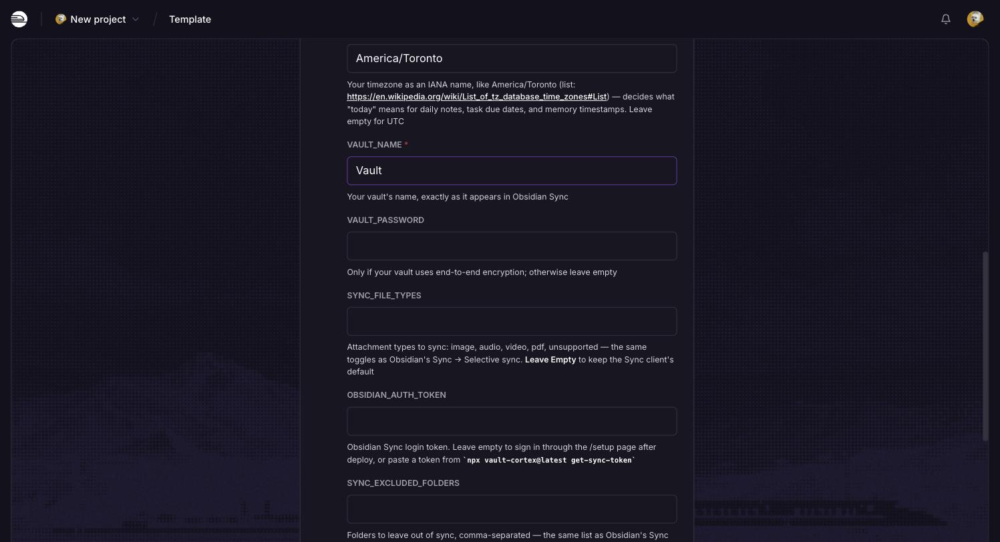
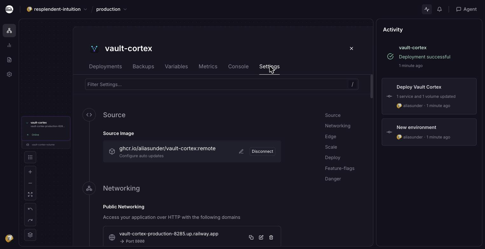
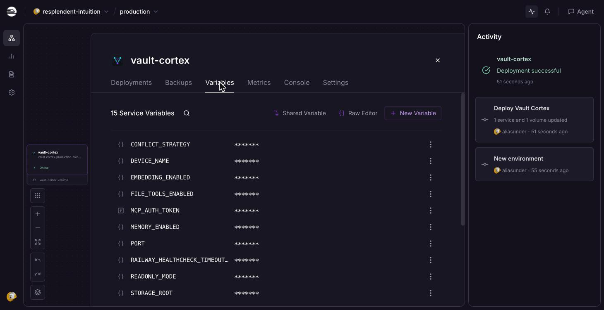
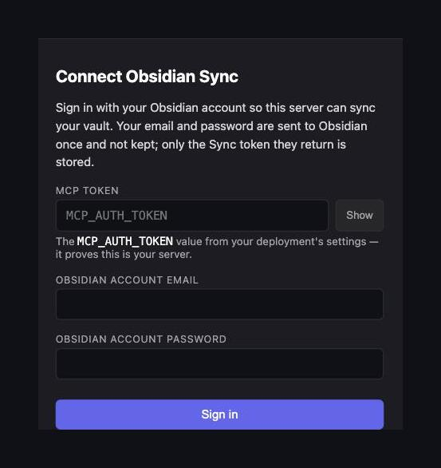
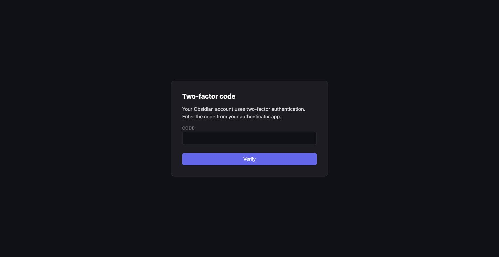
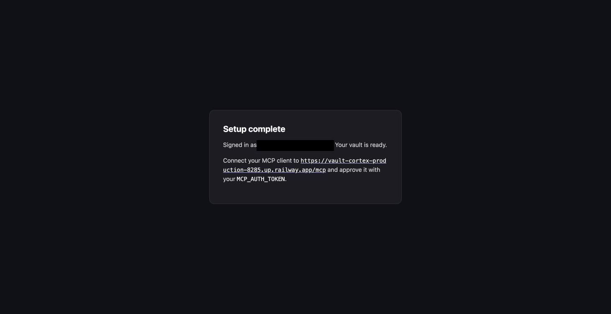
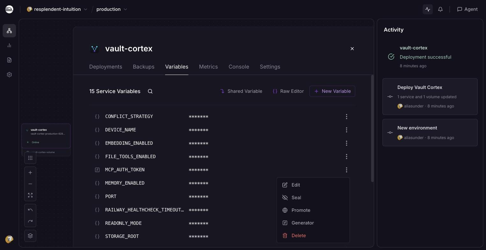

# Railway Quickstart (one-click)

Run Vault Cortex on [Railway](https://railway.com) from a button — no server to
manage.

What you end up with:

- A copy of your vault on Railway, kept current by Obsidian Sync in both
  directions.
- Any MCP client can search, read, and write it from anywhere.
- HTTPS, restarts, and a generated access token, handled by Railway.
- One volume holding the vault copy, the search index, and the Sync
  connection.

Your notes' home stays Obsidian Sync and your own devices; delete the
service and you lose only the copy.

Prefer your own VPS? Use the [remote quickstart](../remote/) instead.
Curious how the container is put together?
[ARCHITECTURE.md →](../../ARCHITECTURE.md#container-startup).

**Contents** — [Prerequisites](#prerequisites) · [Deploy](#deploy) · [Your URL and token](#your-url-and-token) · [Sign in to Obsidian Sync](#sign-in-to-obsidian-sync) · [Security](#security) · [First start](#first-start) · [Connect](#connect-your-mcp-client) · [Verify](#verify) · [Updating](#updating) · [Restart, stop, delete](#restart-stop-delete) · [Config](#configuration) · [Troubleshooting](#troubleshooting)

## Prerequisites

- A [Railway](https://railway.com) account on the **Hobby** plan or higher —
  the trial plan caps volumes at 0.5 GB, and a volume keeps the size of the
  plan it was created on. A typical vault plus its search index overflows
  0.5 GB, and the only fix afterwards is deleting the volume and syncing the
  whole vault again — so upgrade **before** deploying; Hobby includes the
  5 GB volume this template uses. See
  [Railway's pricing](https://railway.com/pricing); a typical instance uses
  roughly 1–2 GB of memory.
- An [Obsidian Sync](https://obsidian.md/sync) subscription

## Deploy

[](https://railway.com/deploy/vault-cortex?referralCode=_ldHIU&utm_medium=integration&utm_source=template&utm_campaign=generic)

The button opens the template's page. Click **Deploy Now**, then
**Configure** on the `vault-cortex` service card to open the form. Only
`VAULT_NAME` is required; the rest are optional:



| Field                   | Value                                                                                                                                                                                                                           |
| ----------------------- | ------------------------------------------------------------------------------------------------------------------------------------------------------------------------------------------------------------------------------- |
| `TZ`                    | Your timezone as an [IANA name](https://en.wikipedia.org/wiki/List_of_tz_database_time_zones#List) (`America/Toronto`) — decides what "today" means for daily notes, task due dates, and memory timestamps. Leave empty for UTC |
| `VAULT_NAME`            | Your vault's name, the same as it is in Obsidian                                                                                                                                                                                |
| `VAULT_PASSWORD`        | Only if your vault uses end-to-end encryption; otherwise leave empty                                                                                                                                                            |
| `SYNC_FILE_TYPES`       | Attachment types to sync: `image`, `audio`, `video`, `pdf`, `unsupported`. Leave empty to keep the Sync client's default                                                                                                        |
| `OBSIDIAN_AUTH_TOKEN`   | Leave empty — you sign in through the setup page after deploy (see [Sign in to Obsidian Sync](#sign-in-to-obsidian-sync)). Or paste a token from `npx vault-cortex@latest get-sync-token` to skip the setup page                |
| `SYNC_EXCLUDED_FOLDERS` | Folders to leave out of sync, comma-separated — the same list as Obsidian's Sync → Excluded folders. Leave empty to sync everything                                                                                             |

Fill in at least the vault name **before** the first deploy. Click
**Deploy**. Railway creates the service and volume, pulls the image, and
starts the first deploy. Everything else — the MCP token, the public URL,
the port, the storage layout — is set by the template.

## Your URL and token

- **URL:** click the `vault-cortex` card on the project canvas, then open
  **Settings → Networking**. Railway generates the domain from the service
  and environment names plus a short suffix —
  `https://vault-cortex-production-xxxx.up.railway.app`. Wherever this
  guide shows `<host>`, put your own domain in its place: `https://<host>/mcp`
  becomes `https://vault-cortex-production-xxxx.up.railway.app/mcp`.

  

- **Token:** on the same card, open **Variables**, hover over the
  `MCP_AUTH_TOKEN` value, and click the eye or copy icon. Railway generated
  it for you; your MCP client enters it once on the consent page.

  

## Sign in to Obsidian Sync

When the Activity panel shows **Deployment successful**, sign in to
Obsidian Sync through the setup page:



1. **Copy `MCP_AUTH_TOKEN`** from the service's **Variables** tab — hover
   over the value and click the eye or copy icon.
2. **Open the setup page**: under **Settings → Networking**, click your
   `…up.railway.app` domain — the server sends your browser straight to the
   sign-in page. (Adding `/setup` to the address goes to the same place.)
3. **Paste the `MCP_AUTH_TOKEN` value** in the token field.
4. **Enter your Obsidian account email and password.** If you use
   two-factor authentication, the page asks for the code on the next step.

   

5. **Wait for "Your vault is ready."** The server signs in, validates your
   vault settings, writes the token, and restarts to download your vault
   and build the search index. The page follows the progress automatically.
   A vault of a few thousand notes takes two to three minutes; a large vault
   can take longer.

Once the page shows your MCP URL, the server is live and ready to connect.



<details>
<summary><strong>Already have a token?</strong></summary>

<a id="getting-your-obsidian-sync-token"></a>

If you already have an Obsidian Sync token (from a previous deploy, from the
CLI, or from a manual login), paste it into `OBSIDIAN_AUTH_TOKEN` on the
deploy form — the container skips the setup page and starts syncing
immediately.

To generate a token from the command line:

```bash
npx vault-cortex@latest get-sync-token
```

Or, if you don't have Node.js installed:

```bash
docker run --rm -it --entrypoint get-sync-token ghcr.io/aliasunder/vault-cortex:remote
```

</details>

## Security

Out of the box, every request to your instance travels over HTTPS to
Railway's edge and is checked by the server before any vault data moves:

- **Always HTTPS.** Railway provisions and renews the certificate and
  terminates TLS at its edge; the container is never reachable directly.
- **Nothing without the token.** `/mcp` answers `401` to any request that
  lacks a valid token. OAuth clients get one through the consent page (full
  OAuth 2.1 with PKCE and refresh-token rotation); scripts send
  `MCP_AUTH_TOKEN` as a bearer header. The login, registration, and token
  endpoints are rate-limited per visitor address.
- **Encrypted at rest.** The volume holding your vault, index, and Sync
  device state is encrypted by Railway
  ([Trust Center](https://trust.railway.com)).
- **Logs carry no secrets.** The server logs note paths, headings, search
  queries, and error text — your vault's own metadata — never tokens,
  passwords, or note bodies.

What the server can't protect is the Railway account that holds it: anyone
who can open this project in the dashboard can read the variables, the logs,
and the volume. Four steps close that, all from the dashboard:

1. **Seal the secrets** once you have copied `MCP_AUTH_TOKEN`. Values are
   masked in the dashboard, but anyone with access can reveal them with the
   eye icon; sealing makes that impossible. Open the **⋮** menu beside
   `MCP_AUTH_TOKEN` — plus `OBSIDIAN_AUTH_TOKEN` and `VAULT_PASSWORD` if you
   filled them in on the deploy form — and choose **Seal**.

   

   A sealed value still reaches the
   container but can never be viewed again — to rotate it later, set a new
   value. These are the credentials that grant access to your vault.

2. **Turn on two-factor authentication** for your Railway account
   (profile photo → **Account Settings → Account Security**).
3. **Keep the project to yourself.** Workspace members you invite can reveal
   unsealed variables and read every log line, search queries included.
4. **Schedule volume backups** (open the volume on the project canvas →
   **Backups**). A daily schedule keeps six days; restoring is one click.

Optional settings narrow what a connected client can do — change them
under **Variables**: `READONLY_MODE=true` removes every tool that writes to
the vault, and `FILE_TOOLS_ENABLED=false` or `MEMORY_ENABLED=false` hide
those tool groups entirely (see [Configuration](#configuration)).

Changing `MCP_AUTH_TOKEN` ends every session: access tokens issued under
the old value stop working, stored refresh tokens become unusable, and each
client goes back through the consent page on its next request.
[SECURITY.md](../../SECURITY.md) describes what the server exposes and how
each part is hardened.

## First start

After you sign in on the setup page, the container restarts and runs the
full startup sequence: it logs in to Obsidian Sync, downloads your vault,
builds the search index, and then answers health checks and receives
traffic. A vault of a few thousand notes takes two to three minutes; the
template allows 15 minutes, and a large vault can take most of it.

Watch the service's **Deployments → View logs**. Lines prefixed
`[obsidian-sync]` are the Sync setup and download; `[vault-cortex]` lines
show the storage layout and the public URL the container derived
(`PUBLIC_URL derived from RAILWAY_PUBLIC_DOMAIN`); the structured JSON lines
are the MCP server. `server started` means the deploy is about to go live.

## Connect your MCP client

The same three steps in every app:

1. In Claude Desktop, claude.ai, Perplexity, or any app with an **Add custom
   connector** (remote MCP server) option, paste
   `https://<host>/mcp` — the MCP URL the setup page showed when it
   finished. Leave Client ID and Secret empty.
2. A consent page opens in your browser. Approve it with the
   `MCP_AUTH_TOKEN` Railway generated.
3. Done — the client renews its own access from then on. Under the hood that
   is full OAuth 2.1, with PKCE, dynamic client registration, and
   refresh-token rotation on a 60-day sliding expiry.

**Other clients:**

- **Claude Code** — one command instead of a settings screen; the same
  consent page opens:

  ```bash
  claude mcp add --scope user --transport http vault-cortex https://<host>/mcp
  ```

- **Scripts and MCP Inspector** — send `MCP_AUTH_TOKEN` as an
  `Authorization: Bearer` header.

Client-by-client details are in the remote quickstart's
[Connect your MCP client](../remote/#connect-your-mcp-client).

## Verify

Open `https://<host>/healthz` in your browser — it answers `{"ok":true}`.
Then, in your MCP client, run a search — results come from your vault.

The same check from a terminal, if you prefer:

```bash
curl https://<host>/healthz
# → {"ok":true}
```

## Updating

Services deployed from a Docker-image template don't update on their own
unless you turn that on. Either way, your vault and search index stay on the
volume, so an update takes a minute or two: the new image is pulled, then
the container starts the same way a restart does.

- **By hand** — open the service, open the latest entry under
  **Deployments**, and choose **Redeploy**. Railway pulls the current
  `:remote` image and restarts the container.
- **Automatically** — **Settings → Source → Configure auto updates**, pick
  **Update to the latest tag**, and choose a maintenance window (weekends,
  overnight, as soon as ready, or custom hours). Railway checks the image
  every few hours and redeploys when `:remote` changes; the restart takes
  the same minute or two as a redeploy by hand.

Before you redeploy, skim
[GitHub Releases](https://github.com/aliasunder/vault-cortex/releases) — each
release lists what changed since the last one, and an entry marked
**Breaking change** means a setting or behavior you rely on may have moved.

## Restart, stop, delete

- **Restart** — on the service, **Deployments → ⋮ → Restart**. Same
  container, same volume.
- **Stop** — **Deployments → ⋮ → Remove** stops the running deployment; the
  volume and variables stay. **Redeploy** brings it back.
- **Delete** — **Settings → Delete Service**, then delete the volume from the
  project canvas. Your vault in Obsidian Sync is untouched — the container
  only held a copy.

## Configuration

The template sets these; change them under the service's **Variables** tab
(Railway stages the change and redeploys when you apply it):

| Variable                          | Value           | What it does                                                                                                                                                                              |
| --------------------------------- | --------------- | ----------------------------------------------------------------------------------------------------------------------------------------------------------------------------------------- |
| `STORAGE_ROOT`                    | `/persist`      | Where the volume is mounted — the vault, search index, Sync device state, and logs live under it. Must not contain `*`, `?`, or `[`. Leave as is.                                         |
| `PORT`                            | `8000`          | The port the image listens on. Leave as is.                                                                                                                                               |
| `DEVICE_NAME`                     | `vault-cortex`  | The device name that labels this container's changes in Obsidian's sync log.                                                                                                              |
| `TRUST_PROXY_HOPS`                | `2`             | Two Railway proxies sit between a visitor and the container; this lets the server see the visitor's real address in its logs and rate limits.                                             |
| `RAILWAY_HEALTHCHECK_TIMEOUT_SEC` | `900`           | How long Railway waits for the first health check — the first start downloads the vault and builds the index.                                                                             |
| `MCP_AUTH_TOKEN`                  | generated       | Your MCP client's token. Change it here to rotate it — every connected client re-authorizes.                                                                                              |
| `OBSIDIAN_AUTH_TOKEN`             | from setup page | Obsidian Sync login. Set by the setup page on first deploy (written to the volume). To re-sign-in, set a new token here — it always overrides the file on the volume.                     |
| `VAULT_NAME`                      | yours           | The vault this container syncs.                                                                                                                                                           |
| `VAULT_PASSWORD`                  | yours / empty   | End-to-end encryption password, if your vault has one.                                                                                                                                    |
| `TZ`                              | yours / empty   | Timezone for daily notes, task due dates, and memory timestamps. Empty means UTC.                                                                                                         |
| `MEMORY_ENABLED`                  | `true`          | The About Me/ memory layer and its tools. Set `false` to hide them and skip creating the folder.                                                                                          |
| `EMBEDDING_ENABLED`               | `true`          | Semantic search. Set `false` to skip the models and use keyword search only — the container fits in much less memory.                                                                     |
| `READONLY_MODE`                   | `false`         | Set `true` to hide every tool that changes the vault — clients can only read and search.                                                                                                  |
| `FILE_TOOLS_ENABLED`              | `true`          | `vault_read_file` and `vault_list_files`. Set `false` when Obsidian Sync has attachment syncing off.                                                                                      |
| `SYNC_MODE`                       | `bidirectional` | Sync direction: `bidirectional`, `pull-only` (server edits are kept locally but never uploaded), or `mirror-remote` (server edits are undone; the server is an exact copy).               |
| `CONFLICT_STRATEGY`               | `merge`         | Obsidian Sync conflict resolution: `merge` integrates changes automatically; `conflict` writes a separate conflict file.                                                                  |
| `SYNC_EXCLUDED_FOLDERS`           | _(empty)_       | Folders to leave out of sync, comma-separated — the same list as Obsidian's Sync → Excluded folders. Empty excludes nothing.                                                              |
| `SYNC_FILE_TYPES`                 | _(empty)_       | Attachment types to sync: `image`, `audio`, `video`, `pdf`, `unsupported`, comma-separated — the same toggles as Obsidian's Sync → Selective sync. Empty keeps the Sync client's default. |
| `LOG_DIR`                         | derived         | Log files, kept 90 days on the volume — the platform's own log viewer keeps only the last 7 days on Hobby plans. Set `none` to keep logs in the platform viewer only.                     |

`SYNC_MODE`, `CONFLICT_STRATEGY`, `SYNC_EXCLUDED_FOLDERS`, and
`SYNC_FILE_TYPES` are the settings most worth changing on a hosted instance;
the template pre-fills them with the image defaults so you can edit them in
place. `LOG_DIR` is not pre-filled — the container derives it at every start,
and `none` is the only value worth setting by hand. Every other optional setting uses the same names as the remote
quickstart's [Configuration table](../remote/#configuration) — add it as a
new variable.

Don't set `PUBLIC_URL` or `VAULT_PATH` — the container derives
them from `STORAGE_ROOT` and Railway's own address variable at every start.

Railway's **Serverless** toggle (**Settings → Deploy**) saves nothing here.
Serverless sleeps a service after ten minutes without outbound traffic, and
the Obsidian Sync connection keeps sending. The container stays up, and you
are billed for it, whether the toggle is on or off.

Volume size is changed from the volume's settings on the project canvas
(Railway can grow a volume, never shrink it).

## Troubleshooting

**The setup page shows an error after signing in.** The page tells you
what went wrong:

- _login was rejected_ — wrong email, password, or two-factor code. Try
  again on the same page.
- _Vault "X" was not found_ — the vault name doesn't match Obsidian Sync
  exactly (it is case-sensitive). Fix `VAULT_NAME` under the service's
  **Variables** tab and apply the staged change — Railway redeploys with it.
- _Vault password required_ — the vault is end-to-end encrypted and
  `VAULT_PASSWORD` is missing. Add it under **Variables** and apply the
  staged change.
- _Wrong vault key_ — the vault password is incorrect. Fix
  `VAULT_PASSWORD` under **Variables** and apply the staged change.

**`VAULT_NAME is not set` in the logs.** Add it under **Variables** and
apply the staged change — Railway redeploys with it.

**The deploy timed out waiting for the health check.** The template allows
15 minutes (`RAILWAY_HEALTHCHECK_TIMEOUT_SEC`) from container start. The
first start of a large vault — download plus search-index build — can exceed
that. **Redeploy**: the files and index that already reached the volume are
reused, so the second attempt is much faster. For very large vaults, set
`EMBEDDING_ENABLED=false` for the first deploy and remove it once the vault
has synced.

**The logs repeat `ENOSPC: no space left on device`.** The volume is full.
A volume created on the trial plan is 0.5 GB and stays that size after an
upgrade. Upgrade to Hobby, delete the volume (**Settings → Volumes**), add a
new one at `/persist`, then **Redeploy** — the container downloads the vault
again, like a first deploy.

**A redeploy took as long as the first deploy and downloaded the whole vault
again.** The volume was replaced, or `/persist/config` was removed, so the
container started over with a fresh Obsidian Sync connection. Nothing needs
cleaning up.

**`The vault is empty but this device has previously synced.`** The
container refused to start because the vault directory on the volume is
empty while the device state says a sync already happened — starting would
push deletions to your other devices. This happens only if something removed
`/persist/vault` by hand. Restore the volume from a backup (the volume's
**Backups** tab), or remove `/persist/config` as well to start over with a
fresh device.
