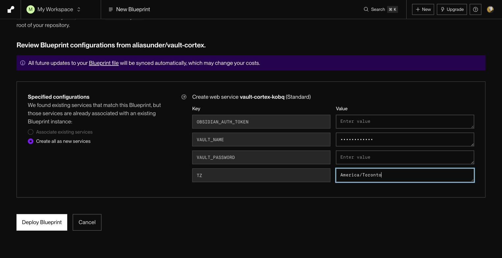
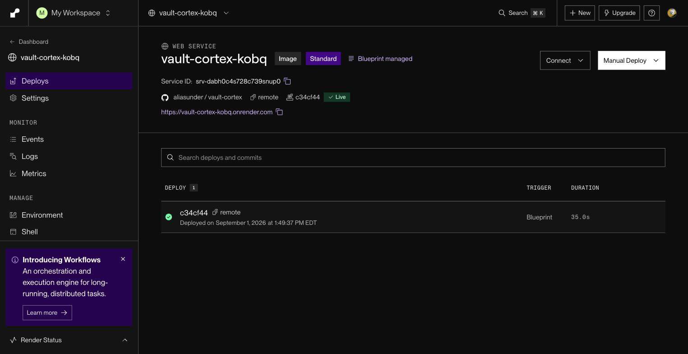
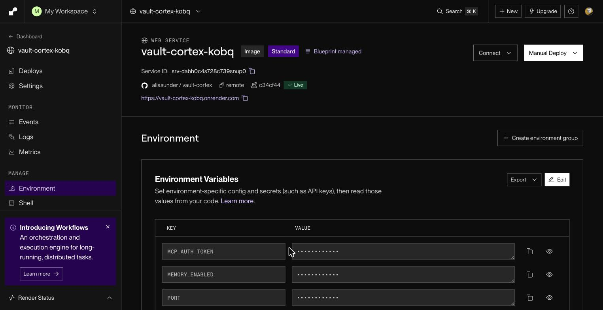
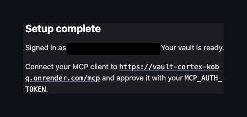

# Render Quickstart (one-click)

Run Vault Cortex on [Render](https://render.com) from a button — no server to
manage.

What you end up with:

- A copy of your vault on Render, kept current by Obsidian Sync in both
  directions.
- Any MCP client can search, read, and write it from anywhere.
- HTTPS, restarts, and a generated access token, handled by Render.
- One disk holding the vault copy, the search index, and the Sync
  connection.

Your notes' home stays Obsidian Sync and your own devices; delete the
service and you lose only the copy.

Prefer your own VPS? Use the [remote quickstart](../remote/) instead.
Curious how the container is put together?
[ARCHITECTURE.md →](../../ARCHITECTURE.md#container-startup).

**Contents** — [Prerequisites](#prerequisites) · [Deploy](#deploy) · [Your URL and token](#your-url-and-token) · [Sign in to Obsidian Sync](#sign-in-to-obsidian-sync) · [Security](#security) · [First start](#first-start) · [Connect](#connect-your-mcp-client) · [Verify](#verify) · [Updating](#updating) · [Restart, stop, delete](#restart-stop-delete) · [Config](#configuration) · [Troubleshooting](#troubleshooting)

## Prerequisites

- A [Render](https://render.com) account with a payment card on file. You
  don't need a paid Render plan — the free Hobby workspace works — but the
  server itself is paid: the **Standard** instance (1 CPU, 2 GB) and the
  5 GB disk the Blueprint creates cost about **$26 USD/month** together,
  the instance billed by the second and the disk as its own line item
  ([Render's pricing](https://render.com/pricing)).
- An [Obsidian Sync](https://obsidian.md/sync) subscription

## Deploy

[](https://render.com/deploy?repo=https://github.com/aliasunder/vault-cortex)

Render asks for a card first if your workspace has none on file, then reads
the Blueprint — Render's name for a ready-made deployment recipe stored in
the repository — and asks for a **Blueprint Name** (any name) and four
values before it creates anything. Only `VAULT_NAME` is required; the rest
are optional:

| Field                 | Value                                                                                                                                                                                                                           |
| --------------------- | ------------------------------------------------------------------------------------------------------------------------------------------------------------------------------------------------------------------------------- |
| `OBSIDIAN_AUTH_TOKEN` | Leave empty — you sign in through the setup page after deploy (see [Sign in to Obsidian Sync](#sign-in-to-obsidian-sync)). Or paste a token from `npx vault-cortex@latest get-sync-token` to skip the setup page                |
| `VAULT_NAME`          | Your vault's name, exactly as it appears in Obsidian Sync                                                                                                                                                                       |
| `VAULT_PASSWORD`      | Only if your vault uses end-to-end encryption; otherwise leave empty                                                                                                                                                            |
| `TZ`                  | Your timezone as an [IANA name](https://en.wikipedia.org/wiki/List_of_tz_database_time_zones#List) (`America/Toronto`) — decides what "today" means for daily notes, task due dates, and memory timestamps. Leave empty for UTC |



Fill in at least the vault name **before** the first deploy. Click **Deploy
Blueprint**. Render creates the service and disk, pulls the image, and
starts the first deploy. Everything else — the MCP token, the public URL,
the port, the storage layout — is set by the Blueprint.

## Your URL and token

- **URL:** shown as a link at the top of the service page. Render builds it
  from the service name the Blueprint sets, `vault-cortex`, plus four random
  characters, because `onrender.com` subdomains are unique across all of
  Render and the bare name is taken. Expect
  `https://vault-cortex-xxxx.onrender.com`. Wherever this guide shows
  `<host>`, put your own `vault-cortex-xxxx.onrender.com` address in its
  place: `https://<host>/mcp` becomes
  `https://vault-cortex-xxxx.onrender.com/mcp`.

  

- **Token:** `MCP_AUTH_TOKEN` under the service's **Environment** tab. Render
  generated it for you; your MCP client enters it once on the consent page.

  

## Sign in to Obsidian Sync

When the service shows a green **Live** badge, sign in to Obsidian Sync
through the setup page:


1. **Copy `MCP_AUTH_TOKEN`** from the service's **Environment** tab — click
   the eye icon to reveal it, then copy the value.
2. **Open the setup page**: click the URL at the top of the service page —
   the server sends your browser straight to the sign-in page. (Adding
   `/setup` to the address goes to the same place.)
3. **Paste the `MCP_AUTH_TOKEN` value** in the token field.
4. **Enter your Obsidian account email and password.** If you use
   two-factor authentication, the page asks for the code on the next step.

   

5. **Wait for "Your vault is ready."** The server signs in, validates your
   vault settings, writes the token, and restarts to download your vault
   and build the search index. The page follows the progress automatically.
   A vault of a few thousand notes takes two to three minutes; a large vault
   can take longer.

Once the page shows your MCP URL, the server is live and ready to connect.



<details>
<summary><strong>Already have a token?</strong></summary>

<a id="getting-your-obsidian-sync-token"></a>

If you already have an Obsidian Sync token (from a previous deploy, from the
CLI, or from a manual login), paste it into the `OBSIDIAN_AUTH_TOKEN` field
on the Blueprint form — the container skips the setup page and starts
syncing immediately.

To generate a token from the command line:

```bash
npx vault-cortex@latest get-sync-token
```

Or, if you don't have Node.js installed:

```bash
docker run --rm -it --entrypoint get-sync-token ghcr.io/aliasunder/vault-cortex:remote
```

</details>

## Security

Out of the box, every request to your instance travels over HTTPS to
Render's edge and is checked by the server before any vault data moves:

- **Always HTTPS.** Render provisions and renews the certificate and
  terminates TLS at its edge; the container is never reachable directly.
- **Nothing without the token.** `/mcp` answers `401` to any request that
  lacks a valid token. OAuth clients get one through the consent page (full
  OAuth 2.1 with PKCE and refresh-token rotation); scripts send
  `MCP_AUTH_TOKEN` as a bearer header. The login, registration, and token
  endpoints are rate-limited per visitor address.
- **Encrypted at rest, snapshotted daily.** The disk holding your vault,
  index, and Sync device state is encrypted, and Render snapshots it every
  24 hours (kept at least seven days) — restore from **Disks → Snapshots**.
- **Logs carry no secrets.** The server logs note paths, headings, search
  queries, and error text — your vault's own metadata — never tokens,
  passwords, or note bodies.

What the server can't protect is the Render account that holds it: anyone
who can open this service in the dashboard can read the environment
variables, the logs, and the disk. Two steps close that, both from the
dashboard:

1. **Turn on two-factor authentication** for your Render account
   (**Account Settings → Account Security**). The environment variables
   hold the credentials that grant access to your vault.
2. **Keep the workspace to yourself.** Members you invite can read every
   environment variable and every log line, search queries included.

Optional settings narrow what a connected client can do — change them
under **Environment**: `READONLY_MODE=true` removes every tool that writes
to the vault, and `FILE_TOOLS_ENABLED=false` or `MEMORY_ENABLED=false` hide
those tool groups entirely (see [Configuration](#configuration)).

Changing `MCP_AUTH_TOKEN` ends every session: access tokens issued under
the old value stop working, stored refresh tokens become unusable, and each
client goes back through the consent page on its next request.
[SECURITY.md](../../SECURITY.md) describes what the server exposes and how
each part is hardened.

## First start

After you sign in on the setup page, the container restarts and runs the
full startup sequence: it logs in to Obsidian Sync, downloads your vault,
builds the search index, and then answers health checks and receives
traffic. A vault of a few thousand notes takes two to three minutes; Render
allows up to 15 minutes, and a large vault can take most of it. Until the
index is built, the URL answers `502` — that is Render waiting, not a
failure.

Watch the **Logs** tab. Lines prefixed `[obsidian-sync]` are the Sync setup
and download; `[vault-cortex]` lines show the storage layout and the public
URL the container derived (`PUBLIC_URL derived from RENDER_EXTERNAL_URL`);
the structured JSON lines are the MCP server. `server started` means the
deploy is about to go live.

## Connect your MCP client

The same three steps in every app:

1. In Claude Desktop, claude.ai, Perplexity, or any app with an **Add custom
   connector** (remote MCP server) option, paste
   `https://<host>/mcp` — the MCP URL the setup page showed when it
   finished. Leave Client ID and Secret empty.
2. A consent page opens in your browser. Approve it with the
   `MCP_AUTH_TOKEN` Render generated.
3. Done — the client renews its own access from then on. Under the hood that
   is full OAuth 2.1, with PKCE, dynamic client registration, and
   refresh-token rotation on a 60-day sliding expiry.

**Other clients:**

- **Claude Code** — one command instead of a settings screen; the same
  consent page opens:

  ```bash
  claude mcp add --scope user --transport http vault-cortex https://<host>/mcp
  ```

- **Scripts and MCP Inspector** — send `MCP_AUTH_TOKEN` as an
  `Authorization: Bearer` header.

Client-by-client details are in the remote quickstart's
[Connect your MCP client](../remote/#connect-your-mcp-client).

## Verify

Open `https://<host>/healthz` in your browser — it answers `{"ok":true}`.
Then, in your MCP client, run a search — results come from your vault.

The same check from a terminal, if you prefer:

```bash
curl https://<host>/healthz
# → {"ok":true}
```

## Updating

Image services on Render don't redeploy on their own when a new image is
published. To update: open the service, click **Manual Deploy → Deploy latest
reference**. Render pulls the current `:remote` image and restarts the
container. Your vault and search index stay on the disk, so the update takes
a minute or two: the new image is pulled, then the container starts the same
way a restart does.

Before you redeploy, skim
[GitHub Releases](https://github.com/aliasunder/vault-cortex/releases) — each
release lists what changed since the last one, and an entry marked
**Breaking change** means a setting or behavior you rely on may have moved.

## Restart, stop, delete

- **Restart** — on the service, **Manual Deploy → Restart service**. Same
  container, same disk.
- **Stop** — **Settings → Suspend Service**. The instance stops billing;
  the disk and everything on it stay, and Render bills disks separately at
  $0.25 USD per GB per month — about $1.25 a month for the 5 GB disk — so
  expect that charge to continue until the service is deleted. **Resume**
  picks up where it left off.
- **Delete** — two steps, because the Blueprint would otherwise re-create
  the service: from the dashboard, open **Blueprints** in the left nav, open
  your Blueprint → **Settings → Disconnect Blueprint**, then the service →
  **Settings → Delete Service**. Deleting the service deletes the disk too.
  Your vault in Obsidian Sync is untouched — the container only held a copy.

## Configuration

The Blueprint sets these; change them under the service's **Environment**
tab (each change triggers a redeploy):

| Variable                | Value           | What it does                                                                                                                                                                              |
| ----------------------- | --------------- | ----------------------------------------------------------------------------------------------------------------------------------------------------------------------------------------- |
| `STORAGE_ROOT`          | `/persist`      | Where the disk is mounted — the vault, search index, Sync device state, and logs live under it. Must not contain `*`, `?`, or `[`. Leave as is.                                           |
| `PORT`                  | `8000`          | The port the image listens on. Leave as is.                                                                                                                                               |
| `DEVICE_NAME`           | `vault-cortex`  | The device name that labels this container's changes in Obsidian's sync log.                                                                                                              |
| `TRUST_PROXY_HOPS`      | `2`             | Render's network puts two proxies between a visitor and the container; this lets the server see the visitor's real address in its logs and rate limits.                                   |
| `MCP_AUTH_TOKEN`        | generated       | Your MCP client's token. Change it here to rotate it — every connected client re-authorizes.                                                                                              |
| `OBSIDIAN_AUTH_TOKEN`   | from setup page | Obsidian Sync login. Set by the setup page on first deploy (written to the disk). To re-sign-in, set a new token here — it always overrides the file on the disk.                         |
| `VAULT_NAME`            | yours           | The vault this container syncs.                                                                                                                                                           |
| `VAULT_PASSWORD`        | yours / empty   | End-to-end encryption password, if your vault has one.                                                                                                                                    |
| `TZ`                    | yours / empty   | Timezone for daily notes, task due dates, and memory timestamps. Empty means UTC.                                                                                                         |
| `MEMORY_ENABLED`        | `true`          | The About Me/ memory layer and its tools. Set `false` to hide them and skip creating the folder.                                                                                          |
| `EMBEDDING_ENABLED`     | `true`          | Semantic search. Set `false` to skip the models and use keyword search only — the container fits in much less memory.                                                                     |
| `READONLY_MODE`         | `false`         | Set `true` to hide every tool that changes the vault — clients can only read and search.                                                                                                  |
| `FILE_TOOLS_ENABLED`    | `true`          | `vault_read_file` and `vault_list_files`. Set `false` when Obsidian Sync has attachment syncing off.                                                                                      |
| `SYNC_MODE`             | `bidirectional` | Sync direction: `bidirectional`, `pull-only` (server edits are kept locally but never uploaded), or `mirror-remote` (server edits are undone; the server is an exact copy).               |
| `CONFLICT_STRATEGY`     | `merge`         | Obsidian Sync conflict resolution: `merge` integrates changes automatically; `conflict` writes a separate conflict file.                                                                  |
| `SYNC_EXCLUDED_FOLDERS` | _(empty)_       | Folders to leave out of sync, comma-separated — the same list as Obsidian's Sync → Excluded folders. Empty excludes nothing.                                                              |
| `SYNC_FILE_TYPES`       | _(empty)_       | Attachment types to sync: `image`, `audio`, `video`, `pdf`, `unsupported`, comma-separated — the same toggles as Obsidian's Sync → Selective sync. Empty keeps the Sync client's default. |
| `LOG_DIR`               | derived         | Log files, kept 90 days on the disk — the platform's own log viewer keeps only the last 7 days on Hobby plans. Set `none` to keep logs in the platform viewer only.                       |

`SYNC_MODE`, `CONFLICT_STRATEGY`, `SYNC_EXCLUDED_FOLDERS`, and
`SYNC_FILE_TYPES` are the settings most worth changing on a hosted instance;
the Blueprint pre-fills them with the image defaults so you can edit them in
place. `LOG_DIR` is not pre-filled — the container derives it at every start,
and `none` is the only value worth setting by hand. Every other optional setting uses the same names as the remote
quickstart's [Configuration table](../remote/#configuration) — add it as a
new environment variable.

Don't set `PUBLIC_URL` or `VAULT_PATH` — the container derives
them from `STORAGE_ROOT` and Render's own address variable at every start.

Instance size and disk size are changed under **Settings** (Render can grow a
disk, never shrink it).

## Troubleshooting

**The setup page shows an error after signing in.** The page tells you
what went wrong:

- _login was rejected_ — wrong email, password, or two-factor code. Try
  again on the same page.
- _Vault "X" was not found_ — the vault name doesn't match Obsidian Sync
  exactly (it is case-sensitive). Fix `VAULT_NAME` under the service's
  **Environment** tab and save — saving redeploys the service.
- _Vault password required_ — the vault is end-to-end encrypted and
  `VAULT_PASSWORD` is missing. Add it under **Environment** and save.
- _Wrong vault key_ — the vault password is incorrect. Fix
  `VAULT_PASSWORD` under **Environment** and save.

**`VAULT_NAME is not set` in the logs.** Add it under **Environment** and
save — saving redeploys the service.

**The deploy timed out waiting for the health check.** Render allows 15
minutes from container start. The first start of a large vault — download
plus search-index build — can exceed that. Click **Manual Deploy → Deploy
latest reference**: the files and index that already reached the disk are
reused, so the second attempt is much faster. For very large vaults, set `EMBEDDING_ENABLED=false`
for the first deploy and remove it once the vault has synced.

**A redeploy took as long as the first deploy and downloaded the whole vault
again.** The disk was replaced, or `/persist/config` was removed, so the
container started over with a fresh Obsidian Sync connection. Nothing needs
cleaning up.

**`The vault is empty but this device has previously synced.`** The
container refused to start because the vault directory on the disk is empty
while the device state says a sync already happened — starting would push
deletions to your other devices. This happens only if something removed
`/persist/vault` by hand. Restore the disk from a snapshot (**Disks → Snapshots**
on the service page), or remove `/persist/config` as well to start over with
a fresh device.
